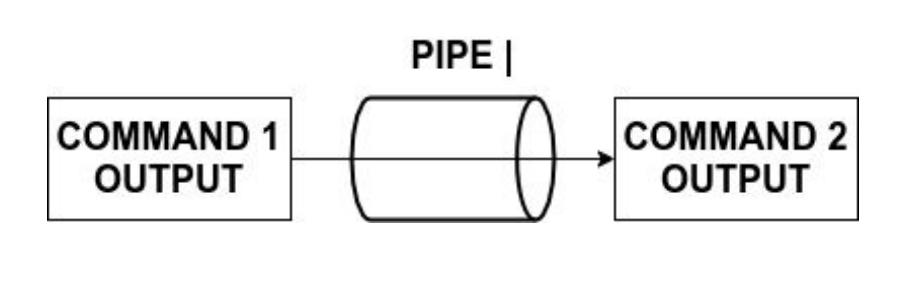
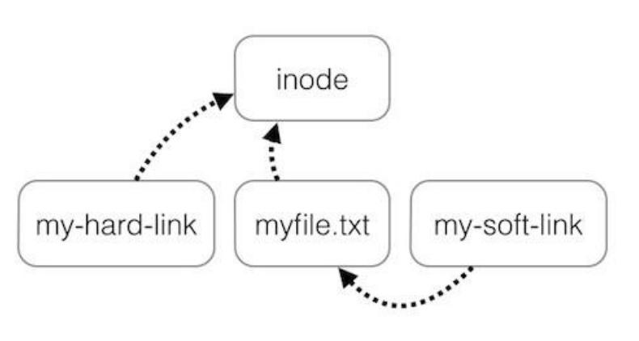
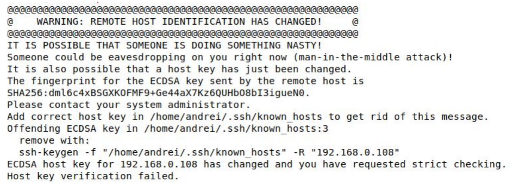
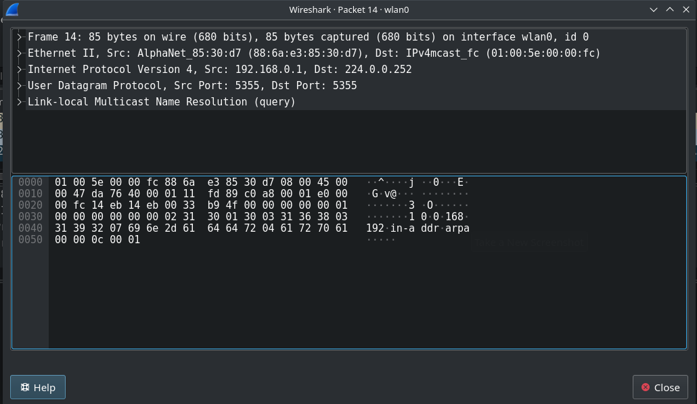

# Linux Administration: The Complete Linux Bootcamp For 2022

# Section 1: Getting Started

# Section 2: Setting Up The Environment

## General Notes

- The __Linux Distribution__ is an Operating System made from a software 
  collection that is based upon the Linux kernel and, often, a package management
  system.
- The Linux OS Comprises:
  - The Linux Kernel
  - The GNU shell utilities
  - The graphical desktop environment
  - more...
- The best place to learn about different distros is 
  [DistroWatch](https://distrowatch.com). It's the database for all linux distros.
  - The Internet uses:
    - RedHat
    - CentOs
    - Ubuntu 
  - Personal PC's:
    - Linux Mint
  - Embedded Devices
    - OpenWrt
  - Raspberry Pi
    - Raspberry Pi OS
  - High-Performance Computing Clusters
    - Rocks Cluster Distribution
- The __Windows__ key is called the __Super__ key in Linux and can be used to
  switch between applications.
- __LibreOffice__ is an open-source replacement for Microsoft Office 

### <u>The most important and popular linux distros today are:</u>
  - __Ubuntu__
  - __RedHat__

### Describing some of the OS's:
  - [__Ubuntu__](https://ubuntu.com/)
    - Based on Debian and is free.
    - African word meaning "Humanity", often translated to "Humanity towards others."
  - [__RedHat__](https://download.virtualbox.org/virtualbox/6.1.38/Oracle_VM_VirtualBox_Extension_Pack-6.1.38.vbox-extpack)
    - Acquired by IBM in 2019 for $30 billion
  - [__CentOS__](https://www.centos.org/)
    - Based on RedHat
    - Lacks the branding and support.
  - [__LinuxMint__](https://linuxmint.com/)
    - User-friendly
    - Interface similar to Windows
  - [__MX Linux__](https://mxlinux.org/)
    - Based on Debian
    - Desktop-oriented
    - Lightweight
  - [__Kali Linux__](https://www.kali.org/)
    - Based on Debian
    - Used for ethical hacking
    - Contains hundreds of security tools that work out of the box

## Installing Linux In A VM

### There's 3 options for running Linux:

 1. Install it as the Main OS
 2. Run it from a flashdrive, but don't install it
 3. Install it into a VM

### Installation

1. Install a VM - [VirtualBox](https://www.virtualbox.org/wiki/Downloads)
   - If using VirtualBox, install the [Extension Pack](https://download.virtualbox.org/virtualbox/6.1.38/Oracle_VM_VirtualBox_Extension_Pack-6.1.38.vbox-extpack)
     after.
2. Install your OS 
   - If you need lighter-weight installs, you can use:
     1. [__Lubuntu__](https://lubuntu.me/)
     2. [__Xubuntu__](https://xubuntu.org/)
   - If you install Ubuntu, get the __LTS (Long-Term Support)__ version.
     - LTS means five years of free security and maintenance updates.
   - Make sure that __Virtualization__ or __VT-X__ is enabled in your system BIOS.
   - If installing Ubuntu:
     - Use 4GB if possible for the RAM
   - If installing CentOS:
     - Use 2GB if possible for the RAM
   - Always use 20GB if possible for the virtual disk size
   - You may need to hit __Right Ctrl__ to use the mouse during installation.
     - The __Host Key__
3. If installing as Main OS or to USB drive, choose custom installation
   - After installation, you may need to remove the installation disk from virtual
     drive:
     1. Click __Devices__
     2. Click __Optical Drives__
     3. Click __Remove Disk from virtual drive__
     4. Force unmount if necessary
     5. Restart the VM
4. Put the network card into NAT mode.
5. Start a terminal and ping an IP address (`8.8.8.8`) to test internet connection.
6. Check a random website for internet connection.

## Things To Do After Installation

### Update all install applications

#### Update all apps:

```shell
sudo apt update
```

#### Update all apps to their latest version (Run next):

```shell
sudo apt full-upgrade
```

- Many, if not all, admin tasks (including updating/installing new software) 
  must be started as __root__
  - __root__ is the linux admin
- Use `sudo` command to run a command as __root__. 

#### Snapshot

Create a snapshot of the current state of the VM.

1. Go to __Machine__
2. __Take Snapshot__

- Allows you to save the current state of a VM. 
  - Great for testing or if you're going to change something.

##### To See Snapshots:

1. Go to VB Manager
2. Click the Hamburger Menu to the right of the VM
3. Click __Snapshots__

- The VM must be powered off or in a safe state to restore to a snapshot.


### Install The Guest Additions In The Host VM

- Consists of device drivers and system applications that optimize guest operating
  system performance and usability.
  - Shared folders & keyboards between host/guest
  - Better mouse integration
  - Better video support

#### Running Automatically

1. Go to Devices
2. Click __Insert Guest Additions CD Image__
   - Provided as a single image file VBox.iso in the VirtualBox installation
     folder.

#### Running Manually


1. ```zsh
    cd /run/media/<username>/VBox_GAs_<version_number>/
    ```
2. ```zsh
   sudo bash VBoxLinuxAdditions.run
   ```
   
Reboot the VM after installing.

```zsh
reboot
```

- You can now resize the window.

# Section 3: The Linux Terminal In Depth

## General Notes

- Linux is highly oriented towards commands.
- Gnome terminal is the default for CentOS and Ubuntu
- __Ctrl + Alt + T__ Is the shortcut to open Terminal.
- The most widely used shell is __Bash__.
  - Ubuntu
  - Linux Mint
  - Debian
  - CentOS
  - MacOS
- To install Terminator:

```shell
sudo apt update && sudo apt install terminator
```

### The Linux Terminal

- A __Terminal Emulator__ and is a crucial part of any Linux system because it
  basically allows you to access the system through a shell.
- A __shell__ is a program that takes commands from the user and gives them to 
  the operating system's kernel to execute. It's also called the command
  interpreter. The shell gets started when the suer logs in or starts the
  terminal.
- __Linus is a case-sensitive operating system.__
- The terminal is the graphical application where the default shell will start.

### What Is The Console

- The __console__ is a special sort of terminal that starts if no GUI was installed.
- The console and terminal are similar.
- Started in a text-only environment.

## Commands

- You can have as many whitespaces as you want between arguments, as long as 
  there's at least one.
- It's standard for the options to come after the command, and before the command 
  arguments.
- There are two types of commands in Linux:
  - Executable files on the disk
  - Shell built-in commands
    - Often don't have a dedicated __man__ page.
  - Use `type <command>` to check.

### Ping

```shell
ping [options] [num_of_times_to_ping] ip_addr_to_ping

ping -c 1 8.8.8.8
```

- `c [num_of_times_to_ping`]
- Checks that the internet is working

### List (LS)

```shell
ls [options] [directory]

ls -l /etc/
```

- `-l` tells `ls` to use a long listing format
- `-a` or `--a` shows all directories, including hidden

### DF

Displays information about the file system and the disk space usage.

```shell
df [options] [directory]

df -h

df -hi

df -hil
```

### ifconfig

Used for configuring network and getting network information.

### wget

Used for downloading from a link in the background even while not logged in.

## Getting Help

### Man Pages (Executable File Commands)

```shell
man <command to get help with>
```

- Documentation for a program or command
- Man is short for Manual
- Type `h` to get even more help for a command
  - This uses the __less__ command.
    - __Less__ is a pager/viewer that's used to view the text of a file.
- Everything that has an ellipsis after it can be repeated.

#### Keyword Search

```shell
man -k <keyword>

# Examples
man -k ifconfig
man -k "copy files"
```

- Searched through all __man__ files for a keyword.
- Similar to `apropos`
  - `apropos ifconfig`
  - `apropos uman`

### Help (Shell Built-Ins)

```shell
help <command to get help with>
```

### --Help (Both Types)

```shell
command --help
```

### Navigation

- __Ctrl + F__ or __Space__ to move forward a window.
- __Ctrl + B__ or __b__ to move backwards a window.
- __g__ to move to the beginning.
- __G__ to move to the end.
- __/string_to_search_for__ to search for a string going forwards
  - __n__ goes to the next match
  - __N__ goes to the prior match
- __?string_to_search_for__ to search for a string going backwards
  - __n__ goes to the next match
  - __N__ goes to the prior match

## Above-Section Code

```shell
##########################
## Getting Help in Linux
##########################
 
# MAN Pages
man command     # => Ex: man ls
 
# The man page is displayed with the less command
# SHORTCUTS:
# h         => getting help
# q         => quit
# enter     => show next line
# space     => show next screen
# /string   => search forward for a string
# ?string   => search backwards for a string
# n / N     => next/previous appearance
 
# checking if a command is shell built-in or executable file
type rm        # => rm is /usr/bin/rm
type cd        # => cd is a shell builtin
 
# getting help for shell built-in commands
help command    # => Ex: help cd
command --help  # => Ex: rm --help
 
# searching for a command, feature or keyword in all man Pages
man -k uname
man -k "copy files"
apropos passwd
```

## Keyboard Shortcuts

- __Ctrl + L__
  - Clears the screen
- __Ctrl + D__
  - Closes the shell screen
- __Ctrl + A__
  - Moves the cursor to the beginning of the file
- __Ctrl + E__
  - Moves the cursor to the end of the file
- __Up Arrow Key__
  - Retrieves the previous command
- __Down Arrow Key__
  - Retrieve commands from history
- __Ctrl + U__
  - Deletes all characters before the cursor by cutting and adding them to the
    clipboard.
- __Ctrl + C__
  - Interrupts the process running in the terminal

### Keyboard Shortcuts Code

```shell
##########################
## Keyboard Shortcuts
##########################
TAB  # autocompletes the command or the filename if its unique
TAB TAB (press twice)   # displays all commands or filenames that start with those letters
 
# clearing the terminal
CTRL + L
 
# closing the shell (exit)
CTRL + D
 
# cutting (removing) the current line 
CTRL + U
 
# moving the cursor to the start of the line
CTRL + A
 
# moving the cursor to the end of the line
Ctrl + E
 
# stopping the current command
CTRL + C
 
# sleeping a the running program
CTRL + Z
 
# opening a terminal 
CTRL + ALT + T
```

## Bash History

```shell
# Get command history
cat .bash_history

# Get the history file size
echo $HISTFILESIZE

# Get command history - Descending order
history

# Get command history in memory size
echo $HISTSIZE

# Run a command from history
# Get the command numbers from history
!<command_number_to_run>

# Running the last command you ran
!!

# Run the last n command from your current
!-<num of how far back to go>
!-1
!-8

# Run the last command and all its args from history
!<same command as in history>
!ping  # Runs the last ping command

# Print out a command from history without running it
!<command>:p
!ping:p

# Go through previous commands in history
CTRL + P
CTRL + UP

# Walk forward through history
CTRL + N
CTROL + DOWN

# Search bash history for a command
CTRL + R

## CTRL + P or ENTER to run the command
## CTRL + G to exit command history lookup

# Delete a line from history
history -d <line_number>

# Delete all history
history -c

# Append this to prevent a command from being saved to history
history -d $(history 1)

```

- The number of commands that will be stored in the history file is controlled
  by an environment variable called __HISTFILESIZE__.
- __HISTSIZE__ controls how many commands from your bash history will be stored
  in the memory.
- __n__ and __N__ can be used to navigate history
- You can type a space before a command before running it in a bash shell, and
  the command will not appear in command history.
- There's a special variable called __HISTCONTROL__ that allows you to ignore
  commands and not save them if you set the variable to ignore __space__.
  - `echo $HISTCONTROL`

### HISTCONTROL

```shell
# Ignore duplicates
HISTCONTROL=ignoredups

# Ignore spaces
HISTCONTROL=ignorespace

# Ignore both
HISTCONTROL=ignoreboth
```

- Variables are saved only for the session. To save one permanently, you need to
  save it to the bashrc file.

```shell
echo "HISTCONTROL=ignoreboth" >> ~/.bashrc
```

- Saves the variable to a file
- The `>>` appends to a file

### HISTTIMEFORMAT

```shell
HISTTIMEFORMAT="%d/%m/%y %T "

echo "HISTTIMEFORMAT=\"%d/%m/%y %T\"" >> ~/.bashrc
```

- `%d` Day
- `%m` Month
- `%y` Year
- `%T` Time

## History Code

```shell
##########################
## Bash History
##########################
 
# showing the history
history
 
# removing a line (ex: 100) from the history
history -d 100
 
# removing the entire history
history -c
 
# printing the no. of commands saved in the history file (~/.bash_history)
echo $HISTFILESIZE
 
# printing the no. of history commands saved in the memory
echo $HISTSIZE
 
# rerunning the last command from the history
!!
 
# running  a specific command from the history (ex: the 20th command)
!20
 
# running the last nth (10th) command from the history
!-10
 
# running the last command starting with abc 
!abc
 
# printing the last command starting with abc 
!abc:p
 
# reverse searching into the history
CTRL + R
 
# recording the date and time of each command in the history
HISTTIMEFORMAT="%d/%m/%y %T"
 
# making it persistent after reboot
echo "HISTTIMEFORMAT=\"%d/%m/%y %T\"" >> ~/.bashrc
# or
echo 'HISTTIMEFORMAT="%d/%m/%y %T"' >> ~/.bashrc
```

## Getting Root Access

On Linux there are 2 main categories of users:

1. __Non-privileged Users__ - Have no special rights on the system.
2. The __root__ user (superuser or the administrator)

- __Root privileges__ are the powers taht the root account has on the system. The
  root account is the most privileged on the system and has absolute power over
  it.
- Root only exists on any Linux system if there's only one.
- It's not recommended to use root for ordinary tasks. When root permissions are
  needed you simply become root only to perform that particular administrative
  task.
- On many Linux distros, you cannot directly log into root.
  - Such as Ubuntu or Debian
- All directories end in a `$`, with root being the only exception as it ends in
  a `#`.
- `/` is the root directory  
- `/root` is the root user's directory
- `/home` is the directory for all other users


### Logging In

```shell
# Log into sudo
sudo su
```

- `sudo` on Ubuntu, and `wheel` on CentOS

#### Activating The Root Working Environment

```shell
sudo su -
```

### Sudo Cache

The `sudo` command caches for 5 minutes the credentials, and it is re-cached
everytime it is used.

```shell
# Updating the cached credentials without running a command
sudo -v

# Invalidating a user's credentials
sudo -k
```

### Directly Logging Into Root

On some distros, such as __Ubuntu__, this is disabled by default.

```shell
su
```

### Practice

```shell
sudo groupadd myadmin

sudo useradd john
```

## Code For Getting Root Access

```shell
##########################
## Running commands as root (sudo, su)
##########################
 
# running a command as root (only users that belong to sudo group [Ubuntu] or wheel [CentOS])
sudo command
 
# becoming root temporarily in the terminal
sudo su      # => enter the user's password
 
# setting the root password
sudo passwd root
 
# changing a user's password
passwd username
 
# becoming root temporarily in the terminal
su     # => enter the root password
```

# Section 5: The Linux File System

## General Notes

- A __file system__ controls how data is stored and retrieved.
- Each group of data is called a file and the structure and the logic rules used
  to manage files and their names are called __file systems__.
- A file system is a logical collection of files on a partition or disk.
  - A harddrive can have multiple partitions and each one has its own __file
    system__.
- On a Linux system, everything is considered to be a file.
  - Even the partition is represented as a special file.
- On Linux, file and directory names are case-sensitive.
- The __file system__ is hierarchical.
- __directory__ is a classical term, while __folder__ is a friendly name that
  sounds more friendly to Windows users.
  - __Directory__: A __file system__ concept.
  - __Folder__: The GUI metaphor used to represent a __Directory__.
- All files & directories appear under the __root directory (/)__, even if they are
  stored on different physical devices (such as disks or partitions).
- When using a usb stick, you need to logically attach it to an existing 
  directory of the unique file system. That directory is called __Mount Point__.
  - To see the mount point, use `df -h`
- `/dev/mem` is a character device file that is an image of the main memory of
  the computer.
  - Run `man mem` for more info.

## The Filesystem Hierarchy Standard FHS)

- __/bin__ contains binaries or user executable files which are available to all
  users.
  - Commands like `ls` are located here.
- __/sbin__ contains applications that only the superuser (hence the initial s)
  will need.
  - Commands like `fdisk` and `ifconfig` are here.
- __/boot__ contains files required for starting your system.
- __/home__ is where you will find your users' home directories. Under this 
  directory there is another directory for each user, if that particular user has
  a home directory.
  - Root has its home directory separated from the rest of the users' home
    directories and is __/root__.
- __/dev__ contains device files.
  - Contains the device files for every hardware device attached to the system,
    like a hard disk or a partition.
  - These are __not__ device drivers, rather they are files that represent each 
    device on the computer and facilitate access to those.
- __/etc__ contains most, if not all system-wide configuration files.
  - Gets its name from the earliest unix systems. Used to be the dumping grounds 
    for system files that system administrators were not sure where to put.
- __/lib__ contains shared library files used by different applications.
  - The package manager updates it accordingly when you install, update, or 
    delete an application.
- __/media__ is used for external storage will be automatically mounted.
- __/mnt__ is like __/media__, but it's not very often used these days.
  - Was the mount point for the cd roms or floppy disks.
  - If you need to quickly mount a partition and don't know where, you can use
    __/mnt__.
- __/tmp__ contains temporary files, usually saved there by applications that 
  are running. Non-privileged users may also store files here temporarily.
- __/proc__ is a virtual directory. It contains information about your computer 
  hardware, such as information about your CPU, RAM memory or Kernel. The files 
  and directories are generated when your computer starts, or on the fly, as your 
  system is running and things change.
  - `cat /proc/cpuinfo`
  - `cat /proc/meminfo`
- __/sys__ contains information about devices, drivers, and some kernel features.
  - Not used directly.
- __/srv__ contains data for servers.
  - Not used directly.
- __/run__ is a temporary file system which runs in RAM.
  - Very new and different file systems use it in different ways.
  - Contents vanish when the system reboots.
  - Used only by processes.
- __/usr__ contains many other subdirectories with binaries files, shared 
  libraries and so on. 
  - On some distributions like CentOS many commands are saved
    in __/usr/bin__ and __/usr/sbin__ instead of __/bin__ and __/sbin__.
  - <u>On Ubuntu and CentOS, __/bin__ and __/sbin__ are symlinks to __/usr/bin__
    and __/usr/sbin__.</u>
- __/var__ typically contains variable-length files such as logs which are files 
  that register events that happen on the system.
  - `cat /var/log/auth.log`
    - Contains info about authentication tries.

## Absolute vs Relative Paths. Walking Through The File System (pwd, cd, tree)

A path is a unique location to a file in a file system of an operating system.

### Absolute

Defined by specifying the location of a file or directory from the root directory.

### Relative

Defined by specifying the location of a file or directory from the current 
working directory.

- Never starts with a __forward slash (/)__

### Double Dots ..

These lead to the parent directory and are created in every directory. They can
be seen using `ls -a`.

### CD

Change Directory

```shell
cd [filepath]
```


### PWD

Print Working Directory

```shell
pwd
```

### tree

Recursively lists all files and directories in a human-readable format.

```shell
tree [directory]
```

## Commands - Path

```shell
##########################
## Linux Paths
##########################
 
.       # => the current working directory
..      # => the parent directory
~       # => the user's home directory
 
cd      # => changing the current directory to user's home directory
cd ~    # => changing the current directory to user's home directory
cd -    # => changing the current directory to the last directory
cd /path_to_dir    # => changing the current directory to path_to_dir 
pwd     # => printing the current working directory
 
# installing tree
sudo apt install tree
 
tree directory/     # => Ex: tree .
tree -d .           # => prints only directories
tree -f .           # => prints absolute paths
```

## LS Command (In-Depth)

```shell
ls [options]... [filepath]...

# Run ls without the alias
\ls

# Long listing format
-l

# Info about the directory
-d

# Human-readable format
-h

# Show hidden files
-a

# Sort files by size Descending
-S

# Sort by extension
-X

# Hide file extensions
--hide=*.<extension>

# List recursively (including subdirectories)
-R

# Timestamps
-l

# Modification time
-lt

# Access time
-lu

# Change time
-lc

# Sort by modification time
-t

# Sort by and show access time
-lu

# Reverse the order of sorting
-r

# Indicate the filetype
-F
```

### Long-list Format

```shell
-rwxrwxrwx 1 root root    458752 Oct  4  2021  ntuser.dat.LOG1
-rwxrwxrwx 1 root root   2097152 Oct  4  2021  ntuser.dat.LOG2
-rwxrwxrwx 1 root root        20 Oct  4  2021  ntuser.ini
drwxrwxrwx 1 root root      4096 Sep  5 13:17  NucleusCoop
drwxrwxrwx 1 root root      4096 Apr  8 19:03  OneDrive
drwxrwxrwx 1 root root      4096 Aug 29 08:44  Oracle
drwxrwxrwx 1 root root      4096 Mar 29 18:53  PhpstormProjects
drwxrwxrwx 1 root root      4096 Dec 28  2021  Pictures
drwxrwxrwx 1 root root      4096 May 23 13:35  Postman
lrwxrwxrwx 1 root root        70 Oct  4  2021  PrintHood -> '/mnt/c/Users/tljci/AppData/Roaming/Microsoft/Windows/Printer Shortcuts'
drwxrwxrwx 1 root root      4096 Sep 13 11:52  programming
drwxrwxrwx 1 root root      4096 Feb  9  2022  PycharmProjects
lrwxrwxrwx 1 root root        59 Oct  4  2021  Recent -> /mnt/c/Users/tljci/AppData/Roaming/Microsoft/Windows/Recent
drwxrwxrwx 1 root root      4096 Dec 28  2021 'Recorded Calls'
drwxrwxrwx 1 root root      4096 Apr 23 13:58 'Saved Games'
drwxrwxrwx 1 root root      4096 Oct  4  2021  Searches
lrwxrwxrwx 1 root root        59 Oct  4  2021  SendTo -> /mnt/c/Users/tljci/AppData/Roaming/Microsoft/Windows/SendTo
drwxrwxrwx 1 root root      4096 Oct  4  2021  source
lrwxrwxrwx 1 root root        63 Oct  4  2021 'Start Menu' -> '/mnt/c/Users/tljci/AppData/Roaming/Microsoft/Windows/Start Menu'
drwxrwxrwx 1 root root      4096 Aug 27 14:49  Sync
```

- `ls` does not display the actual size of a directory, only the size of the inode
  structure.

Order of Information:

1. The first character indicates the type:
   - `-` is a normal file
   - `l` is a symbolic link
   - `d` is a directory
   - `b` is a block device
     - Device files represent logical hardware devices like a disk, a partition,
       or a serial console port.
   - `c` is a char device
     - Device files represent logical hardware devices like a disk, a partition,
       or a serial console port.
   - `s` Socket that's used by processes to communicate and has nothing to do
     with the __socket__ term used in TCP/IP networking.
   - `p` Named pipe
     - Like a socket, provides an easy way for processes to communicate.
2. The 9 characters that follow indicate the file permissions in this order:
   1. The owner
   2. The group owner
   3. Everyone else
3. The number after the permissions indicates the number of hardlinks
4. Next is the Owner
5. Followed by the Group Owner of the tile
6. The next field is the size
7. Then the modification time
8. Then the file name

### Disk Usage (DU)

To see the size of a directory, use the `du` command instead.

```shell
du [options]... [file]...

sudo du -sh ~
```

## LS - Commands

```shell
##########################

## The ls Command

## ls [OPTIONS] [FILES]

##########################


# listing the current directory

# ~ => user's home directory

# . => current directory

# .. => parent directory

ls

ls .


# listing more directories

ls ~ /var /


# -l => long listing

ls -l ~


# -a => listing all files and directories including hidden ones

ls -la ~


# -1 => listing on a single column

ls -1 /etc


# -d => displaying information about the directory, not about its contents

ls -ld /etc


# -h => displaying the size in human readable format

ls -h /etc


# -S => displaying sorting by size

ls -Sh /var/log


# Note: ls does not display the size of a directory and all its contents. Use du instead

du -sh ~


# -X => displaying sorting by extension

ls -lX /etc


# --hide => hiding some files

ls --hide=*.log /var/log


# -R => displaying a directory recursively

ls -lR ~


# -i => displaying the inode number

ls -li /etc
```

## File Timestamps

Every file on Linux has three timestamps:

1. The __access__ timestamp or __atime__ is the last time the file was read 
   (`ls -lu`)
2. The __modified__ timestamp or __mtime__ is the last time the contents of the 
   file was modified (`ls -l`, `ls -lt`)
3. The __changed__ timestamp __ctime__ is the last time when some metadata 
   related to the file was changed (`ls -lc`)

### Stat

Shows information about a file, including the __atime__, __mtime__, and __ctime__.

```shell
stat [options]... [file]...

>>stat /etc/passwd
  File: Desktop/
  Size: 4096            Blocks: 0          IO Block: 4096   directory
Device: 32h/50d Inode: 562949953522534  Links: 1
Access: (0777/drwxrwxrwx)  Uid: (    0/    root)   Gid: (    0/    root)
Access: 2022-09-14 11:55:37.750129000 -0700
Modify: 2022-09-14 01:15:30.322961000 -0700
Change: 2022-09-14 01:15:30.322961000 -0700
 Birth: -
```

- `Access` : The last time the file was read.
  - Includes a file displaying the info.
  - `ls -lu`
- `Modify` : The last time the file was updated / modified.
  - `ls -lt`
- `Change` : The last time some metadata related to the file (not the contents)
  was updated / modified.
  - `ls -lc`

### Timestamps

#### To get the full time, use:
```shell
ls -l --full-time
```

#### To Change A Timestamp

```shell
# Change access, modify, and change
touch {file}

# Change only access (Change will be updated by default)
touch -a {file}

# Change only modification
touch -m {file}

# Change both access and modification time
touch -d

# Set timestamp values of one file to a different one's
touch {target_file} -r {source_file}

# Change modification time to a past date
touch -m 201812301530.45 file.txt

# Change both access and modification time to a past date
touch -d "2018/12/30 3:45:12" file.txt
```

- If the file doesn't exist, `touch` will create it. If it does, it will update
  the timestamp to the current time.
- To change a time, there's two formats:
  - `year/month/day/hour/minute/seconds` (For use with `-m`, without slashes)
  - `year-month-day hour:minute:second` (For use with `-d`)
- To change only the __change__ time, you need to set the system time/date to
  the desired one, and `touch` the file. Then change it back.

## File Types In Linux (ls -F, file)

The filetype of a file is determined the file header, not the extension.

- It's common for many files to not even have an extension.
- Extensions are only useful for GUIs

### See the type of a file

```shell
file [options]... [file]...

ls -F [options]... [file]...

# Get info on all files in a directory
file [filepath]/*
```

- `-F` indicates the filetype
  - `/` is a directory
  - `@` is a symlink
  - `=` is a socket
  - `|` is a named pipe
- `-F` will add a `*` to executable files.

## File Types and Timestamps

```shell
##########################
## File Timestamps and Date
##########################
 
# displaying atime
ls -lu
 
# displaying mtime
ls -l
ls -lt
 
# displaying ctime
ls -lc
 
# displaying all timestamps
stat file.txt
 
# displaying the full timestamp
ls -l --full-time /etc/
 
# creating an empty file if it does not exist, update the timestamps if the file exists
touch file.txt
 
# changing only the access time to current time
touch -a file
 
# changing only the modification time to current time
touch -m file
 
# changing the modification time to a specific date and time
touch -m -t 201812301530.45 a.txt
 
# changing both atime and mtime to a specific date and time
touch -d "2010-10-31 15:45:30" a.txt
 
# changing the timestamp of a.txt to those of b.txt
touch a.txt -r b.txt
 
# displaying the date and time
date
 
# showing this month's calendar
cal
 
# showing the calendar of a specific year
cal 2021
 
# showing the calendar of a specific month and year
cal 7 2021
 
# showing the calendar of previous, current and next month
cal -3
 
# setting the date and time
date --set="2 OCT 2020 18:00:00"
 
# displaying the modification time and sorting the output by name.
ls -l
 
# displaying the output sorted by modification time, newest files first
ls -lt
 
# displaying and sorting by atime
ls -ltu
 
# reversing the sorting order
ls -ltu --reverse
```
## Viewing Files

- Both Ubuntu and CentOS have __gedit__.

### Cat

Displays a file's contents in the terminal

```shell
cat [options]... [file]...

# Print the line number
cat -n {file}
```

- The entire file is displayed on the screen.
- Ideal for small files.

#### File concatenation

```shell
cat {file1} {file2} > {result_file}
```

### Less

If the output of a file exceeds the terminal window, use `less`.

```shell
less [options]... [file]...
```

- Extends the capabilities of `cat` and is the most used tool.
- __Ctrl + F__ or __Space__ to move forward a window.
- __Ctrl + B__ or __b__ to move backwards a window.
- __g__ to move to the beginning.
- __G__ to move to the end.
- __/string_to_search_for__ to search for a string going forwards
  - __n__ goes to the next match
  - __N__ goes to the prior match
- __?string_to_search_for__ to search for a string going backwards
  - __n__ goes to the next match
  - __N__ goes to the prior match

### Tail

Shows the last 10 lines of a file.

```shell
tail [options]... [file]...

# Get the last two lines of a file
tail -n 2 /etc/group

# Get from line 20 to the end of a file
tail -n +20 /etc/group

# Monitor a file's tail output live
tail -f /etc/group
```

- To read a custom number of lines, use `-n {number_of_lines}`
- To start from a specific line number and go to the end, use `-n +{num_offset}`
- To watch the tail of a file live, user `-f`

### Head

Shows the first 10 lines of a file.

The complement of `tail`.

```shell
head [options]... [file]...

# Get the first two lines of a file
head -n 2 /etc/group

# Get from line 20 to the beginning of a file
head -n -20 /etc/group

# Monitor a file's head output live
head -f /etc/group
```

### Watch

Runs command repeatedly (default every 2 seconds) and watches the output change
over time.

```shell
watch {command}
```

- `-d` highlights the differences between successive updates
- `-n {number}` specifies the update interval

## Commands - Viewing Files

```shell
##########################
## Viewing files (cat, less, more, head, tail, watch)
##########################
 
# displaying the contents of a file
cat filename
 
# displaying more files
cat filename1 filename2
 
# displaying the line numbers
can -n filename
 
# concatenating 2 files
cat filename1 filename2 > filename3
 
# viewing a file using less
less filename
 
# less shortcuts:
# h         => getting help
# q         => quit
# enter     => show next line
# space     => show next screen
# /string   => search forward for a string
# ?string   => search backwards for a string
# n / N     => next/previous appearance
 
 
# showing the last 10 lines of a file
tail filename
 
# showing the last 15 lines of a file
tail -n 15 filename
 
# showing the last lines of a file starting with line no. 5
tail -n +5 filename
 
# showing the last 10 lines of the file in real-time
tail -f filename
 
 
# showing the first 10 lines of a file
head filename
 
# showing the first 15 lines of a file
head -n 15 filename
 
# running repeatedly a command with refresh of 3 seconds
watch -n 3 ls -l
```

## Creating Files & Directories

### touch

```shell
touch [options]... [file]...
```

### mkdir

```shell
mkdir [options]... [directory]...

# Verbose
mkdir -v directory

# Making multiple directories
mkdir dir3 dir1/dir10 /tmp/tmp_dir
mkdir first/second/third
```

- `-v` Verbose option to display info about what it's doing.
- `-p` Parent option
  - When creating directories, they're created from right to left. To create
    a directory structure with non-existent directories, use this option.

## Copying Files and Directories (cp)

There are 3 modes of `cp`.

- `-v` Verbose
  - Shows what the command is doing
- `-i` Prompt for overwrite
  - Stands for Interactive
- `p` Preserves the permissions, ownership, and timestamps.
  - By default, they are not preserved


#### One Source (file) + One Destination (dir)

```shell
 cp {src} {dest}
```

#### Multiple Sources (files) + One Destination (dir)

```shell
 cp {src} {src2} {src3} {dest}
```

- Creates any files or directories that do not exist in `dest`

#### All Sources Are Directories + One Destination (dir)

```shell
 cp -r {dir_src} {dir_src2} {dir_src3} {dest}
```

- `-r` is needed to recursively copy all subfolders and contents to `dest`.

## Moving and Renaming Files and Directories (mv)

Moves or renames files and directories

```shell
mv {src1[ src2 ... src_n]} {dest}
```

- `-n` causes the `mv` command to ignore anything that would overwrite an 
  existing file.
- `-u` Update. Moves only when the source file is newer than the destination file,
  or the destination file is missing.

#### Moving + Renaming

```shell
mv dir1/a.txt dir1/dir2/b.txt
```

### Practice

```shell
ls
mkdir -p dir1/dir2
touch dir1/a.txt dir1/dir2/b.txt c.txt
ls
tree dir1/
mv dir1/dir2/b.txt dir1
tree dir1
mv c.txt dir1/a.txt dir1/b.txt dir1/dir2/

# Pattern matching
mv dir1/dir2/*.txt dir1/
```

## Removing Files and Directories (rm & shred)

### Remove (rm)

There is no recycle bin for this command, and files/directories are deleted
permanently.

- A good tip is to use `echo` before using `rm` to see what files will be matched.
- The `rm` does not actually delete a file. It unlinks it, meaning the file is
  still on the disk. The space on disk occupied by the deleted file is marked as
  free and can be used by other files or processes.

```shell
rm {file1 [file2 ... file_n]}

# Example
rm -rf Music/Pictures/
```

- `-v` Verbose
  - Shows what the command is doing
- `-i` Prompt for overwrite
  - Stands for Interactive
- `-r` Recursive
  - Used for removing directories
- `-f` Force
  - Skip prompts to delete a file/directory

### Shred 

Overwrites a file many times to hide its contents many times before removing.

- You have to encrypt it if you truly care about security

```shell
shred [options]... {file1[ file2 ... file_n]}
shred -vu -n 100 {file}
```
- `-v` Verbose
  - Shows what the command is doing
- `-u` Removes the file after overwriting
- `-n` Number of times to overwrite the file
  - _Default is 3_

## Commands - touch, mkdir, cp, mv, rm, shred

```shell
##########################
## Working with files and directory (touch, mkdir, cp, mv, rm, shred)
##########################
 
# creating a new file or updating the timestamps if the file already exists
touch filename
 
# creating a new directory
mkdir dir1
 
# creating a directory and its parents as well
mkdir -p mydir1/mydir2/mydir3
 
######################
### The cp command ###
######################
# copying file1 to file2 in the current directory
cp file1 file2
 
# copying file1 to dir1 as another name (file2)
cp file1 dir1/file2
 
# copying a file prompting the user if it overwrites the destination
cp -i file1 file2
 
# preserving the file permissions, group and ownership when copying
cp -p file1 file2
 
# being verbose
cp -v file1 file2
 
# recursively copying dir1 to dir2 in the current directory
cp -r dir1 dir2/
 
# copy more source files and directories to a destination directory
cp -r file1 file2 dir1 dir2 destination_directory/
 
 
######################
### The mv command ###
######################
# renaming file1 to file2
mv file1 file2
 
# moving file1 to dir1 
mv file1 dir1/
 
# moving a file prompting the user if it overwrites the destination file
mv -i file1 dir1/
 
# preventing a existing file from being overwritten
mv -n file1 dir1/
 
# moving only if the source file is newer than the destination file or when the destination file is missing
mv -u file1 dir1/
 
# moving file1 to dir1 as file2
mv file1 dir1/file2
 
# moving more source files and directories to a destination directory
mv file1 file2 dir1/ dir2/ destination_directory/
 
######################
### The rm command ###
######################
# removing a file
rm file1
 
# being verbose when removing a file
rm -v file1
 
# removing a directory
rm -r dir1/
 
# removing a directory without prompting
rm -rf dir1/
 
# removing a file and a directory prompting the user for confirmation
rm -ri fil1 dir1/
 
# secure removal of a file (verbose with 100 rounds of overwriting)
shred -vu -n 100 file1
```

## Working With Pipes In Linux (|, wc)

Piping takes multiple functions or programs that work well by theirself, and
makes them work together.

- Piping is used largely for filtering.
- One of the most used shell features.

### Piping

Every Linux command or program we run has three data streams connected to it:
1. __STDIN (0)__ - Standard Input
2. __STDOUT (1)__ - Standard Output
3. __STDERR (2)__ - Standard Error


- Using the pipe symbol (|) we can connect two or more commands at a time.
  - Allows us to send the output of one command to the input of another.

```shell
{command1} | {command2} | {command3}
```

#### Examples

```shell
ls -lSh /etc | head

# Get only the 20th line
ls -lSh /etc | head -n 20 | tail -n 1

# Count the number of authentication errors
cat -n /var/log/auth.log | grep -a "authetication failure" | wc -l
```

### Word Count (wc)

Counts the chars, words, and lines in a file.

```shell
wc [options] {file}

# Example
wc /usr/share/dict/american-english
```

- Returns __Lines__, __Words__, and __Characters__ in that order.
- `-l` Line count only
- `-c` Char count only
- `-w` Word count only

### Command Redirection

We use output redirection `>` to tell the shell that we want to save and use 
the output



```shell
ls -l > ls.txt
```

- Created or overwrites if it already exists.

If we put a number before the redirection command, put the number (0, 1, or 2)
before it:

```shell
# Redirect the error output to error.txt
tail -n 3 /etc/shadow 2> error.txt

# Redirect the success to one file, and error to another
tail -n 3 /etc/passwd [1]> success.txt 2>> error.txt

# Redirect both success and error to one file
tail -n 3 /etc/passwd [1]> success.txt 2>&1
```

- `&1` is the id of STDOUTPUT


#### Appending To A File:

```shell
ls -l >> output.txt
```

#### Cut

```shell
cut -d"{delimiter}" -f{section} [options] {file}

ifconfig | grep ether | cut -d" " -f10 > mac.txt
```

- `-d` Delimiter
- `-f` Which item to return within the generated list

#### tee

Gets its name from the Tee in plumbing. Breaks an output in two, allowing it to
be saved and displayed at the same time.

```shell
ifconfig | grep ether | tee m.txt

uname -r | tee -a mac.txt kernel.txt
```

- By default, `tee` overwrites the file
- `-a` Append to file instead of overwrite

#### Terminal

Everything in Linux is a file, even terminal.

1. Open a terminal window
2. Get the terminal path using `tty`
3. Split it vertically or open a second one.
4. Put into the second one `echo "hello" > {terminal_path}`
5. Output displays in the first one

```shell
echo "Hello how are you!" > /dev/pts/0
```

Commands - Piping and Redirection

```shell
##########################
## Piping and Command Redirection
##########################
 
## Piping Examples:
 
ls -lSh /etc/ | head            # see the first 10 files by size
ps -ef | grep sshd              # checking if sshd is running
ps aux --sort=-%mem | head -n 3  # showing the first 3 process by memory consumption
 
## Command Redirection
 
# output redirection
ps aux > running_processes.txt
who -H > loggedin_users.txt
 
# appending to a file
id >> loggedin_users.txt
 
# output and error redirection
tail -n 10 /var/log/*.log > output.txt 2> errors.txt
 
# redirecting both the output and errors to the same file
tail -n 2 /etc/passwd /etc/shadow > output_errors.txt 2>&1
 
cat -n /var/log/auth.log | grep -ai "authentication failure" | wc -l
cat -n /var/log/auth.log | grep -ai "authentication failure" > auth.txt     # => piping and redirection
```

## Finding Files and Directories

`mlocate` is the new implementation of `locate` and is faster than `find`.

- Some distros use `plocate`
- It searches in a previously built database rather than the live system.
  - Database needs to be updated periodically, manually or automatically
    - Manually: `sudo updatedb`
    - When you update the database, it keeps timestamp information. This allows
      it to check if there's any updates without reading the contents.
- `Find` has more options available.

The database can be found using (for `mlocate`):

```shell
ls /var/lib/mlocate
```

#### Locate

```shell
locate {string | keyword}
```

- Searches the entire absolute pathname for the string or keyword. 
- `-b` Matches only against the filename portion of the path.
  - Directories will be excluded
- When you search for something, it replaces `keyword` with `*keyword*`
  - To disable this, use a backslash before or after the `keyword`:
    - `\keyword`
- `-e` or `--existing` checks if the file exists
- Has two major drawbacks:
  1. Doesn't do a real time search of the file system
  2. Only has a few options

### Which

Locates a command and returns the absolute path of the executable when the path 
is run.

```shell
which ls
which rm

which pwd ifconfig find grep firefox
```

- By default, it only displays the first mentioned exe.
  - `-a` displays all of them

### Find

Does a realtime search of the file system.

- Is recursive
- 
```shell
find {start_directory} [options] {filename}

# Find todo.txt in this or any sub-directories in this directory
find . -name todo.txt
find . -name todo*

# Case-insensitive search
find . -iname todo.txt

# Delete a found file
find . -name todo.txt -delete

# Count how many directories are here
find /etc/ -type d -maxdepth 3 -perm 755 | wc -l

# Find files that do not belong to the root user
sudo find /etc/ -type f -not -group root -ls
````

- `-name` Sets the name of the file to find.
- `-iname` __Case-insensitive__. Sets the name of the file to find.
- `-type` Type of file to search:
   - `b` block (buffered) special
   - `c` character (unbuffered) special
   - `d` directory
   - `D` door (Solaris)
   - `f` regular file
   - `l` is a symbolic link
   - `p` Named pipe (FIFO)
   - `s` Socket
- `-maxdepth {num}` Specifies the depth of a directory-traversal
- `-size {filesize}` Searches for files that match the filesize.
  - `+` or `-` before `filesize` means greater than or less than
- `-perm` Searches by specific permissions
- `-delete` Deletes the file with no possibility of recovering it, when it's 
  found.
- `-ls` Will execute the `ls` command on each file it finds.
- `user` Searches by files that belong to a user
- `group` Searches by files that belong to a group
- When you use __shell meta__ characters, such as `*`, it's better to enclose
  them in double quotes (`""`).
- `-not` Negates an option.

#### Searching By Timestamps

Searches by __n__ amount of days since a given time attribute.

```shell
# Search all files modified in the last 24 hours
find /var -type f -mtime 0

# Search all files modified between 1-2 days ago
find /var -type f -mtime 0

# Search all files that were accessed at least 2 days ago
find /var -type f -atime +1 -ls

# Search all files that were access in the last hour
find /var -type f -amin -60
```

- `atime` Access time in __days__.
- `mtime` Modified time in __days__.
- `ctime` Changed time in __days__.
- `amin` Access time in __minutes__.
- `mmin` Modified time in __minutes__.
- `cmin` Changed time in __minutes__.

#### Executing Commands On Found Files

Use the `-exec` command or `-ok` to run the command interactively.

```shell
sudo find /etc -type f -mtime 0 -exec cat {} \;
```

- A format specifier is used and each file is filled in. `cat` runs on each file.
- `\;` is always used at the end of `-exec`.

## Commands - Locate, Find

```shell
##########################
## Finding Files (find, locate)
##########################
 
## LOCATE ##
# updating the locate db
sudo updatedb
 
# displaying statistics
locate -S
 
# finding file by name
locate filename # => filename is expanded to *filename*
locate -i filename # => the filename is case insensitive
locate -b '\filename' # => finding by exact name
 
# finding using the basename
locate -b filename
 
# finding using regular expressions
locate -r 'regex'
 
# checking that the file exists
locate -e filename
 
# showing command path
which command
which -a command
 
 
## FIND ##
find PATH OPTIONS
 
# Example: find ~ -type f -size +1M # => finding all files in ~ bigger than 1 MB
 
## Options:
# -type f, d, l, s, p
# -name filename
# -iname filename # => case-insensitive
# -size n, +n, -n
# -perm permissions
# -links n, +n, -n
# -atime n, -mtime n, ctime n
# -user owner
# -group group_owner
```

## Searching for String Patterns in Text Files (grep)

```shell
grep {pattern} {file}

# Ignore case
grep -i "ssh" /etc/ssh/ssh_config

# Examples
grep user /etc/ssh/ssh_config

# Get all files, ignoring directories and empty lines, sorting in reverse
sudo ls -RF /etc | rep -v / | rep -v "^$" | sort -r | less
```

- `i` Ignores case.
- `n` Prints the line number where the pattern was found.
- `w` Searches for whole words.
- `v` Inverse. Finds all matches that __do not__ contain `pattern`.
- `a` Searches a binary file as if it were a text file.
- `A {num}` Provides `num` additional lines before the match.
- `B {num}` Provides `num` additional lines after the match.
- `C {num}` Provides `num` additional lines before __and__ after the match.
- `R` Recursively searches in all files in a directory.
- `s` Suppresses non-existing or unable-to-read files.
- `c` Shows the number of matches.

## Commands - grep

```shell
##########################
## Searching for text patterns (grep)
##########################
 
grep [OPTIONS] pattern file
 
Options:
-n          # => print line number
-i          # => case insensitive
-v          # inverse the match
-w          # search for whole words
-a          # search in binary files
-R          # search in directory recursively
-c          # display only the no. of matches
-C n        # display a context (n lines before and after the match)
 
 
# printing ASCII chars from a binary file
strings binary_file
```

## Searching For Strings In Binary Files (strings)

When an application is launched, some ASCII text is packed into the binary file
by the developer.
  - This usually contains things such as short help or copyright information.
  - There are also binary files used by separate applications for information.

```shell
strings /usr/bin/ls

strings /dev/mem | less
```

- `strings` extracts printable characters from binary files.
  - Brings out character sequences that are at least 4 characters long.
- `a` Scans the whole file.
  - _Default behavior in most cases._

## Comparing Files (cmp, diff, sha256)

### cmp

Compares the files byte-by-byte and displays the first match where the files are
different.

```shell
cmp {file1} {file2}
```

### sha256

Generates a __sha256__ for each file given

```shell
sha256sum {file1[ file2 ... file_n]}
```

### diff

Displays the differences in files by comparing them line by line.

```shell
diff {file1} {file2}

diff /etc/ssh/sshd_config ./sshd_config
14c14
< #Port 22
---
> #Port 29
```

- `14c14` says that line 14 in the first file must be changed to line 14 in the
  second file to make them identical.
  - `a` append
  - `d` delete
  - `c` change or replace
- `< #Port 22` Line from the first file
  - `<` are lines from the first file.
  - `>` are lines from the second file.
- `patch` is then used to merge the files.
- `B` Ignores blank lines
- `w` Ignores whitespaces
- `i` Ignores case differences in file contents
- `c` Provides a more detailed comparison
- `y` Shows both files on two columns, indicating the differences with a pipe.

## VIM Editor In-Depth

There are a lot of editors:

- vi
- vim
  - Stands for __Vi Improved__ 
  - Most used and the default for most linux distros
- nano
- pico
- emacs

```shell
vim {file1[ file2 ... file_n]} 
```

- `o` Creates stacked windows
  - Creates several windows, one per file.
- `d` Shows differences between files in stacked windows.
  - `vimdiff` is a wrapper and is the same as `vim -d`.

### VIM has 3 Modes:

- command
  - Any characters typed in this mode are interpreted as a command.
  - Press `esc` to go to command from any other mode.
- insert
  - `i` to go to Insert mode.
  - `I` inserts text at the beginning of the line
  - `a` appends the text after the cursor
  - `A` appends the text to the end of the current line
  - `o` Writes the text on a new line below the current line
  - `O` Writes the text on a new line above the current line
- last line
  - For saving, quitting the file without saving, etc.
  - `:` to enter last line mode.
  - `q!` Quits without saving
  - `w!` Saves without closing the file.
  - `wq` Saves and quits the file

### VIM Notes

- Run `vimtutor` to practice vim.
- `Shift + zz` Saves and quits the file
- If you close vim without saving or exiting with a command, you'll get an error.
  Press `r` to try and recover it, or delete the swapfile that was created.
- To make changes permanent in vim, edit `.vimrc` in the user's home folder.

#### Command Mode

- Press `*` when on a word in vim to find the next occurrence of that word.
- `/` Search forward
- `?` Search backwards
- `{num}dd` Cuts `num` of lines
- `dd` Cuts a line
- `e!` Returns the file to the version of its last save.
- `CTRL + u` undoes the last operation.
- `CTRL + R` redoes the last operation.
- `p` Pastes a line
- `Shift + p` Pastes a line before the cursor.
- `v` Selects characters
- `Shift + v` selects whole lines
- `CTRL + v` Selects rectangular blocks

#### Last Line Mode

- `:!{shell command}` Exits vim and runs a command.
- `:set nu` Shows line numbers
- `:set nonu` Hides line numbers
- `:syntax on` Enables syntax highlighting
- `:syntax off` Disables syntax highlighting
- To search for and replace all occurrences:
  - `%s/{search_term}/{replace_string}/g
- `{line_number}` Goes to the line number
- `Shift + g` Goes to the end of the file.
- `gg` Goes to the beginning of the file.
- `n` Goes to the next file
- `Shift + n` or `prev` Goes to the previous file
- `CTRL + w` goes between stacked windows.

#### Insert Mode

N/A

## Commands - VIM

```shell
##########################
## VIM
##########################
 
Modes of operation: Command, Insert, and Last Line Modes.
VIM Config File: ~/.vimrc
 
# Entering the Insert Mode from the Command Mode
i  => insert before the cursor
I  => insert at the beginning of the line
a  => insert after the cursor
A  => insert at the end of the line
o  => insert on the next line
 
# Entering the Last Line Mode from the Command Mode
:
 
# Returning to Command Mode from Insert or Last Line Mode 
ESC
 
# Shortcuts in Last Line Mode
w!  => write/save the file
q!  => quit the file without saving
wq! => save/write and quit
e!  => undo to the last saved version of the file
set nu => set line numbers
set nonu  => unset line numbers
syntax on|off
%s/search_string/replace_string/g
 
# Shortcuts in Command Mode
x   => remove char under the cursor
dd  => cut the current line
5dd => cut 5 lines
ZZ  => save and quit
u   => undo
G   => move to the end of file
$   => move to the end of line
0 or ^  => move to the beginning of file
:n (Ex :10) => move to line n
Shift+v     => select the current line
y           => yank/copy to clipboard
p           => paste after the cursor
P           => paste before the cursor
/string     => search for string forward
?string     => search for string backward
n           => next occurrence
N           => previous occurrence
 
# Opening more files in stacked windows
vim -o file1 file2
 
# Opening more files and highlighting the differences
vim -d file1 file2
Ctrl+w => move between files
```

## Compressing And Archiving Files And Directories (tar and gzip)

- Tar alone only archives the files without compressing them.
  - With specific options, it can compress them.
- Tar files `.tar.gz` are called tarballs.
  - Sometimes a `.tgz` extension is used instead

#### Archiving Vs Compressing

- Archiving does not change the size of the overall files, and adds them.
- Compressing changes the overall size.

### Most Used Options

- `c` Creates an archive
- `x` Extracts the archives
- `t` Displays the contents of the archives


### Creating A Tar File

```shell
tar [options] {name_of_archive} {file1[ file2 ... file_n]}

tar -czvf {name_of_archive} {file}

# gzip archive
tar -czvf archive.tar.gz text.txt

# bzip2 archive
tar -cjvf archive.tar.bz2 text.txt

# Creating a backup with today's date as the name
sudo tar -cjvf backup$(date +%F).tar.bz2 /etc/
```

- `c` Create an archive
- `v` Verbose
- `z` tells tar to also compress teh archive using gzip, or gnuzip, compression.
  - Another good compression algorithm is __bzip2__, which creates smaller files
    at the cost of speed.
    - Not compatible with bzip2
- `j` Uses bzip2 instead of gzip.
  - Not compatible with gzip
- `f` Allows you to specify the filename of the archive
  - Must be at the end of the options.
- `--exclude='{file/type to exclude}'` Excludes file or filetype. Can be used
  multiple times.
- `.xz` extension are files compressed with the __LZMA Algorithm__.
  - Tar will auto detect this and extract it regardless.


### Extracting A Tar File

```shell
tar [options] {name_of_archive} 

tar -xzvf archive.tar.gz -C ./my_archive
```

- `x` Extracts archives
- `C` Specifies a directory to extract to

### Viewing The Contents Of An Archive

```shell
tar -tf etc.tar.bz2 | grep sshd_config
```

- `t` Shows the contents of an archive.
  - `t` is for table of contents

### Direct Commands

- `gzip` is used to compress an archive
- `gunzip` is used to extract a gzip archive
- `bzip2` is used to compress an archive
- `bunzip2` is used to extract a bzip2 archive

## Hard Links and The Inode Structure

- Each file on the disk has a data structure called __index node__ or __inode__ 
  associated with it.
- This structure stores metadata information about the file such as the type,
  file’s permission, file’s owner and group owner, timestamp information, file
  size and so on.
  - Does not contain the contents or the name.
- __It actually contains all file information except the file contents and the name.__
- Each inode is uniquely identified by an integer number called inode number 
  (`ls -i`)



### Hard Links

- Directories are two columns where each file/directory has an inode number in
  the first column, and the name in the second.
- The filename is just a string, and the pointing between the file structure and
  the filename happens through the data structure of the directory that contains
  the filename.
  - An association between a file structure and a file name is called a __hard
    link__.
- If the file from one hard link is changed, the other is as well.
- If you delete a file using `rm`, then only the entry from the directory that 
  contains the file is removed and the link count of the inode is decremented.
  - Only when it reaches zero, the disk space associated with the inofe and the
    inode itself is freed.
- You cannot create a hard link to a directory or to a file on a different 
  partition or disk.
  - Cannot cross the filesystem boundaries.
- Each `.` and `..` has a hardlink to the current and parent directories.

#### Create a Hard Link

```shell
ln {src_file} {new_file_name}
```

#### Find All Hard Links For a File

```shell
find . -inum {inode number}
```

#### Find all files with more than one link

```shell
find . -type f -links +1 -ls
```

### Symbolic Links (Symlinks / Soft Links)

A special filetype that points to or contains a reference to another file or
directory.

- A hard link references a file's inode, and a symlink references another file.
- You can create a symlink to a directory
- A symlink can cross the filesystem
- A symlink has its own inode structure
- The permissions of symlinks don't matter, because the permissions of the target
  file will be checked.

```shell
ln -s {src_file} {new_file_name}
```

- `s` Creates a symlink

# Section 7: User Account Management

## General Notes

## Understanding passwd And shadow Files

```shell
ls -l /etc/passwd /etc/shadow
```

### /etc/passwd

File contains basic information about each user account on the system.

- Each line represents a single account of type __normal user__ or __system user__.
- The file is world-readable

#### Each Field's Meaning:
```shell
irc:x:39:39:ircd:/run/ircd:/usr/sbin/nologin
gnats:x:41:41:Gnats Bug-Reporting System (admin):/var/lib/gnats:/usr/sbin/nologin
nobody:x:65534:65534:nobody:/nonexistent:/usr/sbin/nologin
systemd-network:x:100:102:systemd Network Management,,,:/run/systemd:/usr/sbin/nologin
systemd-resolve:x:101:103:systemd Resolver,,,:/run/systemd:/usr/sbin/nologin
messagebus:x:102:105::/nonexistent:/usr/sbin/nologin
systemd-timesync:x:103:106:systemd Time Synchronization,,,:/run/systemd:/usr/sbin/nologin
syslog:x:104:111::/home/syslog:/usr/sbin/nologin
_apt:x:105:65534::/nonexistent:/usr/sbin/nologin
tss:x:106:112:TPM software stack,,,:/var/lib/tpm:/bin/false
uuidd:x:107:113::/run/uuidd:/usr/sbin/nologin
tcpdump:x:108:114::/nonexistent:/usr/sbin/nologin
```

- __Field 1:__ The user's login name
- __Field 2:__ Denotes that a password has been assigned, but was saved in
  another file (the __shadow__ file.)
  - During the unix era, it contained an encrypted password.
  - If it's blank, the user does not need to enter a password to log in.
- __Field 3:__ User ID
- __Field 4:__ Group ID
- __Field 5:__ A comment 
- __Field 6:__ User's home directory
- __Field 7:__ Default shell (usually set to bash)
  - If you see `nologin` or `false`, it means it's a system user that's not able
    to log into the system.

### /etc/shadow

Stores the actual passwords of the users in an encrypted format.

- The hash of the password contains additional information such as the expiration
  date.
- The file is only readable by the root account.

#### What Each Field Means:

```shell
www-data:*:19212:0:99999:7:::
backup:*:19212:0:99999:7:::
list:*:19212:0:99999:7:::
irc:*:19212:0:99999:7:::
gnats:*:19212:0:99999:7:::
nobody:*:19212:0:99999:7:::
systemd-network:*:19212:0:99999:7:::
systemd-resolve:*:19212:0:99999:7:::
messagebus:*:19212:0:99999:7:::
systemd-timesync:*:19212:0:99999:7:::
syslog:*:19212:0:99999:7:::
_apt:*:19212:0:99999:7:::
tss:*:19212:0:99999:7:::
uuidd:*:19212:0:99999:7:::
tcpdump:*:19212:0:99999:7:::
```

- __Field 1:__ Username
  - This is what connects the __passwd__ file to the __shadow__ file.
- __Field 2:__ The password, encrypted
  - If there's an asterisk here, the user will not be able to log in with
    user-authentication.
    - Other authentication methods are still available.
  - Format: `$type$salt$hash`
    - `$type`:
      - __1__: MD5
      - __2a__: Blowfish
      - __2y__: Eksblowfish
      - __5__: SHA-256
      - __6__: SHA-512
- __Field 3:__ Last password change
- __Field 4:__ Minimum passport age
- __Field 5:__ Maximum passport age
- __Field 6:__ Password Warning Period
- __Field 7:__ Password Inactivity period
- __Field 8:__ Account expiration date
- __Field 9:__ Reserved field

## Understanding Linux Groups (groups & id)

The main purpose of groups is to define a set of permissions like read, write, or
execute for a given file that can be shared among users within the group.

- In Linux, a file is owned by both a user and a group.

There are two types of groups that a user can belong to:
1. __The primary group__: the id is stored in `/etc/passwd` and the group name 
  in `/etc/group`.
2. __Secondary groups__: stored in `/etc/group`.

```shell
tail -n 3 /etc/group
  geoclue:x:127:
  pulse:x:128:
  pulse-access:x:129:
  gdm:x:130:
  lxd:x:131:student, john
  student:x:1000:
```

### groups

```shell
groups
groups rashino
groups root
```

- When executed without any arguments, prints out all groups a user belongs to
- Provide the username to the `groups` command to get a list of all groups that
  user belongs to.

### id

Prints information about a specified user and its groups. 

```shell
id
id rashino
id root
```

- When executed without any arguments, prints out all groups a user belongs to
- Provide the username to the `id` command to get a list of all groups that
  user belongs to.

## Creating User Accounts (useradd)

```shell
sudo useradd [options]

# Example
sudo useradd -m -d /home/james -c "C++ Developer" -G sudo,adm,mail james
```

- If no arguments are given, the default options will be selected from 
  `/etc/default/useradd`.
  - `useradd` also reads the contents of the file `/etc/login.defs`.
  - A user created without any options does not have a home directory
- `m` Creates a home directory for the user.
- `d {home_name}` Allows the home file to be created with a different name or in
  a different directory.
- `c` Adds a comment to the user.
  - Usually is short and can contain the user's full name or contact information.
- `s {abs_path_to_shell}` Allows a specific shell to be used by that user.
  - `/bin/bash` is where the bash shell is.
  - Set the __shell__ to `false` or `nologin` to create a limited account.
- `g {group_name}` Add user to other primary groups
  - Not common
- `G {group_name}` Add user to other secondary groups
  - Common and preferred over adding primary groups.
- `e {year-month-day}` Sets an expiration for a user, creating a temp account.

Some distros have `adduser` as well.

- `useradd` is a native binary compiled with any Linux system, but `adduser` is
  just a perl script which uses `useradd` as a back-end.
- `adduser` is more interactive and user-friendly.

### Expirations

```shell
# Change the expiration date of the account
chage {username}

# Show the aging information for an account
chage -l {username}
```

### nologin Accounts

```shell
backup:x:34:34:backup:/var/backups:/usr/sbin/nologin
list:x:38:38:Mailing List Manager:/var/list:/usr/sbin/nologin
irc:x:39:39:ircd:/run/ircd:/usr/sbin/nologin
gnats:x:41:41:Gnats Bug-Reporting System (admin):/var/lib/gnats:/usr/sbin/nologin
nobody:x:65534:65534:nobody:/nonexistent:/usr/sbin/nologin
systemd-network:x:100:102:systemd Network Management,,,:/run/systemd:/usr/sbin/nologin
systemd-resolve:x:101:103:systemd Resolver,,,:/run/systemd:/usr/sbin/nologin
messagebus:x:102:105::/nonexistent:/usr/sbin/nologin
systemd-timesync:x:103:106:systemd Time Synchronization,,,:/run/systemd:/usr/sbin/nologin
syslog:x:104:111::/home/syslog:/usr/sbin/nologin
_apt:x:105:65534::/nonexistent:/usr/sbin/nologin
tss:x:106:112:TPM software stack,,,:/var/lib/tpm:/bin/false
uuidd:x:107:113::/run/uuidd:/usr/sbin/nologin
tcpdump:x:108:114::/nonexistent:/usr/sbin/nologin
sshd:x:109:65534::/run/sshd:/usr/sbin/nologin
pollinate:x:110:1::/var/cache/pollinate:/bin/false
landscape:x:111:116::/var/lib/landscape:/usr/sbin/nologin
```

- Some accounts have `nologin` or `false`. Sometimes you need a system account to
  be able to run a process such as a web server.
- In Linux, every daemon or process should be run as a specific user, and it's
  recommended not to be root.
- Set the __shell__ to `false` or `nologin` to create a limited account.

## Changing and Removing User Accounts (usermod, userdel)

### usermod

All the info for users are stored in:

- `/etc/passwd`
- `/etc/shadow`
- `/etc/gshadow`
- `/etc/group`
- `/etc/login.defs`

The shell commands that create, change, or remove a user/group are only modifying
these files.

```shell
sudo usermod -c "Golang developer" james
sudo usermod -g daemon james
```

- Uses the same options as `useradd`
- `ag` or `aG` Appends the groups to the user's existing groups.

### userdel

- The group with the user's name is also deleted if there are no other members.

```shell
sudo userdel [options] {user}
```

- `r` Deletes the home directory along with the user.

`deluser` is a wrapper for `userdel.

## Creating Admin Users

`sudo` in Debian and Ubuntu-based distros, and `wheel` in RedHat and CentOS-based
distros.

## Group Management

### groupadd

```shell
sudo groupadd [options] {group_name}

sudo groupadd engineering
```

### groupmod

```shell
sudo groupmod -n {new_name} {old_name}
```

### groupdel

```shell
sudo groupdel [options] {group_name}

sudo groupdel engineering
```

- It's not possible to remove the primary group of a user without first removing
  the user.

## User Account Monitoring (whoami, who am i, who, id, w, uptime, last)

Because you can become another using `su` in Linux, there are two concepts:

- `RUID` Real User ID
  - The user who initially logs in.
- `EUID` Effective User ID
  - ID of the user who executes a command in the shell.

### Commands

- `whoami` Prints out the `EUID`
  - Equivalent to `id -un`
- `who` Prints out the `RUID`
  - Parses and displays the contents of `/var/run/utmp`
    - File that logs the current users on the system
    - `/var/log/wtmp` is the history file for `/var/run/utmp`.
- `id` Prints the __effective user__ and its groups
- `w` Provides a list of who's logged in and what they're doing (current
  process).
  - Header Details _(from left-to-right)_:
    - Current Time
    - How long the system has been running
    - How many users are logged in
    - Load average for the past 1, 5, and 15 minutes
      - Load averages should be below 1 or there's a problem
      - Same as `uptime`
- `last [user]` Shows a listing of the last logged-in users.
  - Reads `/var/log/wtmp`
  - If a user is given, it shows information about that specific user's log-ins.

## Commands - Account Management

```shell
##########################
## Account Management
##########################
 
## IMPORTANT FILES
# /etc/passwd # => users and info: username:x:uid:gid:comment:home_directory:login_shell
# /etc/shadow # => users' passwords
# /etc/group # => groups
 
# creating a user account
useradd [OPTIONS] username
# OPTIONS:
# -m => create home directory
# -d directory => specify another home directory
# -c "comment"
# -s shell
# -G => specify the secondary groups (must exist)
# -g => specify the primary group (must exist)
 
Exemple:
useradd -m -d /home/john -c "C++ Developer" -s /bin/bash -G sudo,adm,mail john
 
# changing a user account
usermod [OPTIONS] username # => uses the same options as useradd
Example:
usermod -aG developers,managers john # => adding the user to two secondary groups
 
# deleting a user account
userdel -r username # => -r removes user's home directory as well
 
# creating a group
groupadd group_name
 
# deleting a group
groupdel group_name
 
# displaying all groups
cat /etc/groups
 
# displaying the groups a user belongs to
groups
 
# creating admin users
# add the user to sudo group in Ubuntu and wheel group in CentOS
usermod -aG sudo john
 
 
## Monitoring Users ##
who -H # => displays logged in users
id # => displays the current user and its groups
whoami # => displays EUID
 
# listing who’s logged in and what’s their current process.
w
uptime
 
# printing information about the logins and logouts of the users
last
last -u username
```

# Section 9: Linux File Permissions

## General Notes

- `lscpu` Lists information about the cpu.

## Understanding File Permissions

- __File permissions__ (file modes) specify who can access, change or execute a file 
  on a Linux System.
- It ensures that only authorized users and processes can access files and 
  directories.
- __Each file or directory has an owner and a group. By default, the owner is the 
  user who creates the file and the group is the primary group of that user.__
- The ownership of a file or a directory can be changed only by root using the 
  `chown` and `chgrp` commands.

For each file the permissions are assigned to three different categories of users:
1. The file owner.
2. The group owner.
3. Others (anyone else or the whole world)

There are three file permissions types that apply to each category:

- The read permission (__r__)
- The write permission (__w__)
- The execute permission (__x__)

To view the files permission run: `ls -l` or `stat`

[File Permissions Meaning](https://en.wikipedia.org/wiki/File-system_permissions#Numeric_notation)

### Breaking Down The Permissions (Symbolic Representation)

```shell
lrwxrwxrwx 1 root root   13 Sep 14 00:05 Desktop -> /root/Desktop
lrwxrwxrwx 1 root root   15 Sep 14 00:05 Documents -> /root/Documents
lrwxrwxrwx 1 root root   15 Sep 14 00:05 Downloads -> /root/Downloads
lrwxrwxrwx 1 root root   11 Sep 14 00:05 Music -> /root/Music
lrwxrwxrwx 1 root root   14 Sep 14 00:05 Pictures -> /root/Pictures
lrwxrwxrwx 1 root root   12 Sep 14 00:05 Public -> /root/Public
drwxr-xr-x 4 root root 4096 Sep 14 00:05 snap
drwxr-xr-x 2 root root 4096 Sep 14 00:05 socket
lrwxrwxrwx 1 root root   15 Sep 14 00:05 Templates -> /root/Templates
lrwxrwxrwx 1 root root   12 Sep 14 00:05 Videos -> /root/Videos
```

- `-/---/---/---`
  - The first letter is the filetype
  - The first set is the owner permissions
  - The second set is the group permissions
  - The third set is everyone else's permissions
- `-` Indicates the absence of a permission

## Octal Notation of File Permissions

To see a file's permissions in Octal (numeric) notation, use `stat`.

```shell
>> stat /etc/passwd
      File: /etc/passwd
      Size: 1644            Blocks: 8          IO Block: 4096   regular file
    Device: 810h/2064d      Inode: 43368       Links: 1
    Access: (0644/-rw-r--r--)  Uid: (    0/    root)   Gid: (    0/    root)
    Access: 2022-09-16 08:47:07.609394623 -0700
    Modify: 2022-09-14 00:05:31.434680825 -0700
    Change: 2022-09-14 00:05:31.434680825 -0700
     Birth: 2022-09-14 00:05:31.434680825 -0700
```

The __number__ that represents the permission in base-8 can be a either a 3 or 
a 4-digit number with digits from 0 to 7. The leading zero (0) can be omitted.

- 0755 = 755 and 0644 = 644.
- __When a 3-digit number is used, the first digit represents the permissions of 
  the file’s owner, the second one the file’s group, and the last one the 
  permissions of the others class.__
- `r`, `w`, and `x` have their own fixed number value:
  - __`r` (read) = 4__
  - __`w` (write) = 2__
  - __`x` (execute) = 1__
  - __`-` (no permissions) = 0__
  - The permissions number of a specific user class is represented by the sum of 
    the values of the permissions for that group.

#### Examples

`rw-rw-r--` = `4 + 2 + 0`, `4 + 2 + 0`, `4 + 0 + 0` = `0664`
`rwxr---wx` = `4 + 2 + 1`, `4 + 0 + 0`, `0 + 2 + 1` = `0743`

## Changing File Permissions (chmod)

- `chmod` is the command used to change the permissions of a file or a directory 
  using either the symbolic or the numeric notation.
- Only the root, or the file’s owner, can change the file’s permissions.

```shell
chmod [who][OPERATION][permissions] filename

# Examples
chmod -v u-x,g+w,o-rwx user.txt
chmod -v ug-x,o+rw user.txt
chmod ug=rw,
```

- `who` signifies the user category whose permissions will be changed.
  - `u`: the user that owns the file.
  - `g`: the group that the file belongs to.
  - `o`: the other users.
- The `OPERATION` flags define whether the permissions are to be removed, added, 
  or set:
  - `-`: a hyphen means remove the specified permissions.
  - `+`: the plus sign means Add the specified permissions.
  - `=`: equals means change the current permissions to the specified permissions.
    - If no permissions are specified after, all permissions are removed from that
      class.
- The `permissions` are specified using the letters `r`, `w` and `x`.
- `a` Specifies all categories (__user__, __owner__, and __group__).
  - `chmod -v a+x {file}`
- <u>__Do not use a space after the commas__</u>
- `R` To recursively operate on all files and directories in a directory
  - Be careful when using this, as files do not have the same permissions as
    directories in Linux.

### Changing Permissions In Octal:

```shell
chmod 644 user.txt
chmod 765 user.txt
```

### Copying a File's Permissions

```shell
chmod --reference={src_file} {target_file}
```

## The Effect of Permissions on Directories

<u>__The permissions of the parent directory outweigh the permissions of the 
file.__</u>

Create the test directory:

```shell
mkdir -p linux/ubuntu
who -a > linux/users.txt
chmod 400 linux/
```

- The `r` permission on a directory only means that the contents can be shown 
  using `ls`.
  - It does not give access to the contents of the directory.
- The alias `ls` creates an error, because the `--color` argument tries to 
  identify the type of each file, which is not allowed.
- The `w` only has effect when used with the `x` permission.

## Combining `chmod` and `find`

```shell
# Change the permissions for all files in home directory
find ~ -type f -exec chmod 640 {} \;

# Change the permissions for all directories in the home directory
find ~ -type d -exec chmod 750 {} \;
```

## Changing File Ownership (`chown`, `chgrp`)

- In Linux, all files are associated with an owner and a group owner.
- The `chown` and `chgrp` commands are used to change the files owner and group.
- __Only root can change the file owner.__
- Normal users can change the group of the file only if they own the file and 
  only to a group of which they are a member of. root can change the group 
  ownership of all files.
- `R` Recursively changes owner or group in all files and subdirectories.


### Changing Owner

```shell
# Changing owner only
sudo chown {username | userid} {file}

# Changing both owner and group
sudo chown {username}:{groupname} {file}

>> ls -l hello.c
-rw-r--r-- 1 root root 81 iul 18 12:49 hello.c
>> chown james hello.c
>> ls -l hello.c
-rw-r--r-- 1 james root 81 iul 18 12:49 hello.c
chgrp adm hello.c
>> ls -l hello.c
-rw-r--r-- 1 james adm 81 iul 18 12:49 hello.c
```

- It's not possible to disown a file, but you can switch it to another one.
- Prefix the userid with a `+` if there is another user with the same name as
  the ID, to avoid it transferring to the username instead.
- `.` Can be used inplace of `:` in some distros.

### Changing Group

```shell
sudo chgrp {group} {file}
```

## Understanding `SUID` (Set User ID)

- Besides `r`, `w` and `x` for the owner, group and others there are 3 extra special 
  permissions for each file or directory: 
  - `SUID` or __Set User ID__
  - `SGID` or __Set Group ID__
  - `Sticky Bit`. 
  - These special permissions are for a file or directory overall, not just for
    a user category.
- __When an executable file with SUID is executed then the resulting process will 
  have the permissions of the owner of the command, not the permissions of the 
  user who executes the command.__
- This command is used for something like changing the password, where `passwd`
  is run with root privileges instead of the user's.
- `find /usr/bin/ -perm -4000` Finds all files with a special permission

### Setting SUID:
- __Absolute Mode__: `chmod 4XXX file`
- __Relative Mode__: `chmod u+s file`

```shell
>> ls -l /usr/bin/passwd
-rwsr-xr-x 1 root root 68208 apr 16 15:36 /usr/bin/passwd
```

#### Before Setting User ID

```shell
  File: /usr/bin/cat
  Size: 35280           Blocks: 72         IO Block: 4096   regular file
Device: 810h/2064d      Inode: 1584        Links: 1
Access: (0755/-rwxr-xr-x)  Uid: (    0/    root)   Gid: (    0/    root)
Access: 2022-09-16 08:47:08.079394619 -0700
Modify: 2022-02-07 09:03:08.000000000 -0700
Change: 2022-09-14 00:04:57.644680599 -0700
 Birth: 2022-09-14 00:04:57.644680599 -0700
```

#### After Setting User ID

```shell
  File: /usr/bin/cat
  Size: 35280           Blocks: 72         IO Block: 4096   regular file
Device: 810h/2064d      Inode: 1584        Links: 1
Access: (4755/-rwsr-xr-x)  Uid: (    0/    root)   Gid: (    0/    root)
Access: 2022-09-16 08:47:08.079394619 -0700
Modify: 2022-02-07 09:03:08.000000000 -0700
Change: 2022-09-16 13:49:36.942487338 -0700
 Birth: 2022-09-14 00:04:57.644680599 -0700
```

- The `4` in `4755` Under `Access` means that it has a special permission
- `s`  in `-rwsr-xr-x` in that spot means there is a __SUID__
  - `S` means that there is not an executablepermission set.

## Understanding `SGID` (Set Group ID)

- __SGID__ is set mainly to directories.
- If you set __SGID__ on directories, all files or directories created inside 
  that directory will be owned by the same group owner of the directory where 
  SGID was configured.
- This is useful in creating shared directories, which are directories that are
  writable at the group level.
- Setting __SGID__:
  - __Absolute Mode__: `chmod 2XXX directory`
  - __Relative Mode__: `chmod g+s directory`

```shell
>> ls -ld /programming/
drwxrws--- 2 pr1 programmers 4096 iul 14 13:15 /programming/
```

- `s`  in `drwxrws---` in that spot means there is a __GUID__
  - `S` means that there is not a permission set.

## Understanding The Sticky Bit

- The __Sticky Bit__ is applied to directories.
- A user may only delete files that he owns or for which he has explicit write 
  permission granted, even when he has write access to the directory.
- The sticky bit allows you to create a directory that everyone can use as a
  shared file storage. The files are protected because, no one can delete
  anyone else’s files.
- Setting the sticky bit:
  - __Absolute Mode__: `chmod 1XXX directory`
  - __Relative Mode__: `chmod o+t directory`

```shell
>> ls -ld /temp/
drwxrwxrwt 2 root root 4096 iul 14 13:45 /temp/
```

- `t`  in `drwxrwxrwt` in that spot means there is a __SUID__
  - `T` means that there is not an executable permission set.

## umask

The `umask` utility lets you set the base/default permissions for when a new file
or directory is created.

- Used by `mkdir`
  - Default for `umask` is `0002`.
- Typically, the defaults are:
  - 0666 for files
  - 0777 for directories

### The process for creating files permissions

#### The umask is subtracted from the permission defaults
```shell
umask 0022
# 0777 for directories
0777 - 0002 = 0775
# 0666 for files
0666 - 0002 = 0664
0666 - umask = 0644 => umask = 0022
```

## Understanding File Attributes (`lsattr`, `chattr`)

Linux has advanced access control features like:

- __ACLs (Access Control Lists)__
- Attributes
  - Can be either set or clear
- etc.


### lsattr

```shell
lsattr [options] [file]

>> lsattr
--------------e------- ./Desktop
--------------e------- ./Public
--------------e------- ./Documents
--------------e------- ./Videos
--------------e------- ./Downloads
```

- `e` Means __extend format__ and that the file is using extents mapping the 
  blocks on disk.
- `R` Recursive.

### chattr

```shell
sudo chattr +a user.txt
lsattr user.txt
```

- `a`: You can only append to the file. Not even root can modify it.
- `A`: No access time updates.
  - When a file is accessed, it's access time is not updated.
  - Can be cleared/set by both the file owner and root.
- `i`: Immutable. The file cannot be modified, deleted, renamed, no hard-links
  can be created, no metadata can be changed.
  - Only the __superuser__ can set or clear this.
  - Not even the permissions can be changed until this is changed.
- `R` Recursive.

## Commands - File Permissions

```shell
##########################
## File Permissions
##########################
 
## LEGEND
u = User
g = Group
o = Others/World
a = all
 
r = Read
w = write
x = execute
- = no access
 
# displaying the permissions (ls and stat)
ls -l /etc/passwd
    -rw-r--r-- 1 root root 2871 aug 22 14:43 /etc/passwd
 
stat /etc/shadow
    File: /etc/shadow
    Size: 1721      	Blocks: 8          IO Block: 4096   regular file
    Device: 805h/2053d	Inode: 524451      Links: 1
    Access: (0640/-rw-r-----)  Uid: (    0/    root)   Gid: (   42/  shadow)
    Access: 2020-08-24 11:31:49.506277118 +0300
    Modify: 2020-08-22 14:43:36.326651384 +0300
    Change: 2020-08-22 14:43:36.342652202 +0300
    Birth: -
 
# changing the permissions using the relative (symbolic) mode
chmod u+r filename
chmod u+r,g-wx,o-rwx filename
chmod ug+rwx,o-wx filename
chmod ugo+x filename
chmod a+r,a-wx filename
 
# changing the permissions using the absolute (octal) mode
PERMISSIONS      EXAMPLE
u   g   o
rwx rwx rwx     chmod 777 filename
rwx rwx r-x     chmod 775 filename
rwx r-x r-x     chmod 755 filename
rwx r-x ---     chmod 750 filename
rw- rw- r--     chmod 664 filename
rw- r-- r--     chmod 644 filename
rw- r-- ---     chmod 640 filename
 
# setting the permissions as of a reference file
chmod --reference=file1 file2
 
# changing permissions recursively
chmod -R u+rw,o-rwx filename
 
## SUID (Set User ID)
 
# displaying the SUID permission
ls -l /usr/bin/umount 
    -rwsr-xr-x 1 root root 39144 apr  2 18:29 /usr/bin/umount
 
stat /usr/bin/umount 
    File: /usr/bin/umount
    Size: 39144     	Blocks: 80         IO Block: 4096   regular file
    Device: 805h/2053d	Inode: 918756      Links: 1
    Access: (4755/-rwsr-xr-x)  Uid: (    0/    root)   Gid: (    0/    root)
    Access: 2020-08-22 14:35:46.763999798 +0300
    Modify: 2020-04-02 18:29:40.000000000 +0300
    Change: 2020-06-30 18:27:32.851134521 +0300
    Birth: -
 
# setting SUID
chmod u+s executable_file
chmod 4XXX executable_file      # => Ex: chmod 4755 script.sh
 
 
## SGID (Set Group ID)
 
# displaying the SGID permission
ls -ld projects/
    drwxr-s--- 2 student student 4096 aug 25 11:02 projects/
 
stat projects/
    File: projects/
    Size: 4096      	Blocks: 8          IO Block: 4096   directory
    Device: 805h/2053d	Inode: 266193      Links: 2
    Access: (2750/drwxr-s---)  Uid: ( 1001/ student)   Gid: ( 1002/ student)
    Access: 2020-08-25 11:02:15.013355559 +0300
    Modify: 2020-08-25 11:02:15.013355559 +0300
    Change: 2020-08-25 11:02:19.157290764 +0300
    Birth: -
 
# setting SGID
chmod 2750 projects/
chmod g+s projects/
 
 
## The Sticky Bit 
 
# displaying the sticky bit permission
ls -ld /tmp/
    drwxrwxrwt 20 root root 4096 aug 25 10:49 /tmp/
 
stat /tmp/
    File: /tmp/
    Size: 4096      	Blocks: 8          IO Block: 4096   directory
    Device: 805h/2053d	Inode: 786434      Links: 20
    Access: (1777/drwxrwxrwt)  Uid: (    0/    root)   Gid: (    0/    root)
    Access: 2020-08-22 14:46:03.259455125 +0300
    Modify: 2020-08-25 10:49:53.756211470 +0300
    Change: 2020-08-25 10:49:53.756211470 +0300
    Birth: -
 
# setting the sticky bit
mkdir temp
chmod 1777 temp/
chmod o+t temp/
ls -ld temp/
    drwxrwxrwt 2 student student 4096 aug 25 11:04 temp/
 
 
## UMASK
# displaying the UMASK
umask 
 
# setting a new umask value
umask new_value     # => Ex: umask 0022
 
## Changing File Ownership (root only)
 
# changing the owner
chown new_owner file/directory      # => Ex: sudo chown john a.txt
 
# changing the group owner
chgrp new_group file/directory
 
# changing both the owner and the group owner
chown new_owner:new_group file/directory
 
# changing recursively the owner or the group owner
chown -R new-owner file/directory
 
# displaying the file attributes
lsattr filename
 
#changing the file attributes
chattr +-attribute filename     # => Ex: sudo chattr +i report.txt
```

# Section 11: Linux Process Management

## General Notes

- __A running instance of a program is called a <u>process</u> and it runs in 
  its own memory space__. Each time you execute a command, a new process starts.
- A process is an _active_ entity as opposed to a program, which is considered to 
  be a passive entity.
- A new process is created only when running an executable file (not when 
  running Shell builtin commands).
- Type check if a command is built-in or an executable, use `type {command}`.
- The __PID__ of a server is normally found in `/var/run`

## Process properties:

Each process is associated with a particular user and group. If the process does
not have the __SUID__ bit set, then it will only have the permissions of the user
who ran it.

- __PID (Process ID) - a unique positive integer number__
- __User__
- __Group__
- __Priority / Nice__

## Type of Processes:

In Linux, all the processes are created in the OS when another process executes
the __fork__ system call.

- The only exception is the first process that starts when the system is booting:
  `init` or `systemd`, which has the process id of __1__.
- The OS maintains a table that assoicates every process to the data necessary
  for its functioning.
  - When a process terminates its execution, the operating system releasese most
    of the resources and information related to that process.

- __Parent__
- __Child__
- __Daemon__
  - Processes that run in the background and are not interactive.
  - They have no controlling terminal.
  - End in __d__.
- __Zombie (defunct)__
    - A terminated process whose data has not been collected.
    - Normally removed quickly from the memory and don't use any of the system
      resources
- __Orphan__
  - Opposite of a __Zombie process__, where the parent process terminates before
    the __child process_ has a chance to.
  - An example would be running `ls` recursively on a large structure and closing
    the terminal before it has a chance to finish.
    - All the ongoing processes would receive the __hangup singla__ and terminate.
  - It's also possible for a process to be adopted by another one.

```shell
ps
```

### Thread vs Process vs Task


#### Process

Multiple threads can exist within the same process, and they share resources 
such as memory, while different processes do not share these resources.

#### Thread

__Threads__ are subprocesses that run in the same memory context of a single
process and make the application responsive.

- Threads may share the same data while executing.

#### Task

A synonym for __process__.

- Commands like `top` which are processes are sometimes called __tasks__.

## Listing Processes (`ps`, `pgrep`, `pstree`)

### ps

__Process Status__. Displays the processes running in the current terminal.q

```shell
>> ps
PID TTY          TIME CMD
 16 pts/0    00:00:00 bash
160 pts/0    00:00:00 ps
```

- `PID` Process ID
  - Positive integer assigned by the kernel to uniquely identify each process.
- `TTY` Name of the controlling terminal for the process.
- `TIME` Cumulative time of the process shown in hours:minutes:seconds
- `CMD` Name of the command that was used to start the process

#### More In-Depth

```shell
>> ps -ef
UID        PID  PPID  C STIME TTY          TIME CMD
root         1     0  0 12:18 ?        00:00:00 /init
root        14     1  0 12:19 ?        00:00:00 /init
root        15    14  0 12:19 ?        00:00:00 /init
root        16    15  0 12:19 pts/0    00:00:00 -bash
root       161    16  0 15:35 pts/0    00:00:00 ps -ef
```

- `e` List all processes
- `f` List full status information (more in-depth)
- `UID` User who ran the process
- `PID` Process ID
- `PPID` Parent Process ID
- `STIME` Start time of the process
- `TTY` Name of the controlling terminal for the process.
  - A `?` means that it has no terminal for which it is attached.
    - Probably a system service or a daemon
- `TIME` Cumulative time of the process shown in hours:minutes:seconds
- `CMD` Name of the command that was used to start the process

```shell
>> ps -aux
USER       PID %CPU %MEM    VSZ   RSS TTY      STAT START   TIME COMMAND
root         1  0.0  0.0    924   536 ?        Sl   12:18   0:00 /init
root        14  0.0  0.0   1272   376 ?        Ss   12:19   0:00 /init
root        15  0.0  0.0   1272   376 ?        R    12:19   0:00 /init
root        16  0.0  0.0  11516  5656 pts/0    Ss   12:19   0:00 -bash
root       162  0.0  0.0  12976  3444 pts/0    R+   15:38   0:00 ps -aux
```

- `USER` User who ran the process
- `PID` Process ID
- `%CPU` The CPU utilization of the process expressed as a percentage
- `%MEM` The __memory__ utilization of the process expressed as a percentage
  - The ratio of the process's resident set size to the physical memory on the 
    machine.
- `VSZ` __Virtual Memory Size__ of the process in Kilobytes
  - Includes all the memory that the process can access, including:
    - The memory that is swapped out
    - The memory that is allocated but not used
    - The memory that is from shared libraries
- `RSS` The size of the physical memory that the process is using.
  - Indicates how much memory is allocated to each process.
  - Does not include memory that is swapped out
  - Includes the memory from shared libraries, as long as they're actually in
    the memory.
  - Includes all stack & heap memory
- `STAT` Indicates the process state
  - `S` Sleeping
  - `R` Running
  - `I` Idle kernel thread
  - `Z` Zombie
  - `T` Stopped
  - `<` High priority
  - `N` Low priority
- `START` Start time of the process
- `TIME` Cumulative time of the process shown in hours:minutes:seconds
- `COMMAND` Name of the command that was used to start the process

A CPU can run a single process at a specific moment. A CPU with 4 cores can only
run 4 processes simultaneously.

- The concept of switching between queued processes is called __process
  scheduling__.

### Some useful arguments

```shell
ps aux [options]
```

- `--sort={column}` Sort by a column
- `f {user}` See the processes of a specific user

### pgrep

When you use `grep` with `ps`, `grep` is started as a process and will display
the result even if it's not running.

```shell
pgrep [options] {name}
```

- `pgrep` looks up a process without including the result from the `grep` process.
- `l` Shows process ID additional to the name
- `u {user}` searches for a specific user

### pstree

`pstree` merges identical branches and prefixes them with the number of branches.

```shell
pstree | less
```

- This can be disabled with `-c`.
- The threads of a process are shown under a process and are shown in curly
  braces.

## Commands - ps, pstree, pgrep

```shell
##########################
## Process Viewing (ps, pstree, pgrep)
##########################
# checking if a command is shell built-in or executable file
type rm        # => rm is /usr/bin/rm
type cd        # => cd is a shell built-in
 
# displaying all processes started in the current terminal
ps
 
# displaying all processes running in the system
ps -ef 
ps aux
ps aux | less       # => piping to less
 
# sorting by memory and piping to less
ps aux --sort=%mem | less
 
# ASCII art process tree
ps -ef --forest
 
# displaying all processes of a specific user
ps -f -u username
 
# checking if a process called sshd is running
pgrep -l sshd
ps -ef | grep sshd
 
#displaying a hierarchical tree structure of all running processes
pstree
 
# merging identical branches
pstree -c
```

## Getting a Dynamic Real-Time View of the Running System (top, htop)

### top

Provides a dynamic real-time view of the system.

- Consists of the summary area and the task area.

```shell
>> top
top - 15:56:05 up  3:37,  0 users,  load average: 0.00, 0.00, 0.00
Tasks:   5 total,   1 running,   4 sleeping,   0 stopped,   0 zombie
%Cpu(s):  0.0 us,  0.0 sy,  0.0 ni,100.0 id,  0.0 wa,  0.0 hi,  0.0 si,  0.0 st
MiB Mem :  51348.1 total,  51102.9 free,    177.5 used,     67.7 buff/cache
MiB Swap:  13312.0 total,  13312.0 free,      0.0 used.  50767.7 avail Mem

  PID USER      PR  NI    VIRT    RES    SHR S  %CPU  %MEM     TIME+ COMMAND
    1 root      20   0     924    536    468 S   0.0   0.0   0:00.01 init
   14 root      20   0    1272    376     20 S   0.0   0.0   0:00.00 init
   15 root      20   0    1272    376     20 S   0.0   0.0   0:00.10 init
   16 root      20   0   11516   5656   3720 S   0.0   0.0   0:00.16 bash
  163 root      20   0   12948   3432   3072 R   0.0   0.0   0:00.00 top
```


- __First Line:__ 
  - How long your system has been running
  - Number of users logged in
  - The load average for the past 1, 5, and 15 minutes
    - Should be less than 1
- __Second Line:__
  - Number of processes and their states
- __Third Line:__
  - Information about the cpu state percentages, based on the interval since
    the last refresh.
- __Fourth Line:__
  - Shows information about the physical memory (in megabytes)
- __Fifth Line:__
  - Shows inormation about the __swap memory__ (in megabytes)
- __The Task area__

### Helpful Shortcuts

- Refreshes in 3-second intervals by default.
- `h` Opens a help summary
- `1-9` Switches cores to see that specific core _(on/off)_
- `t` Changes the graphs to different views _(In ASCII)
- `m` Changes memory and swap lines to different display options
- `d` Change the update interval
- `space` Refreshes manually
- `y` Highlights running processes
- `x` Highlight the column used to sort the process list.
- `b` Toggle bold highlighting
- `< | >` Changes the column used for sorting
- `R` Reverse the sort order
- `e` Change the size units
- `P` Sort by processor (CPU)
- `M` Sort by memory
- `u` Sort by a specific user
- `F` Change the columns displayed
  - Fields displayed have an asterisk and bold
  - Use `space` to select/deselect a field
  - `right` + `up | down` to move a field
- `W` Saves the current configuration

### Saving The Output To A File

```shell
>> top -d 1 -n 3 -b > top_processes.txt
```

`b` starts it in batch mode.

### htop

Similar to `top` but easier and more appealing visually.

- Great for when you can install it, but not installed everywhere like `top`.

## Commands - top

```shell
##########################
## Dynamic Real-Time View of Processes(top)
##########################
 
# starting top
top
 
## top shortcuts while it's running
h       # => getting help
space   # => manual refresh
d       # => setting the refresh delay in seconds
q       # => quitting top
u       # => display processes of a user
m       # => changing the display for the memory
1       # => individual statistics for each CPU
x/y     # => highlighting the running process and the sorting column
b       # => toggle between bold and text highlighting
<       # => move the sorting column to the left
>       # => move the sorting column to the right
F       # => entering the Field Management screen 
W       # => saving top settings
 
# running top in batch mode (3 refreshes, 1 second delay)
top -d 1 -n 3 -b > top_processes.txt
 
# Interactive process viewer (top alternative)
sudo apt update && sudo apt install htop    # => Installing htop
htop
```

## Signals and Killing Processes (kill, pkill, killall, pidof)

### kill

Sends the kill command.

- When used without an option, the default is __15__ or `SIGTERM`.
  - A soft kill that can be ignored
  - A hard kill is `SIGKILL` OR __9__, that can't be ignored.
- Use `kill -l` option to get a list of all signals.

A signal is an asynchronous notification sent to a process that determines how
the process should behave when the signal is delivered.

- The process can decide to ignore a signal.
- When you press `CTRL + C`, it sends the `SIGINT` signal, which means 
  __interrupt__.
- A non-privileged user can send signals only to their own processes.
- A privileged user can send signals to other users processes.

```shell
kill [signal number | signal name] {process_id}

kill -INT 15029 14977 14960 14781
kill -SIGINT $(pidof firefox)
```

- The signal name must be in all caps
- `HUP` or __1__ is a useful signal that reloads a process.
  - Stands for __Hang Up__

The fastest way to find the process id of a process is to use `pidod {process name}`.

- Returns all process id's of the process

### killall

Kills all processes with a given name.

```shell
killall {process name}

killall firefox
```

- Does not accept partial names. Use `pkill` instead.

### pkill

Uses partial names to kill a process.

```shell
pkill {partial process name}

pkill firefo
```

## Foreground and Background Processes

### Foreground

Started by the user and not by the system services.

- While they are running, a user cannot start another process from the same 
  terminal.
- It gets its input from the keyboard and sends its output to the terminal.

### Background

Non-interactive and are started/executed by system services or by the user.

- While they're running, you can start another process.
- Still redirects its output and errors to the terminal it was started from
  - If you aren't interested in either, you can redirect both to `/dev/null`
    - Immediately discards anything written to it

To start a background process, add an ampersand (__&__) at the end of the 
command.

```shell
# Background Process
sleep 20 &

# Foreground Process
sleep 20
```

## Job Controls (jobs, fg, bg, nohup)

- `CTRL+Z` Suspends any foreground job.
  - Use `bg` or `fg` to resume it.


### jobs

Lists the current running jobs that are ongoing in the background.

- Jobs are local to the shell, but the __PID__ is run by the kernel and is global.
  - If you close the terminal, the jobs will be killed.

```shell
jobs
```

- `l` Displays the process id as well

### fg

Brings any background process to the foreground

```shell
fg %{job_id}
```

### bg

Brings any foreground process to the background

```shell
bg %{job_id}
```

### nohup

Executes a command in the background that does not get killed when the terminal
is closed, or the process is interrupted.

```shell
nohup {command}
```

- Redirects output to a file called `nohup.out` in either the current directory,
  or the user's home directory.
- The process gets adopted by __init__ or __systemd__ if the terminal is closed.

[Screen](https://www.gnu.org/software/screen/) and [Tmux](https://github.com/tmux/tmux/wiki)
are popular alternatives to prevent a process from being killed.

## Commands - kill, pkill, killall, jobs, fg, bg, nohup

```shell
##########################
## Killing processes (kill, pkill, killall)
##########################
 
# listing all signals
kill -l
 
# sending a signal (default SIGTERM - 15) to a process by pid 
kill pid        # => Ex: kill 12547
 
# sending a signal to more processes
kill -SIGNAL pid1 pid2 pid3 ...
 
# sending a specific signal (SIGHUP - 1) to a process by pid
kill -1 pid
kill -HUP pid
kill -SIGHUP pid
 
# sending a signal (default SIGTERM - 15) to process by process name
pkill process_name          # => Ex: pkill sleep
killall process_name
kill $(pidof process_name)  # => Ex: kill -HUP $(pidof sshd)
 
# running a process in the background
command &   # => Ex: sleep 100 &
 
# Showing running jobs
jobs
 
# Stopping (pausing) the running process
Ctrl + Z
 
# resuming and bringing to the foreground a process by job_d
fg %job_id
 
# resuming in the background a process by job_d
bg %job_id
 
# starting a process immune to SIGHUP
nohup command &     # => Ex: nohup wget http://site.com &
```

# Section 13: Networking on Linux

## General Notes

`net-tools` is not installed by default, and it contains `ifconfig`.

- `net-tools` is deprecated, and `ip addr` should be used over `ifconfig`.

## Getting Information About The Network Interfaces (`ip`, `ifconfig`)

### Displaying all configurations

#### ifconfig

```shell
ifconfig -a
```

- `a` Displays all information about __enabled/disabled__ interfaces
  - Without it, only shows __enabled__ interfaces

#### ip

```shell
ip address show

# short format (all the same)
ip addr show
ip a show
ip a

# Show ipv4 address
ip -4 address
ip -6 address
```

- `address` is the object
- `show` is the command executed on the object
  - _default_ execute command
- `-4` Show the ipv4 address
- `-6` Show the ipv6 address

### Interfaces

```shell
enp39s0: flags=4163<UP,BROADCAST,RUNNING,MULTICAST>  mtu 1500
        inet 192.168.0.237  netmask 255.255.255.0  broadcast 192.168.0.255
        inet6 2600:8800:3012:4600:6ec:1211:4930:f591  prefixlen 64  scopeid 0x0<global>
        inet6 2600:8800:3012:4600::6aae  prefixlen 128  scopeid 0x0<global>
        inet6 fe80::aa9f:7540:d7fa:e132  prefixlen 64  scopeid 0x20<link>
        ether 00:d8:61:77:3f:4c  txqueuelen 1000  (Ethernet)
        RX packets 317148  bytes 399407597 (380.9 MiB)
        RX errors 0  dropped 1  overruns 0  frame 0
        TX packets 130881  bytes 17412022 (16.6 MiB)
        TX errors 0  dropped 0 overruns 0  carrier 0  collisions 0

enp41s0: flags=4099<UP,BROADCAST,MULTICAST>  mtu 1500
        ether 50:3e:aa:0d:b0:46  txqueuelen 1000  (Ethernet)
        RX packets 0  bytes 0 (0.0 B)
        RX errors 0  dropped 0  overruns 0  frame 0
        TX packets 0  bytes 0 (0.0 B)
        TX errors 0  dropped 0 overruns 0  carrier 0  collisions 0

lo: flags=73<UP,LOOPBACK,RUNNING>  mtu 65536
        inet 127.0.0.1  netmask 255.0.0.0
        inet6 ::1  prefixlen 128  scopeid 0x10<host>
        loop  txqueuelen 1000  (Local Loopback)
        RX packets 36478  bytes 144824211 (138.1 MiB)
        RX errors 0  dropped 0  overruns 0  frame 0
        TX packets 36478  bytes 144824211 (138.1 MiB)
        TX errors 0  dropped 0 overruns 0  carrier 0  collisions 0
```

- `inet` IP Address
- `broadcast` Broadcast Address
- `ether` MAC Address

#### Names

```shell
enp41s0
```

1. Consist of 2 character prefixes based on the type of the interface:
   - `lo` Loopback Interface
   - `en` Ethernet
   - `wl` Wireless Lan
2. Next is the type
   - `p{number}` Port Number
   - `s{number}` Slot number

- Old linux interfaces used `eth{number}` instead.

#### Getting Info On Specific Interface - `ifconfig`

```shell
ifconfig <interface_name>
```

#### Getting Info On Specific Interface - `ip`

```shell
ip addr show dev <interface_name>

# short form
ip a s dev <interface_name>
```

### Gateway

To properly communicate on the internet, your system also needs a default
gateway and the DNS server.


#### ifconfig

`ifconfig` cannot display this, so instead use `route`.

```shell
>> route
Kernel IP routing table
Destination     Gateway         Genmask         Flags Metric Ref    Use Iface
0.0.0.0         192.168.0.1     0.0.0.0         UG    100    0        0 enp39s0
192.168.0.0     0.0.0.0         255.255.255.0   U     100    0        0 enp39s0

```

- `n` Displays the names in numeric format
- __Flags__
  - `G` indicates the line is displaying the __default gateway__

#### ip

```shell
ip route show
```

### DNS

On latest versions of Ubuntu, the DNS is under control of __`systemd-resolve`
Daemon__.
  - A service that provides name resolution to local services and applications,
    and can be configured with `net-plan`.

On Arch Linux, systemd-resolved is a [systemd](https://wiki.archlinux.org/title/Systemd) 
service that provides network name resolution to local applications via 
a [D-Bus](https://wiki.archlinux.org/title/D-Bus) interface, the `resolve` 
[NSS](https://wiki.archlinux.org/title/Name_Service_Switch) service 
([nss-resolve(8)](https://man.archlinux.org/man/nss-resolve.8)), and a local 
DNS stub listener on 127.0.0.53. 
- See [systemd-resolved(8)](https://man.archlinux.org/man/systemd-resolved.8)
  for the usage.
- If `systemd-resolve --status` is not working, you need to enable and start
  `systemd-resolved.service`:
  - ```shell
    systemctl enable systemd-resolved.service
    systemctl daemon-reload
    systemctl start systemd-resolved.service
    ```
    
#### Display DNS Info

```shell
systemd-resolve --status
```

- Shows the DNS servers used by the system

## Configuring The Network On The Fly (`ifconfig`, `ip`, `route`)

When configuring network interfaces, you must execute the commands as `root`.

- Do not run commands on a remote machine with SSH access, as the connection
  will drop.
- Settings are not permanent and will be reset upon system reboot. To make them
  permanenet, you need to edit a distro-specific file:
  - On Ubuntu, you need to use `net-plan` to a static configuration.

### Setting Interfaces Up & Down

#### ifconfig

```shell
ifconfig <interface_name> [down | up]
```

#### ip

```shell
ip link set <interface_name> [down | up]

# Display the interface
ip link show dev <interface_name>
```

### Changing IP Address

#### ifconfig

```shell
ifconfig <interface_name> <ip_address>/<network_mask> [up | down]

# Example
ifconfig enp39s0 192.168.0.235/24 up
```

#### ip

````shell
# Step 1 - Delete existing IP
ip address del <ip_address>/<network_mask> dev <interface_name>
# Step 2 - Add needed IP
ip address add <ip_address>/<network_mask> dev <interface_name>
# E
````

### Changing Default Gateway

#### ifconfig

```shell
# Step 1 - Delete Default Gateway
route del default gw <ip_address>
# Step 2 - Add Default Gateway
route add default gw <ip_address>
```

#### ip

````shell
# Step 1 - Delete Default Gateway
ip route del default
# Step 2 - Add Default Gateway
ip route add default via <ip_address>
````

### Changing MAC Address

#### ifconfig

```shell
# Step 1 - Disable interface
ifconfig <interace_name> down
# Step 2 - Set new MAC address
hw ether <new_mac_address>
# Step 3 - Enable interface
ifconfig <interace_name> up
```

#### ip

````shell
ip link set dev <interface_name> address <new_MAC_address>
````

## Commands - `ifconfig`, `ip`, `route`

```shell
##########################
## Getting info about the network interfaces (ifconfig, ip, route)
##########################
 
# displaying information about enabled interfaces
ifconfig
 
# displaying information about all interfaces (enabled and disabled)
ifconfig -a
ip address show
 
# displaying info about a specific interface
ifconfig enp0s3
ip addr show dev enp0s3
 
# showing only IPv4 info
ip -4 address
 
# showing only IPv6 info
ip -6 address
 
# displaying L2 info (including the MAC address)
ip link show
ip link show dev enp0s3
 
# displaying the default gateway
route 
route -n    # numerical addresses
ip route show
 
# displaying the DNS servers
systemd-resolve --status
 
 
##########################
## Setting the network interfaces (ifconfig, ip, route)
##########################
# disabling an interface
ifconfig enp0s3 down
ip link set enp0s3 down
 
# activating an interface
ifconfig enp0s3 up
ip link set enp0s3 up
 
# checking its status
ifconfig -a
ip link show dev enp0s3
 
# setting an ip address on an interface
ifconfig enp0s3 192.168.0.222/24 up
ip address del 192.168.0.111/24 dev enp0s3
ip address add 192.168.0.112/24 dev enp0s3
 
# setting a secondary ip address on sub-interface
ifconfig enp0s3:1 10.0.0.1/24
 
# deleting and setting a new default gateway
route del default gw 192.168.0.1
route add default gw 192.168.0.2
 
# deleting and setting a new default gateway
ip route del default
ip route add default via 192.168.0.1 	
 
# changing the MAC address
ifconfig enp0s3 down
ifconfig enp0s3 hw ether 08:00:27:51:05:a1
ifconfig enp0s3 up
 
# changing the MAC address
ip link set dev enp0s3 address 08:00:27:51:05:a3
```

## Statically Configure a Network Interface

Typically, laptops & desktops have their IP addresses assigned dynamically by a
__DHCP (Dynamic Host Configuration Protocol)__ server, which in most cases is
the router.
- A server requires a static configuration.

`net-plan` is the default network tool for managing servers, in Ubuntu.

- It uses __yaml__ files that are located in `/etc/netplan`
- Currently supports 2 renderers (backend services):
  - __NetworkManager__
    - Used on desktop machines
    - The GUI is used to manage the interfaces
      - The settings on your system where you can choose to automatically or
        manually change your network settings.
  - __systemd-networkd__
    - Used on servers without a GUI

### Using systemd-networkd

  - Only `systemd` or `NetworkManager` can manage the network interface at a time.

```shell
# Step 1 - Stop NetworkManager
systemctl stop NetworkManager
# Step 2 - Disable NetworkManager
systemctl disable NetworkManager
# Step 3 - Check NetworkManager is enabled
systemctl is-enabled NetworkManager
# Step 4 - Move the existing NetworkManager yaml files
mv {path_to_yaml_files} {somewhere_else}
# Step 5 - Create a new yaml file config in /etc/netplan
vim /etc/netplan/01-netconfig.yaml
# Step -
# Step -
# Step -
```

- If you're not using `NetworkManager`, move the existing `yaml` file, as it
  could interfere with the static plan.

#### YAML File Layout

```yaml
# DHCP Auto-setup
network:
    version: 2
    renderer: networkd
    ethernets:
        enp3s0:
            dhcp4: true

# Manual Setup
network:
    version: 2
    renderer: networkd
    ethernets:
        enp3s0:
            dhcp4: false
            addresses:
              - 192.168.0.20/24
            gateway4: "192.168.0.20/24"
            nameservers:
              addresses:
                - "8.8.8.8"
                - "8.8.4.4"
```

- Run `netplan apply` to apply the `YAML` file.
- [YAML Code Validator](https://codebeautify.org/yaml-validator)

## Commands - `netplan`

```shell
##########################
## Network Static configuration using Netplan (Ubuntu)
##########################
 
# 1. Stop and disable the Network Manager
 
sudo systemctl stop NetworkManager
sudo systemctl disable NetworkManager
sudo systemctl status NetworkManager
sudo systemctl is-enabled NetworkManager
 
# 2. Create a YAML file in /etc/netplan
 
network:
  version: 2
  renderer: networkd
  ethernets:
    enp0s3:
      dhcp4: false
      addresses:
        - 192.168.0.20/24
      gateway4: "192.168.0.1"
      nameservers:
        addresses:
          - "8.8.8.8"
          - "8.8.4.4"
 
# 3. Apply the new config
sudo netplan apply
 
# 4. Check the configuration
ifconfig
route -a
```

## Testing and Troubleshooting Network Connectivity

`ping` is the most useful tool for troubleshooting and testing.

```shell
ping [options] <destination_ip>

>> ping ubuntu.com
PING ubuntu.com(website-content-cache-3.canonical.com (2620:2d:4000:1::28)) 56 data bytes
64 bytes from website-content-cache-3.canonical.com (2620:2d:4000:1::28): icmp_seq=1 ttl=49 time=145 ms
64 bytes from website-content-cache-3.canonical.com (2620:2d:4000:1::28): icmp_seq=2 ttl=49 time=146 ms
64 bytes from website-content-cache-3.canonical.com (2620:2d:4000:1::28): icmp_seq=3 ttl=49 time=145 ms
64 bytes from website-content-cache-3.canonical.com (2620:2d:4000:1::28): icmp_seq=4 ttl=49 time=144 ms
64 bytes from website-content-cache-3.canonical.com (2620:2d:4000:1::28): icmp_seq=5 ttl=49 time=146 ms

```

- Running it without options will keep sending packets until you hit `CTRL+C`
- Pinging a website will resolve it into an IP address
- There's a different name than `ubuntu.com`, because `ping` performs a reverse
  DNS resolution asking the DNS server configured on the system, _"What's the 
  domain of the IP?"_.
  - `n` Prevents the reverse dns lookup
- Pinging an ip address that is down will return an "unreachable" response.
- `c <number>` Number of pings to send before stopping the `ping` command.
- `64 bytes` is the package size
- `icmp_seq=` is the number of the packet
  - Can be used for troubleshooting bad routing.
    - I.e., Getting back packets in the wrong order or only some packets would
      mean that they're taking different routes.
- `ttl` __Time To Live__
  - The number of hops between the source and the destination
  - `t` Changes this
- `time` Ping time is the __RTT (Round Trip Time)__ measured in milliseconds 
  needed for the packet to reach the remote host, and for the reponse to return
  to the sender.
  - __<30__ is excellent
  - __30 - 50__ Average
  - __50 - 100__ Below Average (Slightly slow)
  - __>100__ Very Slow
    - You will not be able to run real-time applications
- `i` Change the interval for sending packets
  - Only a __superuser__ can set this to below 0.2 seconds.
- `q` Only gets the end summary, without each ping being shown
- You can get the route a packet takes by sending increasing `TTL` value pings.
  - When a router receives a packet with a `TTL` of 1, it will discard the 
    packet and notify the source with an __`ICMP` Time Exceeded__ packet.
    - This means the first router destination is discovered.
  - ```shell
    ping -t 1 -c 3 -n ubuntu.com
    ping -t 2 -c 3 -n ubuntu.com
    ping -t 3 -c 3 -n ubuntu.com
    ```

### Troubleshooting Network

1. Ping the default gateway
   - ```shell
     ip route show
     ping <default_gateway>
     ```
   - If it's not working, you have a problem in your own LAN
     - You may not be authenticated to the wireless access point
     - You may have the incorrect IP address
     - The router may not be configured properly
2. Ping a public IP
   - `1.1.1.1` is cloudflare's IP
   - If it doesn't work, there's an internet connectivity issue
3. Ping a public domain like Google
   - If it's not working, you have a DNS issue

## Using __SSH (_S_ ecure _Sh_ ell)

- The SSH protocol is used for:
  - __Secure__ Remote Management of Servers, Routers, other Networking Devices
  - Network File Copy: `rsync`, `scp`, `sftp`, `winscp`
  - Tunneling, SSH Port Forwarding
- __sshd__ is the SSH server (daemon) and __ssh__ or __putty__ is the client
- On CentOS and Arch, `ssh` is `sshd` in commands. The `d` stands for 
  __daemon__.

### __Installation__
  - Ubuntu: 
    - ```shell
      sudo apt update && sudo apt install openssh-server openssh-client
      ```
  - CentOS: 
    - ```shell
      sudo dnf install openssh-server openssh-clients
      ```
  - Arch: 
    - ```shell
      sudo pacman -S openssh
      ```
      
### Status Check

```shell
# Ubuntu
sudo systemctl status ssh

#CentOS & Arch
sudo systemctl status sshd
```


### __Service Stop, Restart, Start__ 
```shell
# Ubuntu
sudo systemctl [start|restart|stop] ssh

#CentOS & Arch
sudo systemctl [start|restart|stop] sshd
```

### __Enable, Disable auto booting__

```shell
# Ubuntu
sudo systemctl [enable|disable] ssh

#CentOS & Arch
sudo systemctl [enable|disable] sshd
```

### Config Files

- Server config file: `/etc/ssh/sshd_config`
  - Can specify defaults here to use when connecting
- Client Config file: `/etc/ssh/ssh_config`
  - Not normally modified

### Connecting

```shell
# Option 1
ssh <username>@<ip_address>

# Option 2
ssh -l <username> <ip_address>

# Example
ssh -p 
```

- The `username` should exist on the server, not on the client
- The first time a client connects to a server, a cryptographic fingerprint is
  created.
  - The host key is randomly-generated when the ssh server is set up, and is
    used to the server you're connecting to.
  - It's saved in `known_hosts` file in `.ssh` directory in user's home 
    directory.
- To exit:
  - `exit`
  - `CTRL + D`
- `l` Specifies username to be used
- `p` Specifies port to connect to
  - _Default is 22_

### PuTTY

An SSH and Telnet client for Windows users.

[Download](https://www.chiark.greenend.org.uk/~sgtatham/putty/latest.html)

## Troubleshooting SSH Connections

If you get a warning like this on the client-end:



- Double check you are connecting to the right server
- Can be displayed if the IP or MAC address of the server has changed
- Can be removed by removing the server from the `known_hosts` file in `~/.ssh`.

### Checking a Port Is Open

If the connection is not working, check that the port is open using either:

- `telnet` or `nmap`
  - `telnet` is unsecure as it uses a clear text protocol (no encryption) and
    should only be used with a vpn, or to check if a port is open.

#### telnet

```shell
telnet <ip_address> <port_to_check>
```

- If it times out or is refused, then it's closed.

#### nmap

```shell
nmap -p <port> <ip_address>
```

- If it says it's down, add `-Pn` to the end, and it will open.

### Firewall

If the port is closed and __sshd__ is running on the server, check if there
is a firewall on the server dropping the packets.

- The Linux firewall is called `netfilter iptables` and you can check if there
  are any firewall rules:
  - ```shell
    sudo iptables -vnL
    ```
  - Check if the policy is set to `ACCEPT`
- If there are any rules, or you suspect there's a firewall issue, then your
  distro may have __ufw (Uncomplicated Firewall)__.
  - A user-friendly front-end for managing __iptables__ firewall.
  - Check by running `sudo ufw status verbose`
- You can also check which applications are using it:
  ```shell
  ufw app list
  ```

#### To Allow SSH Through UFW firewall

```shell
sudo ufw allow ssh
```

If there's no firewall option, but you still cannot connect, use __verbose__
mode when running `ssh`:

```shell
ssh -v <username>@<ip_table>
ssh -vv <username>@<ip_table>
ssh -vvv <username>@<ip_table>
```

- Debugging messages will be printed.
- Multiple `v` options increase the verbosity.
- Logs are saved in `/var/log/auth.log`
  - In CentOS, they're in `/var/log/sec`

## Securing The SSH Server

Base installation is not secure.

The configuration file is in `/etc/ssh/sshd_config`

- Any changes will not take effect until server restart.
- Make a backup of the file before changing anything.
- `/etc/ssh/ssh_config` is the config for the __client__.
- Uncommented options override default values.
- Open a `man` page of this config file for more info on each option.

### Best Options

1. Use a non-standard port for the server. Change it to a random port, and you'll
   avoid being seen by casual scans, not through targeted attacks.
   - _The default is port 22_.
   - This is _security through obscurity_ and is not considered a good security
     practice, because changing the port does not make the server more secure.
2. Disable __direct login__. This is one of the biggest security holes. No matter
   how strong the password is for root, they can find a way in.
   - Under `PermitRootLogin`
     - Often has `PermitRootLogin prohibit-password` by default. Change this to
       `PermitRootLogin no`.
3. Disable __password authentication__ entirely, if possible, and only enable 
   __public key authentication__.
4. Limit users' ssh access. 
   - By default, all system users can log in via SSH
     using their user/pass.
   - Add `AllowUsers` and a list of allowed users separates by space
     - `AllowUsers user1 user2`
5. Filter ssh access at the firewall level
   - Accept ssh port only from a limited list of source IP addresses.
   - Permit the entire network if the source IP address changes or is dynamic.
   - To set up only specific IPs allowed, run this per IP address
     ```shell
     iptables -A INPUT -p tcp --dport <ssh_port> -s <ip_address> -j ACCEPT
     ```
     - If you want to enable a network, use the network address instead of the 
       IP address.
   - To drop access from all IP addresses on a port
     ```shell
     iptables -A INPUT -p tcp --dport <ssh_port> -s -j DROP
     ```
6. Use SSH protocol version 2
   - _Default for the latest versions_
7. Configure an idle timeout interval
   - If no data has been received from the client after a certain amount of 
     time, the server will send a message through the encrypted channel to 
     request a response from the client. They will then be automatically logged
     out.
   - Found under `ClientAliveInterval`
   - Also change `ClientAliveCountMax` to `0`.
   - You can also set `MaxAuthTries`, `MaxStartups`, and `LoginGraceTime`
8. Always use the latest ssh version.

## Commands - SSH

```shell
##########################
## OpenSSH
##########################
 
# 1. Installing OpenSSH (client and server)
# Ubuntu
sudo apt update && sudo apt install openssh-server openssh-client
 
# CentOS
sudo dnf install openssh-server openssh-clients
 
# connecting to the server
ssh -p 22 username@server_ip        # => Ex: ssh -p 2267 john@192.168.0.100
ssh -p 22 -l username server_ip
ssh -v -p 22 username@server_ip     # => verbose
 
# 2. Controlling the SSHd daemon
# checking its status
sudo systemctl status ssh       # => Ubuntu
sudo systemctl status sshd      # => CentOS
 
# stopping the daemon
sudo systemctl stop ssh       # => Ubuntu
sudo systemctl stop sshd      # => CentOS
 
# restarting the daemon
sudo systemctl restart ssh       # => Ubuntu
sudo systemctl restart sshd      # => CentOS
 
# enabling at boot time 
sudo systemctl enable ssh       # => Ubuntu
sudo systemctl enable sshd      # => CentOS
 
sudo systemctl is-enabled ssh       # => Ubuntu
sudo systemctl is-enabled sshd      # => CentOS
 
# 3. Securing the SSHd daemon
# change the configuration file (/etc/ssh/sshd_config) and then restart the server
man sshd_config
 
a) Change the port
Port 2278
 
b) Disable direct root login
PermitRootLogin no
 
c) Limit Users’ SSH access
AllowUsers stud u1 u2 john
 
d) Filter SSH access at the firewall level (iptables)
 
e) Activate Public Key Authentication and Disable Password Authentication
 
f) Use only SSH Protocol version 2
 
g) Other configurations:
ClientAliveInterval 300
ClientAliveCountMax 0
MaxAuthTries 2
MaxStartUps 3
LoginGraceTime 20
```

## Copying Files Over The Network (`scp`)

__Secure Copy__ uses ssh.

Can be used in 3 different ways:

1. To copy from your computer to a remote server
2. To copy from a remote server to your computer
3. To copy from a remote server to another remote server

Check that you have ssh access on the server before running this.

- The user on the server must have the right permissions to be able to copy to
  the `destination_directory`.
- Will overwrite files without any warning.

```shell
scp -P <port> <file> <username>@<ip_address>:<destination_directory>

# Examples

# PC to Server
scp -r -P 22 mydir/1 student@192.168.0.20:~

# Server to PC
scp student@192.168.0.20:/etc/passwd /home/student/Desktop

# Server to Server
scp usr1@IP1:/path_to_source usr2@IP2:/path_to_dest
```

- `P` Specifies the port the server is listening to. 
  - If it's the __default 22__, then it's not necessary to specify it.
- `p` Preserve
  - Preserves the modification and access time
- `r` Recursive
  - Used for copying directories
- `:` distinguishes a remote locations instead of a local one.

There is also a protocol called __SFTP (SSH File Transfer Protocol)__ which like 
`scp`, uses `ssh`.

- Includes extra capabilities such as resuming interrupted transfers, directory
  listings, or remote file removal.
- More complex than `scp`, but `scp` is faster.
- Has nothing to do with `ftp`.
- The most well-known GUIs for SFTP:
  - [WinSCP](https://www.winscp.net/eng/download.php) for Windows
  - [FileZilla](https://www.filezilla-project.org) for cross-platform

## Synchronizing Files and Directories Using `rsync`

Synchronize files between two locations that can be local or remote.

- Pre-installed on most major linux distros, and on MacOS
- `rsync` looks for files that have a different file size or modification time,
  and only copies those files over.
- If the destination directory does not exist, it will be created.
- __The trailing slash matters. With a trailing slash (`/`), the contents will be
  copied. Without one, the directory itself will be copied.__

```shell
rsync [OPTION...] SRC... [DEST]

# Examples
rsync -av /etc/ ~/etc-backup

rsync -av -e ssh --delete /etc/ student@192.158.0.20:~/etc-centos/

# Specify a different port
rsync -av -e 'ssh -p 22' --delete /etc/ student@192.158.0.20:~/etc-centos/
```

- `a` Archive mode.
  - Will copy directories recursively, preserve symlinks, the owner, the group,
    and the permissions.
  - Files will be copied as they are.
- `v` Verbose mode.
  - Print out everything it does.
- `q` Quiet mode.
  - Will not print output messages.
- `--delete` Will delete any files in `DEST` that are not in `SRC`.
- `--exclude='<file|filetype>'` Excludes file(s) or filetype(s)
- `--exclude-from='<exclude-file-path>'`
  - You can make a file of specific files, directories (use a trailing 
    slash after its name), or filetypes to exclude.
- `e` Use a different remote shell program.
  - _`ssh` is default._
  - Can be used to specify a different port.

## Commands - `scp`, `rsync`

```shell
##########################
## Copying files using SCP and RSYNC
##########################
 
### SCP ###
# copying a local file to a remote destination
scp a.txt john@80.0.0.1:~
scp -P 2288 a.txt john@80.0.0.1:~       # using a custom port
 
# copying a local file from a remote destination to the current directory
scp -P 2290 john@80.0.0.1:~/a.txt .
 
# copying a local directory to a remote destination (-r)
scp -P 2290 -r projects/ john@80.0.0.1:~
 
 
### RSYNC ###
# synchronizing a directory
sudo rsync -av /etc/ ~/etc-backup/
 
# mirroring (deleting from destination the files that were deleting from source)
sudo rsync -av --delete /etc/ ~/etc-backup/
 
# excluding files
rsync -av --exclude-from='~/exclude.txt' source_directory/ destination_directory/
# exclude.txt:
# *.avi
# music/
# abc.mkv
 
rsync -av --exclude='*.mkv' --exclude='movie1.avi' source_directory/ destination_directory/
 
# synchronizing a directory over the network using SSH
sudo rsync -av -e ssh /etc/ student@192.168.0.108:~/etc-backup/ 
 
# using a custom port
sudo rsync -av -e 'ssh -p 2267' /etc/ student@192.168.0.108:~/etc-backup/ 
```

## Using `wget`

GNU command line utility for downloading files from HTTP, HTTPS, and FTP 
servers.

```shell
wget [options] <url>

wget -i images_to_download.txt -p ./myimages/

nohup wget -p ./my_download https://cdn2.steamgriddb.com/file/sgdb-cdn/thumb/a91696176b9aa96e47ebbbc23783c9e1.jpg
```

- `P` Change the output directory
- `--limit-rate` Changes the download max speed
  - Consumes as much bandwidth as possible by default
  - `k` Kilobytes
  - `m` Megabytes
  - `G` Gigabytes
- `c` Resume download from where it left off
- `i <path_to_file>` Downloads multiple files from urls in a file
- `b` Puts the download in the background

### Checking The Status Of Downloads

The log file can be viewed using `wget-log`.

To view the downloads live:

```shell
tail -f wget-log
```

### Create an offline version of a web page

```shell
wget --mirror --convert-links --adjust-extension --page-requisites --no-parent <url>

# Shorthand
wget -mkEpnp <url>
```

- `--mirror` Makes the download recursive
- `--convert-links` Converts all links, including CSS style-sheets, to relative
  paths, so they will be suitable for offline viewing.
- `--adjust-extension` Will add suitable extensions to the filenames.
- `--page-requisites` Will download things like CSS sheets and images to view it
  offline
- `--no-parent` Download will not ascend to the parent, and stay on the current 
  part of the site.

## Checking For Listening Ports (`netstat`, `ss` `lsof` `telnet`, `nmap`)

When troubleshooting network connectivity issues, one of the first things you
should do is check if the server application is listening on a specific port on
the machine.

- `netstat` is deprecated, and `ss` is preferred.

### netstat

```shell
sudo netstat -tupan
```

- `t` Shows tcp ports
- `u` Shows udp ports
- `p` Shows the PID and name of the program which is listening
- `a` Shows all ports (listening __and__ not listening)
- `n` Shows numeric addresses instead of trying to determine symbolic hosts and
  port names.

```shell
>> sudo netstat -tupan
Proto Recv-Q Send-Q Local Address           Foreign Address         State       PID/Program name    
tcp        0      0 127.0.0.54:53           0.0.0.0:*               LISTEN      665/systemd-resolve 
tcp        0      0 0.0.0.0:5355            0.0.0.0:*               LISTEN      665/systemd-resolve 
tcp        0      0 0.0.0.0:2285            0.0.0.0:*               LISTEN      698/sshd: /usr/bin/ 
tcp        0      0 127.0.0.53:53           0.0.0.0:*               LISTEN      665/systemd-resolve 
tcp        0      0 127.0.0.1:5037          0.0.0.0:*               LISTEN      857/adb             
tcp        0      0 127.0.0.1:52583         127.0.0.1:27183         ESTABLISHED 857/adb             
tcp        0      0 127.0.0.1:39934         127.0.0.1:5037          ESTABLISHED 854/autoadb         
tcp        0      0 127.0.0.1:47992         127.0.0.1:63342         ESTABLISHED 2629/jcef_2415.log  
tcp        0      0 127.0.0.1:42306         127.0.0.1:63342         ESTABLISHED 2629/jcef_2415.log  
tcp        0      0 127.0.0.1:27183         127.0.0.1:40553         ESTABLISHED 1220/scrcpy         
```

- `Local Address`
  - If it's `0.0.0.0`, it means it's listening on all IP addresses of the host
  - `:::` Means it's an ipv6 address
- Use `grep` to filter and see which port is open
  - `sudo netstat -tupan | grep :22

__nginx__ can be used for testing.

### ss (Socket Statistics)

The successor to `netstat`.

- It can display more TCP and port state information, and it is faster.

```shell
ss -tupan
```

### lsof (List Open Files)

```shell
lsof
sudo lsof  # Better to run as root

# Check all files not open by root
sudo lsof -u ^root

# Check all files opened by a specific process
sudo lsof -c <process>
sudo lsof -c brave

# List all files that have open TCP Ports
sudo lsof -iTCP -sTCP:LISTEN

# List all files that have opened port 22
sudo lsof -iTCP:22 -sTCP:LISTEN -nP
```

- `sTCP` combined with `:LISTEN` show only TCP ports which are in the 
  __LISTEN__ state.
- `nP` Shows both host names and ports in numeric format

### Scanning a Remote Server's Ports

#### telnet

```shell
telnet <ip_address> <port>
```

#### nmap

Using `nmap` without any arguments will scan all ports of the given IP address,
and provide the open ones.

```shell
nmap <ip_address>
```

- `p` Check a specific port
- `sV` Scan the version of the port

## Commands - `wget`, `netstat`, `ss`, `nmap`

```shell
##########################
## WGET
##########################
# installing wget
apt install wget        # => Ubuntu
dnf install wget        # => CentOS
 
# download a file in the current directory
wget https://cdimage.kali.org/kali-2020.2/kali-linux-2020.2-installer-amd64.iso
 
# resuming the download 
wget -c https://cdimage.kali.org/kali-2020.2/kali-linux-2020.2-installer-amd64.iso
 
# saving the file into a specific directory
mkdir kali
wget -P kali/ https://cdimage.kali.org/kali-2020.2/kali-linux-2020.2-installer-amd64.iso
 
# limiting the rate (bandwidth)
wget --limit-rate=100k -P kali/ https://cdimage.kali.org/kali-2020.2/kali-linux-2020.2-installer-amd64.iso
 
# downloading more files 
wget -i urls.txt      # urls.txt contains urls
 
# starting the download in the background
wget -b -P kali/ https://cdimage.kali.org/kali-2020.2/kali-linux-2020.2-installer-amd64.iso
tail -f wget-log        # => checking its status
 
# getting an offline copy of a website
wget --mirror --convert-links --adjust-extension --page-requisites --no-parent http://example.org
wget -mkEpnp http://example.org
 
 
##########################
## NETSTAT and SS
##########################
# displaying all open ports and connections
sudo netstat -tupan
sudo ss -tupan
netstat -tupan | grep :80   # => checking if port 80 is open
 
##########################
## LSOF
##########################
# listing all files that are open
lsof
 
# listing all files opened by the processes of a specific user
lsof -u username
 
# listing all files opened by a specific process
lsof -c sshd
 
# listing all files that have opened TCP ports
lsof -iTCP -sTCP:LISTEN
lsof -iTCP -sTCP:LISTEN -nP
 
 
##########################
## Scanning hosts and networks using nmap
##########################
##** SCAN ONLY YOUR OWN HOSTS AND SERVERS !!! **##
## Scanning Networks is your own responsibility ##
 
# Syn Scan - Half Open Scanning (root only)
nmap -sS 192.168.0.1
 
# Connect Scan
nmap -sT 192.168.0.1
 
# Scanning all ports (0-65535)
nmap -p- 192.168.0.1
 
# Specifying the ports to scan
nmap -p 20,22-100,443,1000-2000 192.168.0.1
 
# Scan Version
nmap -p 22,80 -sV 192.168.0.1
 
# Ping scanning (entire Network)
nmap -sP 192.168.0.0/24
 
# Treat all hosts as online -- skip host discovery
nmap -Pn 192.168.0.0/24
 
# Excluding an IP
nmap -sS 192.168.0.0/24 --exclude 192.168.0.10
 
# Saving the scanning report to a file
nmap -oN output.txt 192.168.0.1
 
# OS Detection
nmap -O 192.168.0.1
 
# Enable OS detection, version detection, script scanning, and traceroute
nmap -A 192.168.0.1
 
# reading the targets from a file (ip/name/network separated by a new line or a whitespace)
nmap -p 80 -iL hosts.txt 
 
# exporting to out output file and disabling reverse DNS
nmap -n -iL hosts.txt -p 80 -oN output.txt
```

## Intro To Bash Shell Scripting

# Section 15: Software Management

## General Notes

- __postfix__ is a well-known email server
- __ProFTPD__ is one of the most popular FTP tools
- It is recommended that programs that are compiled and not controlled by the 
  package manager are installed under `/opt`.
  - Stands for __Optional Software__

## DPKG (Debian and Ubuntu Based Distros)

A low-level package manager.

A binary package in Linux is an application which contains executables instead
of source code.

- We do not need to compile the source code
- `deb` comes from Debra (the wife's name of the founder), and is the default
  for Debian.
- Inside a `.deb` file, one archive contains the metadata, dependencies, etc, 
  and the other contains the application files.

### Installating a `.deb` file

```shell
sudo dpkg - i <package1>[ <package2> ... <package_n]>

## Finding a Specific Package
dkpg-query -l | grep <package>

# Find all files in a package
dpkg -L <package>

# See which package contains a command
dpkg -S <command>

# Remove a package
sudo dpkg -r <package>

# Remove a package and its config files
sudo dpkg -P <package>

# List all installed packages
sudo dpkg --get-selections
```

- When there's a circular dependency, it's good to install all of them in one
  line.

## APT - Advanced Package Tool

- The recommended way to manage software packages on Ubuntu and other Debian 
  based distributions is using `apt`.
- In the newest versions of Ubuntu the `apt-get` and `apt-cache` tools were 
  merged into a single command simply called `apt`.
- Unlike `dpkg`, `apt` does not understand `.deb` files. It works with packages
  that are downloaded from repositories and calls `dpkg` directly after
  downloading the 
  `.deb` archives.
- An __APT repository__ is a web server which contains a collection of packages
  with metadata that is readable by the apt tool.
- A special kind of repository hosted on servers like Launchpad are __PPAs__. 
  - Personal Package Archive

## Using APT

```shell
# Update index of repositories
sudo apt update

# Install a new program
sudo apt install <package>

# List all upgradable packages
sudo apt list --upgradable

# Upgrade everything
sudo apt full-upgrade
# Use -y if running from a script

# Remove all config files with the package
sudo apt purge <package>

# Remove unneeded dependencies
sudo apt autoremove

# Search for packages whose description contains something
sudo apt search "<string>"
```

- APT uses an index (or local database) that holds records of available packages
  from the repositories enabled in the system.
- If a package fails to start, it could be that another service is already 
  using that port (such as __nginx__).
- The cache directory for Ubuntu packages is in `/var/cache/apt/archives`
  - For Arch: `/var/cache/pacman/pkg`

## Commands - `dkpg`, `apt`

```shell
##########################
## Software Management (dpkg and apt)
##########################
 
### DPKG ###
# getting info about a deb file
dpkg --info google-chrome-stable_current_amd64.deb
 
# installing an application from a deb file
sudo dpkg -i google-chrome-stable_current_amd64.deb
 
# list all installed programs
dpkg --get-selections
dpkg-query -l
 
# filtering the output
dpkg-query -l | grep ssh
 
# listing all files of an installed package
dpkg-query -l | grep ssh
dpkg -L openssh-server
 
# finding to which package a file belongs 
which ls
dpkg -S /bin/ls
    coreutils: /bin/cp
 
# removing a package
sudo dpkg -r google-chrome-stable
 
# purging a package
sudo dpkg -P google-chrome-stable
 
### APT ###
# updating the package index (doesn't install/uninstall/update any package)
sudo apt update
# installing or updating a package named apache2
sudo apt install apache2
 
# listing all upgradable packages
sudo apt list --upgradable
 
# upgrading all applications
sudo apt full-upgrade
sudo apt full-upgrade -y        # => assume yes to any prompt (useful in scripts)
 
# removing a package
sudo apt remove apache2
 
# removing a package and its configurations
sudo apt purge apache2
 
# removing dependencies that are not needed anymore
sudo apt autoremove
 
# removing the saved deb files from the cache directory (var/cache/apt/archives)
sudo apt clean
 
# listing all available packages
sudo apt list
sudo apt list | wc -l
 
# searching for a package
sudo apt list | grep nginx
 
# showing information about a package
sudo apt show nginx
 
# listing all installed packages
sudo apt list --installed
```

## Compiling Programs From Source Code vs Package Manager

| Advantages                                                                                                                          | Disadvantages                                                                                                                                                              |
|:------------------------------------------------------------------------------------------------------------------------------------|:---------------------------------------------------------------------------------------------------------------------------------------------------------------------------|
| You can compile applications with certain<br/>options which may be missing or disabled in<br/>the standard distribution package.ddd | The package manager will be completely<br/>unaware of the changes you've made. It won’t<br/>be possible to update or remove the<br/>application using the package manager. |
| Access to the latest version of an application.                                                                                     | If you are not careful when compiling to install<br/>the program in separate location you can break<br/>your system.                                                       |                                                                                                                                        
| It’s possible to have multiple versions of the<br/>same program installed.                                                          | It’s not the easiest job.                                                                                                                                                  |

## Compiling C Programs

1. Install the prerequisites: `gcc`, `g++`, `make`
   - Ubuntu: `sudo apt update && sudo apt install build-essential`
   - CentOS: `sudo dnf group install "Development Tools"`
2. Download the source files from the official website
3. Chec the integrity of the tarball (hash or digital signature)
4. Extract the archive and move into the resulting directory
5. Run: `./configure --help` and set the required compilation options
   - Run `/.configure <custom_options>` to apply the changes
6. Run: `make`
7. Run: `make install`

# Section 18: Challenges - System Administration

## General Notes

## Task Automation and Scheduling Using Cron (`crontab` - cron table)

`cron` runs as a daemon and is used to automate repetitive tasks like: backups,
monitoring disk space usage, updating the system with the latest application
versions, sending e-mails, rotating logs, etc.

- Arch doesn't use crontab and instead uses systemd/Timers

The word __crontab__ has 3 meanings:

1. The text file that contains the user's cron jobs is called the user's 
   __crontab__.
   - There is one per user in `/var/spool/cron/crontabs`
2. The command `crontab` used to manage the __crontab__ files.
3. The configuration file for system-wide crontabs in `/etc/crontab`

Two sties for crontab generation:

- [Crontab Guru](https://crontab.guru)
- [Crontab Generator](https://www.crontab-generator.org)

### Individual User crontabs

```shell
# Display current users crontabs
crontab -l

# Edit current users crontab file
crontab -e

# Remove a crontab file
crontab -r

# Edit another users crontab
cronttab -e -u <user>
```

- Each script in a crontab has 6 fields. The first 5 are when to run, and the
  last one is what command to run.
  - `m h dom mon dow command`
    - `m` minute
    - `h` hour
    - `dom` day of month
    - `mon` month
    - `dow` day of week
    - `command` command
  - Using a `*` in that field means all of them.
- The lowest time unit in cron is a minute.
- You can use `/` to specify commands to be repeated over an interval
  - `*/3` would mean every 3 days if used on the day column
- `@yearly` runs something every year
- `@monthly` runs the task once a month at midnight on the first of the month
- `@weekly` runs the task once a week at midnight on sunday
- `@daily` runs the task at midnight daily
- `@hourly` runs the task hourly
- `@reboot` runs the task at boot time

#### Example cron services

```shell
0 6 * * 0 /root/backup.sh
0 4,6,10 * * * /root/check_space.sh
0 9-17 * * 1-5 /root/firewall.sh
10 4,21 */3 * * /root/task.sh
```

- cron creates and uses its own environment. Use absolute paths for this reason.

Root can also disable or allow users from changing their crontabs.

### System-wide crontabs

To change a users crontab to system-wide, move it to one of these:

- `/etc/cron.daily`
- `/etc/cron.hourly`
- `/etc/cron.weekly`
- `/etc/cron.monthly`

To check when the above scripts will run, check in `/etc/crontab`

__cron jobs are intended for servers or machines that are running continuously.
If it's down, the task is lost. Use <u>anacron</u> if it is not continuous.__

Commands - Cron

```shell
##########################
## Task Scheduling using Cron
##########################
 
# editing the current user’s crontab file 
crontab -e
 
# listing the current user’s crontab file 
crontab -l
 
# removing the current user’s crontab file 
crontab -r
 
## COMMON EXAMPLES ##
# run every minute
* * * * * /path_to_task_to_run.sh
 
# run every hour at minute 15
15 * * * * /path_to_task_to_run.sh
 
# run every day at 6:30 PM
30 18 * * * /path_to_task_to_run.sh
 
# run every Monday at 10:03 PM
3 22 * * 1 /path_to_task_to_run.sh
 
# run on the 1st of every Month at 6:10 AM
10 6 1 * * /path_to_task_to_run.sh
 
# run every hour at minute 1, 20 and 35
1,20,35 * * * * /path_to_task_to_run.sh
 
# run every two hour at minute 10
10 */2 * * * /path_to_task_to_run.sh
 
# run once a year on the 1st of January at midnight
@yearly     /path_to_task_to_run.sh
 
# run once a month at midnight on the first day of the month
@monthly    /path_to_task_to_run.sh
 
# run once a week at midnight on Sunday
@weekly      /path_to_task_to_run.sh
 
# once an hour at the beginning of the hour
@hourly     /path_to_task_to_run.sh
 
# run at boot time
@reboot     /path_to_task_to_run.sh
 
All scripts in following directories will run as root at that interval:
/etc/cron.hourly
/etc/cron.daily  
/etc/cron.hourly  
/etc/cron.monthly
/etc/cron.weekly
```

## Scheduling Tasks Using Anacron (`anacron`)

Similar to `cron`, except it's usually used on systems that are not up all the
time (such as desktops or laptops).

- A script that is scheduled for a time and gets skipped because the machine is 
  off over will start next system boot.
  - It's an enabled service and runs at system boot
- Anacron jobs are in `/etc/anacrontab`

```shell
#period in days   delay in minutes   job-identifier   command
1       5       cron.daily              nice run-parts /etc/cron.daily
7       25      cron.weekly             nice run-parts /etc/cron.weekly
@monthly 45     cron.monthly            nice run-parts /etc/cron.monthly
```

- These are here by default
- `run-parts` is a command which runs all the executable files found in a 
  directory.
- `period in days` Frequency of the job execution in __days__.
- `delay in minutes` How long anacron will wait before executing its commands.
  - Will wait this amount of time between each job and before running at startup.
- `job-identifier` Should be unique for each job, and is the name of a file that
  will be created under `/var/spool/anacron`.
  - Called the __Job Timestamp File__, and will contain a single line that
    indicates the last time when this job was executed.
  - Also identifies this message in the job or log files.
- `command` The command that will be executed.

__Run `anacron -T` after modifying the file, and it will check the file for 
errors.__

```shell
# Run all anacron jobs
anacron -d
```

- `d` Doesn't fork anacron to the bg, and keeps it in the fg for testing.

## Mounting and Unmounting File Systems (`df`, `mount`, `unmount`, `fdisk`, `gparted`)

If you want to access another disk, you need to logically attach it to an 
existing directory of the unique file system. That directory is called __Mount
Point__.

```shell
mount

mount -t
```

- when run without any arguments, it displays all currently attached file 
  systems.
  - This includes virtual file systems such as `sysfs`, `tmpfs`, `proc`
- `l` List
- `t <type>` Only display `type` drives

In Linux, a storage device is logically represented as a special char device in
`/dev`.

### Listing Devices

```shell
# List all drives
fdisk -l

# Find the name of the device
dmesg

# List all block devices
lsblk
```

### Mounting To Another Mount Point

```shell
sudo mount <device_file> <dest_to_mount>
```

- You can mount the same physical disk in multiple places
- `mount` will auto-detect the filesystem type, but some need to be specified 
  with `t <file_system_type>`
- `o` Options.
  - Specify other additional options.
  - `mount -o ro /dev/sdb /home/rashino/Desktop/usb`
    - Makes it __read-only__.
  - `mount -o rw,remount /dev/sdb /home/rashino/Desktop/usb`
    - Makes it __read-write__ and remounts.

### Unmounting

```shell
sudo umount <mount_point>
```

- You can unmount partitions only if they're not used
- `l` or `--lazy` unmounts a busy file system as soon as it's not busy anymore.

### Mounting An ISO File

```shell
sudo mount <path_to_iso_file> <mount_point> -o loop
```

### Partitions

`fdisk` is the standard management tool. Make sure to back up your files before 
working with disks and partitions.

- Use __Gparted__ if you have a gui.

## Working With Device Files (`dd`)

Used to convert and copy files. Can be used to read/write from special device
files.

- Examples of use:
  - Backing up the boot sector of a hard drive
  - Cloning a disk or partition to another
  - Creating a boot table USB

```shell
dd if=<src_file> of=<dest_file> status=progress

# Example 1
dd if=/dev/sdc of=/home/rashino/back-usb.img status=progress
# Example 2
dd if=/dev/sdc of=/home/rashino/back-usb.img status=progress conv=sync
```

- Works with blocks, so it will copy both used and unused space.
  - If you have a 10GB drive and only use 9GB, it will still copy 10GB.
- `if` Input File
- `of` Output File
- `status`
  - You need to use the gnu `dd` command from `coreutils` version 8.24 or above
    to use the `status=progress` option.
- `sync` Copies everything using synchronized IO
- `bs` Specifies the block size
- `count` How many blocks to copy

### Master Boot Record (MBR)

The __MBR__ is a special type of boot sector at the very beginning of the disk.
It holds the information on how the logical partition containing file systems 
organized on that medium.

- It also contains executable code, which is usually referred to as a 
  boot-loader.
- To copy only the MBR:
  ```shell
  # Making the backup
  dd if=/dev/sda of=/root/mbr.dat bs=512 count=1
  ```

### Formatting a drive
```shell
mkfs.<file-system> <drive>
```

## Getting System Hardware Information (`lshw`, `lscpu`, `lsusb`, `lspci`, `dmidecode`, `hdparm`)

- Most of the info from these commands in in `/proc`
  - `cat /prov/partitions`
  - `cat /prov/version`

### lshw

Used to extract hardware information of the machine

```shell
lshw

lshw -json

# Get info about the disks
lshw -C disk
lshw -C disk -short
```

- `J` Outputs it as json data
- `html` Outputs it as html
- `short` Only gives a summary

### inxi

Not available on all distros, but does the same as `lshw`

### lscpu

Displays info about the central processor unit and its architecture.

```shell
lscpu
```

- The same as `lshw -C cpu`
- `json` Outputs it as json data

### dmidecode

Get info on all memory modules and their capacities.

- Lists information about the ram memory installed on the system, not the 
  amount of free or used memory on the system.

```shell
dmidecode -t memory

dmidecode -t memory | grep -i size
dmidecode -t memory | grep -i max
```

- `-t memory` Get information only about the memory

### lspci

List all pci buses and details about the devices connected to them.

```shell
lspci

lspci | grep -i wireless
```

### lsusb

List the USB controllers and details about the devices connected to them.

```shell
lsusb
```

- `v` Verbose.
  - Prints out detailed information

### hdparm

Used to get or set SATA drive parameters.

```shell
hdparm -i <drive>

# Example
hdparm -i /dev/sdb

# Request identification information directly from the drive with more info
hdparm -I /dev/sdb

# Perform benchmarks on the hard disks
hdparm -t --direct <disk>
```

- `--direct` will bypass the page cache, causing the reads to go directly from
  the drive into the `hdparm`command buffers.
  - Raw IO
- `t` Perform timing of device reads for benchmarking and testing purposes.

### iw 

Get information on the wireless devices

```shell
iw list
```

### uname

Get information about the kernel

```shell
uname -r
uname -a
```

- `r` Running kernel's name
- `a` More information on the kernel

### acpi 

Shows battery status

```shell
acpi -bi

# Show everything
acpi -V
```

- `bi`

## Commands - Getting Hardware Information

```shell
##########################
## Getting System Hardware Information
##########################
 
# displaying full hardware information
lshw
lshw -short     # => short format
lshw -json      # => json format
lshw -html      # => html format
 
inxi -Fx
# displaying info about the CPU
lscpu
lshw -C cpu
lscpu -J    => json format
 
# displaying info about the installed RAM memory
dmidecode -t memory 
dmidecode -t memory | grep -i size
dmidecode -t memory | grep -i max
 
# displaying info about free/used memory
free -m
 
# getting info about pci buses and about the devices connected to them
lspci
lspci | grep -i wireless
lspci | grep -i vga
 
# getting info about USB controllers and about devices connected
lsusb
lsusb -v
 
# getting info about hard disks
lshw -short -C disk
fdisk -l
fdisk -l /dev/sda
lsblk
hdparm -i /dev/sda
hdparm -I /dev/sda
 
# benchmarking disk read performance
hdparm -tT --direct /dev/sda
 
# getting info about WiFi cards and networks
lshw -C network
iw list
iwconfig
iwlist wlo1 scan
 
# Getting hardware information from the /proc virtual fs
cat /proc/cpuinfo
/proc/partitions
cat /proc/meminfo
cat /proc/version
uname -r    # => kernel version
uname -a
 
acpi -bi    # battery information
acpi -V
 
## Working directly with device files (dd)
 
# backing up the MBR (the first sector of /dev/sda)
dd if=/dev/sda of=~/mbr.dat bs=512 count=1
 
# restoring the MBR
dd if=~/mbr.dat of=/dev/sda bs=512 count=1
 
# cloning a partition (sda1 to sdb2)
dd if=/dev/sda1 of=/dev/sdb2 bs=4M status=progress
```

## Into to __systemd__

### systemd (System Management Daemon) vs SysVInit

- Most modern Linux distributions are using __SystemD__ as the default init 
  system and service manager.
- It replaced the old __SysVinit__ script system, but it’s backward compatible 
  with __SysVinit__.
- __systemd__ starts with PID 1 as the first process, then takes over and 
  continues to mount the host’s file systems and starts services.
- systemd starts the services in parallel.
- Systemd is a Linux initialization system and service manager with many 
  components, such as:
  - On-demand service management
  - Logging
  - Boot manager
  - Many more

The Linux boot process has the following phases:

1. The system powers up
2. The bootloader, which is GRUB, loads the kernel
3. The kernel loads an initial RAM disk that loads the system drives and looks
  for the root file system.
4. Once the kernel is set up, it begins the systemd initialization system.
5. __systemd__ starts with PID 1 as the first process, then takes over and 
   continues to mount the host’s file systems and starts services.

SysVinit used to start the services sequentially, whereas systemd starts them in
parallel.

#### Statistics:
```shell
# Checking how long the boot process took
 systemd-analyze
# Print a list of all running units, ordered by the time they took to initialize
 systemd-analyze blame

# Check the systemd version
systemd --version
```

### SystemD Units

Defined in unit configuration files, which include info about the unit type and
its behaviour. They have the extension `.service`.

- Service Unit
- Mount Unit
- Socket Unit
- Slice Unit

## Service Management (`systemd` and `systemctl`)

```shell
# Check if a status is running
systemctl status <service>

# Restart a service
systemctl restart <service>

# Start/stop a service
systemctl start <service>
systemctl stop <service>

# Reload config files without restarting
systemctl reload <service>

# If you're unsure if a service can reload without restarting
systemctl reload-or-restart <service>

# Enable a service
systemctl enable <service>

# Disable a service
systemctl disable <service>

# Check if a service is enabled
systemctl is-enabled <service>

# Stop a service from being started automatically
systemctl mask <service>
systemctl unmask <service>  # Allows the service to start automatically again

# See a list of all the active units the systemd knows about
systemctl list-units

# See a list of all systemd units even if they're not active
systemctl list-units --all
```

- You don't need the `.service` suffix

## Commands - systemd, systemctl

```shell
##########################
## Service Management using systemd and systemctl
##########################
# showing info about the boot process
systemd-analyze
systemd-analyze blame
 
# listing all active units systemd knows about
systemctl list-units
systemctl list-units | grep ssh
 
# checking the status of a service
sudo systemctl status nginx.service
 
# stopping a service
sudo systemctl stop nginx
 
# starting a service
sudo systemctl start nginx
 
# restarting a service
sudo systemctl restart nginx
 
# reloading the configuration of a service
sudo systemctl reload nginx
sudo systemctl reload-or-restart nginx
 
# enabling to start at boot time
sudo systemctl enable nginx
 
# disabling at boot time
sudo systemctl disable nginx
 
# checking if it starts automatically at boot time
sudo systemctl is-enabled nginx
 
# masking a service (stopping and disabling it)
sudo systemctl mask nginx
 
# unmasking a service
sudo systemctl unmask nginx
```

# Section 19: Configure a Linux Server From Scratch (VPS, DBS, WEEB, PHP, MySql, Wordpress)

## General Notes

- Computers communicate using only IP addresses, not domain names.
  - Each time you send an email or browse the web, a request is made to a DNS
    server. In turn, the server will respond with a reply indicating the IP
    adddress of that domain.
  - A [DNS](https://en.wikipedia.org/wiki/Domain_Name_System) allows us to
    reference domains by their name instead of their IP.
    - `dig`, `nslookup` and `host` are useful commands for getting dns 
      information found in the __bind__ package.
- You can get a free domain at [freenom](https://freenom.com/en/index.html?lang=en)
  - tk comes from Tokelau, a group of three tropical coral islands with a 
    capital that rotates between the islands each year.
    - Located in New Zealand
  - ml is Mali, an African country
  - ga is Gabon, an African country
- The DNS server used for a domain is called the __Authoritative DNS Server__.
  - It holds the master copy of the __Zone file__, which contains all the details
    about a domain, such as the subdomains (like www) or the associated IP
    addresses.
  - For redundancy, it's recommended to have at least 2 DNS servers.
    - One is called __the master__, and the other is the __slave__ (or 
      secondary master).
    - The Authoritative servers are the final holders of the IP the user is 
      looking for.
    - It's only necessary to add personal DNS servers to one domain, and add
      the authoritative DNS servers only to additional sites.
- Due to DNS propagation, it can take up to 24 hours for an ISP to update their
  cache.
  - Use `dig -t ns <domain>` to check if it's working
- Create an alias to login `ssh -l <username> -p <port> <ip_address>`

>__LAMP__ 
> - __L__ inux
> - __A__ pache
> - __M__ ySQL
> - __P__ HP / __P__ erl / __P__ ython

- To configure a server, you need the __LAMP__ software bundle.
  - A Linux server
    - [Digital Ocean](https://www.digitalocean.com)
  - A domain name
    - [Namecheap](https://www.namecheap.com)
    - Registering one only gives you the right to use that domain name for a
      specific period of time.
  - Authoritative DNS server
    - [Bind](https://isc.org/bind)
    - To host the domain
    - For the nameservers, you can use `ns1.<domain>` and `ns2.<domain>`.
  - A web server
    - [Apache](https://httpd.apache.org) 
    - [Nginx](https://www.nginx)
    - To run a web application (a website)
  - SQL Server
    - [MySql](https://www.mysql.com)
  - A web application
    - [WordPress](https://wordpress.com)
  - Security for the web application

### Creating The Server

1. Create a __Droplet__
   - Linux-based virtual machines that run on top of virtualized hardware
2. Use SSH Keys
3. Connect with either console or ssh
   - Log into root

## Securing SSH With Key Authentication

1. Generate a key-pair
   - The secret key will stay on the client, and the public key will stay on the
     server.
   - ```shell
     ssh-keygen -t rsa -b 2048 -C 'keys generated on Sept 2022'
     ```
       - `t` Type
       - `b` Length of the keys in bits
       - `C` Comment
       - Do not enter a passphrase for the private key
   - Use PuTTY keygen on Windows.
   - Private key will be located in `~/.ssh`
     - The public key will have a `.pub` extension.
2. Go to Settings
3. Click SSH Keys
4. Paste your SSH keys
5. Run on local host:
   - ```shell
     `ssh-copy-id <username>@<ip_address>`
     ```
     - The contents of the public key will be appended to the __authorized key__
       file.
6. Disable password authentication
  - ```shell
    vim /etc/ssh/sshd_config
    ```
  - Look for password authentication and change it to __no__.

## Types of DNS Queries

1. __Recursive__
   - A recursive query is a kind of query, in which the DNS server, that 
     received your query, will do all the job, fetching the answer, and giving 
     it back to you. In the end, you’ll get the final answer.
2. __Iterative__
   - The DNS name server will not go and fetch the complete answer for your 
     query but will give back a referral to other DNS servers, which might have 
     the answer. Now it’s your job to query those servers and find the answer.

## What Is a DNS Forwarder

A __forwarder__ is another DNS server that will be queried recursively by our 
server.

A DNS server, configured to use a forwarder, behaves as follows:

1. When the DNS server receives a query, it attempts to resolve this query.
2. If the query cannot be resolved using local data, the DNS server forwards 
   the query recursively to the DNS server that is designated as a forwarder.
3. If the forwarder is not unavailable, the DNS server attempts to resolve the 
   query by itself, using iterative queries.

## Diving into the DNS Protocol and Installing a DNS Server (Bind9)

> __Bind (Berkely Internet Name Domain)__

1. Install `bind9`, `bind9utils`, and `bind9-doc` on server
   - The name of the software is `bind9`, but the name of the process or daemon
     is `named`.
2. Set the server to IPV4 or IPV6 mode
   1. Edit /etc/default/named
   2. Add `-4` for IPV4 or `-6` for IPV6 to the end of the `OPTIONS` string
3. Ask the server for an IP address
   -  ```shell
      dig -t a @localhost google.com
      ```
     - If you want to ask another server, write the IP address of that server 
       instead of `localhost`.
4. Configure the server
   - __bind__ has many configuration files. The main one for the server is in
     `/etc/bind/named.conf`
     - `cat` this file to see the other options files.
     - `/etc/bind/name.conf.options`
       - Contains general server configuration files, such as:
         - The interface on which it listens
         - If it uses a forwarder
         - Who is allowed to query the server
     - `/etc/bind/name.conf.local`
       - Contains the domains hosted on the server for which it's authoritative
     - `/etc/bind/name.conf.default-zones`
       - Contains information about the root servers and the default zones like
         the `localhost`.
5. Set forwarders for the server
   - You can use google's:
   - Add to `/etc/bind/named.conf.options` at the end, before the last closing
     curly brace.
    ```shell
    forwarders {
      8.8.8.8;
      8.8.4.4;
    };
    ```
6. Check that the dns server is working with a dns query to a site
   ```shell
   dig @localhost -t a parrotlinux.org
   ```

## Setting Up The Authoritative Bind9 DNS Server

### To find out the authoritative servers for a domain:

1. Get the nameservers for the Authoritative DNS
   ```shell
   dig -t ns <domain_name>
   
   >> dig -t ns google.com
   ; <<>> DiG 9.18.6 <<>> -t ns google.com
   ;; global options: +cmd
   ;; Got answer:
   ;; ->>HEADER<<- opcode: QUERY, status: NOERROR, id: 57726
   ;; flags: qr rd ra; QUERY: 1, ANSWER: 4, AUTHORITY: 0, ADDITIONAL: 9
   
   ;; OPT PSEUDOSECTION:
   [rashino@thearchdimension ~]$ dig -t ns google.com
   
   ; <<>> DiG 9.18.6 <<>> -t ns google.com
   ;; global options: +cmd
   ;; Got answer:
   ;; ->>HEADER<<- opcode: QUERY, status: NOERROR, id: 51936
   ;; flags: qr rd ra; QUERY: 1, ANSWER: 4, AUTHORITY: 0, ADDITIONAL: 9
   
   ;; OPT PSEUDOSECTION:
   ; EDNS: version: 0, flags:; udp: 512
   ;; QUESTION SECTION:
   ;google.com.                    IN      NS
   
   ;; ANSWER SECTION:
   google.com.             51954   IN      NS      ns4.google.com.
   google.com.             51954   IN      NS      ns2.google.com.
   google.com.             51954   IN      NS      ns3.google.com.
   google.com.             51954   IN      NS      ns1.google.com.
   
   ;; ADDITIONAL SECTION:
   ns1.google.com.         51932   IN      A       216.239.32.10
   ns1.google.com.         51954   IN      AAAA    2001:4860:4802:32::a
   ns4.google.com.         51954   IN      A       216.239.38.10
   ns4.google.com.         51927   IN      AAAA    2001:4860:4802:38::a
   ns2.google.com.         51908   IN      A       216.239.34.10
   ns2.google.com.         51954   IN      AAAA    2001:4860:4802:34::a
   ns3.google.com.         51954   IN      A       216.239.36.10
   ns3.google.com.         51954   IN      AAAA    2001:4860:4802:36::a
   
   ;; Query time: 10 msec
   ;; SERVER: 68.105.28.11#53(68.105.28.11) (UDP)
   ;; WHEN: Wed Sep 21 09:58:18 MST 2022
   ;; MSG SIZE  rcvd: 287
   ```
   - `ANSWER SECTION` is the part that contains the names of the DNS servers for 
     that host. From there
2. Query the found nameservers for the IP addresses
   - ```shell
     dig -t a <nameserver>
     ```
     
### Making The Server DNS Authoritative

1. Check that bind9 service is running
2. Edit `/etc/bind/named.conf.local`
3. Add:
   - ```shell
     zone "<domain>" {
         type master;
         file "<zone_file>";  // Example zone file: "/etc/bind/db.crystalmind.academy";
     };
     ```
4. Copy the zone file template to make your own, located in `/etc/bind/db.empty`

### Creating Your Zone File

#### Example File:

```shell
; BIND reverse data file for empty rfc1918 zone
;
; DO NOT EDIT THIS FILE - it is used for multiple zones.
; Instead, copy it, edit named.conf, and use that copy.
;
$TTL	86400
@	IN	SOA	ns1.crystalmind.academy. root.localhost. (
			      2		; Serial
			 604800		; Refresh
			  86400		; Retry
			2419200		; Expire
			  86400 )	; Negative Cache TTL
;
@	IN	NS	ns1.crystalmind.academy.
;@	IN	NS	ns2.crystalmind.academy.
ns1	IN	A	167.99.135.210
@ 	IN	MX 10 	mail.crystalmind.academy.
crystalmind.academy.	IN	A	167.99.135.210
www	IN	A	167.99.135.210
mail	IN	A	167.99.135.210
external	IN	A 	91.189.88.181
public-dns	IN	A 	8.8.8.8
```

#### Making One

Copy the zone file template to make your own, located in `/etc/bind/db.empty`

```shell
  cp /etc/bind/db.empty /etc/bind/db.<domain>
     
  # Zone File Template:
  ; BIND reverse data file for empty rfc1918 zone
  ;
  ; DO NOT EDIT THIS FILE - it is used for multiple zones.
  ; Instead, copy it, edit named.conf, and use that copy.
  ;
  $TTL    86400
  @       IN      SOA     localhost. root.localhost. (
                                1         ; Serial
                           604800         ; Refresh
                            86400         ; Retry
                          2419200         ; Expire
                            86400 )       ; Negative Cache TTL
  ;
  @       IN      NS      localhost.
  ```

- `IN` __Internet__ class.
  - Other classes exist but are rarely used.
- `@` Is the same as the base domain.
  - I.e., `@=crystalmind.academy`
- `TTL` is the default time to live, and is the time a DNS record can be 
  cached on other DNS servers.
  - When a non-authoritative DNS server is asking this authoritative DNS 
    server for a record, this server will send the record and tell the other
    record to store it in its cache for the `TTL` amount of seconds.
- `SOA` __Start of Authority__ record.
  - Mandatory for each domain
- `NS` __Name Server__
  - Mandatory for each domain
  - Indicates which are the authoritative DNS servers
    - Master & Slave
- `A` __Address__
1. Change `localhost` under `SOA` to your domain, and add a `.` to the end.
   - A `.` at the end means they're fully qualified domain names.
2. Change `localhost` under `NS` to your nameservers and add a `.`.
3. Add an __Address__ line
   - Use the name of the first section of your nameserver
     ```shell
     NS1     IN      A       <ip_address>
     ```
4. Add a __mail__ line
   - __MX (Mail Exchanger)__
   - ```shell
     mail    IN      MX 10   mail.<domain>
     ```
     - Only necessary if you set up a mail server
5. Add an IP address for the whole domain
   - ```shell
     ilovebigbooty.tk.        IN      A       143.198.102.26
     ```
6. Add an IP address for `www`
   - ```shell
     WWW     IN      A       143.198.102.26
     ```
7. Add an IP address for the mail server
   - ```shell
     mail    IN      A       143.198.102.26
     ```
8. Add an IP address for external
   - ```shell
     external        IN      A       91.189.88.181
     ```
9. Add an external-dns for other machines
   ```shell
   public-dns	IN	A 	8.8.8.8
   ```
10. Check for syntax errors by running:
    ```shell
    named-checkconf
    named-checkzone <domain> <path_to_zone_file>  # /etc/bind/db.<domain>
    ```
11. Restart the server and check that it's working, looking that it loaded the 
    serials.
     - The serial number of the zone file provides a way for other servers (
       especially secondary servers) to verify that the contents of a particular
       zone file are up-to-date.
       - If the serial number of a zone file hasn't changed since that zone file
         was last loaded, the secondary servers figure that they can ignore the
         file. 
       - __Always update the SOA serial number when you make changes to a zone 
         file__. _Just increment the value_.
       
## Installing a Web Server (__Apache2__)

> Check the latest server popularity: [netcraft](https://news.netcraft.com/archives/category/web-server-survey/)

1. Download __apache2__
2. Adjust firewall so that the incoming connections to the web server are 
   allowed.
   - Only necessary if a firewall is enabled
   - __ufw__ is installed and enabled on Ubuntu by default.
   - `ufw allow 'Apache Full'`
3. __[Optional]__ If you run the server on a private IP and want the public IP,
   run: 
   - `curl -4 ident.me` for the IPV4 public IP address.

## Setting Up Virtual Hosting

If you want to host more than one domain on an Apache web server that has a 
single IP address, then you have to configure virtual hosting.

- Apache on Ubuntu serves files to the clients from a directory called 
  __DocumentRoot__ that is by default in `/var/www/html`
  - Putting a file in here will display it when that link is used, but you need
    multiple __DocumentRoots__ to host multiple sites on a single server.

1. Create a directory for your domain in `/var/www/`
2. Change the owner of your newly created directory to `www-data.www-data`
   ```shell
   chown -R www-data.www-data /var/www/<domain>
   ```
3. Change permissions of directory
   ```shell
   chmod 755 /var/www/<domain>
   ```
4. Create an index file there
5. Configure apache to serve this content when someone is accessing the domain.
   To do this, create a new virtual host file for apache.
   1. Edit `/etc/apache2/sites-available/<domain>.conf`
   2. ```shell
      <VirtualHost: *:80>
        ServerName <domain>
        ServerAlias www.<domain>
        DocumentRoot /var/www/<domain>
        
        ServerAdmin <existing_admin_email_username>@<domain>
        ErrorLog /var/log/apache2/<domain>_error.log
        CustomLog /var/log/apache2/<domain>_access.log combined
      </VirtualHost>
      ```
6. Enable the virtual host
   ```shell
   a2ensite <virtual_host_file>
   ```
   - `a2ensite` is __Apache2 Enable Site__
     - This creates a symlink in `sites-enabled` to a virtual host in 
       `sites-available`.
     - You can disable the site using `a2dissite <site>`

### Important Apache Directories & Files

In `/etc/apache2`, there are two directories for virtual hosts:

- `sites-available`
- `sites-enabled`
  - Apache will load the files from here, __not__ `sites-available`

## Securing Apache With OpenSSL and Digital Certificates

HTTP is a clear text protocol, which means that it's not secure.

- Anyone between the source and the destination can sniff the traffic.
- __HTTPS__ is HTTP over OpenSSL

There are two parts to this:

1. Getting a digital certificate from a __Certificate Authority (CA)__
   - [Comodo](https://ssl.comodo.com)
   - [Lets Encrypt](https://letsencrypt.org)
     - Provides __Cerbot__ which automates the process
2. Configuring the Apache web server to use the certificate and encrypt the
   connections to the clients using OpenSSL and other cryptographic protocols.

The entire process of obtaining and installing a certificate is automated on
both __Apache__ and __Nginx__.

### Setting Up The Certificate


1. Download __certbot__ and __python3-certbot-apache__ packages on the vps.
   - __certbot__ and __certbot-apache__ on Arch.
2. Request the __CA__ to issue a certificate to our domain.
   ```shell
   certbot -d <domain>
   ```
   - Should be the domain set up in the apache virtual host file
   - Redirect HTTP traffic to HTTPS
3. If there's any errors, check them in `/var/log/letsencrypt/letsencrypt.log`

#### What did Letsencrypt Do?

- Created a virtual host file in 
  `/etc/apache2/sites-available/<domain>-ls-ssl.conf`
- Enabled the OpenSSL module
  - The config file is in `/etc/letsencrypt/options-ssl-apache.conf`
- Enabled the virtual host
- Created a service that runs twice a day and checks if the certificates are
  expired or not, and renews them.
  - `systemctl status certbot.timer` checks the renewal timer
  - `certbot renew --dry-run` tests the renewal process

## Installing PHP

[PHP Download](https://php.net)

- Wordpress, Magento, Joomla, Drupal, and PrestaShop are written in PHP
- Install `php`, `php-mysql`, `libapache2-mod-php`.
  - Check php version with `php -v`
- Make sure the packages are installed correctly:
  ```shell
  >> vim /var/www/<domain>/test.php
  
  # Put this in the file
  <?php
    phpinfo();
  ?>
  ```
  - Request with a browser after

## Installing and Securing the MySql Server

Run on the server:

```shell
apt update && apt install mysql-server

# Check the status
systemctl status mysql
```

__MySql is not secure by default. Run the pre-installed security script.__

- The script: `mysql_secure_installation`
- The script will remove some insecure default settings and lock down access
  to the database server by removing some MySQL accounts and setting the admin
  password.

#### Options

1. Use the validate password plugin
2. Select __STRONG__ for password level
3. Set the password 
   - This is only a MySQL account named root that has nothing to do with the 
     Linux system.
     - It's another user with all the rights on the database server.
   - If you disabled the use of Password Saving on the server, you can manually
     set the password:
     ```shell
     >> mysql
     >> ALTER USER 'root'@'localhost' IDENTIFIED WITH mysql_native_password BY '<password>';
     >> exit
     ```
     - log in with `mysql -u root -p<password> [-h ip_address]`
4. Reload the privileged tables
5. Remove anonymous users
6. Disallow login remotely
7. Remove test database
8. Reload privilege tables
9. Check it worked using `mysql -u root`

## Installing a Web Application (WordPress)

1. Create a MySQL database
   ```mysql
   CREATE DATABASE <database_name>;
   ```
2. Create a User
   ```mysql
   CREATE USER '<username>'@'localhost' IDENTIFIED BY '<password>';
   ```
3. Grant all privileges
   ```mysql
   GRANT ALL PRIVILEGES ON <database>.* TO '<username>'@'localhost';
   ```
4. Flush privileges to reload them
   ```mysql
   FLUSH PRIVILEGES;
   ```
5. Download the latest version of WordPress to `/tmp`
   ```shell
   # Download wordpress
   wget https://wordpress.org/latest.tar.gz
   # Extract the archive
   tar -xzvf latest.tar.gz
   # Move any contents in the DocumentRoot directory
   rm -rf /var/www/<domain>/*
   # Move the contents to the DocumentRoot directory where the contents reside
   mv wordpress/* /var/www/<domain>
   # Change the ownership of the files
   chown -R www-data.www.data /var/www/<domain>
   ```
6. Finalize the installation using the web interface
   - Access the website and it will take you there

## Securing WordPress

[WordPress Security Blog](https://wordpress.org/about/security)
[WordPress Security Tips](https://www.wpbeginner.com/wordpress-security/)

1. Always use the __latest version__ of WordPress and keep all plugins up to date.
2. Use only __strong passwords__ (min. 10 random characters including special ones).
3. __Limit login attempts__ using a plugin or a WAF.
4. Install a security plugin or a WAF (Web Application Firewall). 
   - Example: __WordFence__.
5. Add __2-step verification__ (using a security plugin).
6. Protect __wp-admin__ directory (source IP access or username and passwords).
7. __Make backups__ regularly and test them.

# Section 20: Bash Shell Scripting

## General Notes

- To check which shell is being used: `echo $0`
- There are multiple shells. To check which ones you have, run: 
  `cat /etc/shells`
  - The default shell of a user can be seen in `/etc/passwd` on the last column.
- It's common practice to use a name like `bin` in the user's home directory
  for scripts a user creates.
- Shell scripts should have the `.sh` extension to hint to humans what type of
  file it is.

## Bash Aliases

A shortcut to a command.

```shell
# List all aliases
alias

# Create a new alias
alias <alias_name>="<alias_command>"

# Remove an alias
unalias <alias_name>
```

- Aliases are only available in the terminal they were defined in.
- To make an alias permanent, declare it in either:
  - `~/.bash_profile`
  - `~/.bashrc`
- Newly created aliases will only be set in other terminals after a restart,
  unless you run `source ~/.bashrc`

## Commands - Aliases

```shell
##########################
## Bash Aliases
##########################
 
# listing all Aliases
alias
 
# creating an alias:  alias_name="command"
alias copy="cp -i"
 
# to make the aliases you define persistent, add them to ~/.bashrc
 
# removing an alias: unalias alias_name
unalias copy
 
## Useful Aliases ##
alias c="clear"
alias cl="clear;ls;pwd"
alias root="sudo su"
alias ports="netstat -tupan"
alias sshconfig="sudo vim /etc/ssh/sshd_config"
alias my_server="ssh -p 3245-l user100 80.0.0.1"
alias update=”sudo apt update && sudo apt dist-upgrade -y && sudo apt clean”
alias lt="ls -hSF --size -1"
alias ping='ping -c 5'
 
# Interactive File Manipulation
alias cp="cp -i"
alias mv="mv -i"
alias rm="rm -i"
 
## Important alias ##
# This may look a bit confusing, but essentially, 
# it makes all of the other aliases you define function correctly when used with sudo 
alias sudo='sudo '      # use single quotes, not double quotes.
```

## Intro To Bash Shell Scripting

Shell scripts are great for task automation.

### Simple Shell Script

First create the directory, then open a new text file with your favorite editor.

#### Script:
```shell
mkdir -p dir1
echo "some text" > dir1/file.txt
ls -l dir1
cat dir1/file.txt
```

#### Run the script:

##### Option 1

1. Change the permissions to `700` using `chmod 700 <filename>`.
2. `<path_to_your_script>`
   - The terminal looks for commands from the `PATH` variable. You need to run
     your script by putting the absolute or relative path to your script since
     it's not there.

#### Option 2

1. Run `/usr/bin/bash <path_to_your_script>`
   - This tells bash to run your script

## The Bash Shebang and Comments

For executable scripts, the system expects in the first line a __shebang__ that
indicates which program to run as interpreter with the script file as its
argument.

### Shebangs

```shell
#!<path_to_interpreter>
```

- Can be __Bash__, __Python__, __PHP__, etc.

#### Example Python File:

```python
#!/usr/bin/python
import sys
print(sys.version)
```

- Don't forget to `chmod 700 <python_file>`

### Comments

Bash ignores everything after the `#`, except for the first line in the file.

```shell
#!/bin/bash

# This is a comment
#This is a comment
###This is also a comment
echo "Some test"  # This is a comment on the end of a command
```

- Bash does not support multi-line comments

### Setting Line Numbers and Syntax Persistent

```shell
echo "set nu" >> ~/.vimrc
echo "syntax on" >> ~/.vimrc
```

## Running Scripts

1. The most common one is adding the execution permission and running it with its
   absolute path.
   - The script is executed in a sub-shell (a new one)
2. Type the name of the interpreter followed by the script
   - This overrides the __shebang__ directive.
3. Use the `source` command.
   - `source <filename`
   - Does not require execution permissions
   - Reads and executes commands from the file specified as its argument in the
     current shell environment.
     - Executes the script in the same environment

## Variables in Bash

A variable is a name for a memory for a location where a value, which can be
manipulated, is stored.

- Giving a variable a value is known as __assigning a value to a variable__,
  and getting the value stored in a variable is known as __referencing the value 
  of a variable__.
  - Get the value of a variable in a script by prefixing the variable with `$`.

```shell
<var_name>=<value>

# Examples
billy=5
os=Linux

>> echo $billy
5

>> echo $os

# Unset a variable
unset <variable>
```

- Bash is __weakly-typed__
- Variable names should be descriptive and remind you of the name they hold.
- Variables cannot start with special characters,spaces, or numbers.
  - It __can__ start with an underscore.
- Environmental variables that are introduced by the OS, shell startup scripts,
  by the shell itself are usually all in capitals.
- To declare a __constant__ that is read-only:
  ```shell
  declare -r <var_name>=<var_value>
  ```

### Double vs Single Quotes

```shell
>> os=Linux
>> age=5

>> echo "My os is $os and my age is $age"
My os is Linux and my age is 5

>> echo 'My os is $os and my age is $age'
My os is $os and my age is $age

# To cancel out the dollar sign
>> echo \$os
$os

# Making a variable have another variable's value
>> myvar="$os $age"
```

- To use a format specifier, you need use a double quote instead of a single.

> To get a list of all shell variables and functions: `set`
>   - Run `set -o posix` to display on the environment and shell variables

### Script 

```shell
#!/usr/bin/bash

filename="/etc/passwd"
echo "Number of lines"
wc -l $filename
echo "##################"
echo "First 5 Lines:"
head -n 5 $filename

echo "##################"
echo "Last 7 lines:"
tail -n 7 $filename
```

## Environment Variables

- Environment variables can be used to change your default system.

### The Two Kinds of Variables

1. __Environment Variables__
   - Defined for the current shell and are inherited by any child shells or
     processes.
   - They are used to pass information to processes that are spawned from the
     current shell.
   - Displayed using `env` or `printenv`
     - `printenv <variable1>[ <variable2> ... <variable_n>]` can print specific 
       environment variables
2. __Shell Variables__
   - Are contained exclusively within the shell in which they were set or 
     defined
   - Displayed using `set`

__User configuration file: `~/.bashrc`__\
__System-wide configuration file: `/etc/bash.bashrc`__ and __`/etc/profile`__

#### To create a new environment variable, you use:

- ```shell
  export <var_name>=<var_value>`
  ```
  - To create a system-wide variable, declare it in `/etc/profile` or 
    `/etc/bash.bashrc`

## Getting User Input

```shell
read <var_name>
read -p "Enter your name: " name
read -s -p "Enter password: " password
```

- `read` Gets the user's input and stores it in a variable
- `p` Displays text before getting user input.
- `s` Hides text being entered. Does not echo it.

### Sample Script To Drop All Packets From Specific IP

```shell
#!/bin/bash
read -p "Enter the IP address of domain to b lock: " ip
iptables -I INPUT -s $ip -j DROP
echo "The packets from $ip will be dropped"
```

## Special Variables and Positional Arguments

Many scripts require arguments (The scripts/commands after the command in 
terminal).

- They are by default separated by spaces, also known as the __default internal
  field separator__.

```shell
./script.sh filename1 dir1 10.0.0.1
```
- `$0` is the name of the script itself (`script.sh`).
- `$1` is the first positional argument (`filename1`)
- `$2` is the second positional argument (`dir1`)
- `$3` is the last argument of the script (`10.0.0.1`)
- `$9` would be the ninth argument and `${10}` the tenth
- `$#` is the number of the positional arguments
- `"$*"` is a string representation of all positional arguments: 
  `$1`, `$2`, `$3` `....`
- `$?` is the most recent foreground command exit status

### Example Scripts

#### Positional Arguments

```shell
#!/bin/bash
echo "\$0 is $0"
echo "\$1 is $1"
echo "\$2 is $2"
echo "\$3 is $3"
echo "\$* is $*"
echo "\$# is $#"
```

#### Display & Compress

```shell
#!/bin/bash
echo "Displaying the contents of $1 ..."
sleep 2
cat $1
echo 
echo "Compressing $1 ..."
sleep 2
tar -cjvf "$1.tar.gz" $1
```

## Coding - Variables in Bash

```shell
##########################
## Bash Variables
##########################
 
# defining a variable: variable_name=value
# variable names should start with a letter or underscore and can contain letters, digits and underscore
os="Kali Linux"
version=10
 
# referencing the value of a variable (getting the variable value): $variable_name
echo $os
echo $version
 
# defining a read-only variable (constant)
declare -r temperature=100
 
# removing (unsetting) a variable
unset version
 
# listing all environment variables
env
printenv
 
# searching for an environment variable
printenv PATH
env | grep -i path
 
# creating new environment variables for the user: in ~/.bashrc add export MYVAR=”value” 
export IP="80.0.0.1"
 
# changing the PATH
export PATH=$PATH:~/scripts     # in ~/.bashrc
 
# getting user input
read MY_VAR
echo $MY_VAR
 
# displaying a message
read -p "Enter the IP address: " ip
ping -c 1 $ip
 
read -s -p "Enter password:" pswd
echo $pswd
 
 
### SPECIAL VARIABLES AND POSITIONAL ARGUMENTS ###
./script.sh filename1 dir1
 
$0 => the name of the script itself (script.sh)
$1 => the first positional argument (filename1)
$2 => the second positional argument (dir1)
...
${10} => the tenth argument of the script
${11} => the eleventh argument of the script
 
$# => the number of the positional arguments
"$*" => string representation of all positional argument
$? => the most recent foreground command exit status
```

## `if`, `elif`, `else`

To see all testing conditions that can be used: `man test`

```shell
if [ some_condition_is_true ]
then
//execute this code
elif [ some_other_condition_is_true ]
then
//execute_this_code
else
//execute_this_code
fi
```

### Single Square Brackets `[]` vs Double Square Brackets `[[]]`

- `[]` is the classic way of testing and is older
- `[[]]` is the newer way of testing and __is safer__.
  - They prevent __word-splitting__, and you don't need to double quote string
    variables _(even though it's good practice)_.
    - __word-splitting__: String variables that contain spaces.
  - They also have some other nice features lilke __regular expression__ 
    matching.

### Sample Scripts:

```shell
#!/bin/bash
if [[ -f "$1" ]]
then
        echo "The argument is a file, displaying its contents ..."
        sleep 1
        cat $1
elif [[ -d "$1" ]]
then 
        echo "The argument is a directory, running ls -l ..."
        sleep 1
        ls -l $1
else
        echo "The argument ($1) is neither a file nor a directory."
fi

```

- `f <value>` Returns true if `value` is a regular file.
- `f <value>` Returns true if `value` is a directory.

## Testing Conditions For Numbers

```shell
INTEGER1 -eq INTEGER2
      INTEGER1 is equal to INTEGER2

INTEGER1 -ge INTEGER2
      INTEGER1 is greater than or equal to INTEGER2

INTEGER1 -gt INTEGER2
      INTEGER1 is greater than INTEGER2

INTEGER1 -le INTEGER2
      INTEGER1 is less than or equal to INTEGER2

INTEGER1 -lt INTEGER2
      INTEGER1 is less than INTEGER2

INTEGER1 -ne INTEGER2
      INTEGER1 is not equal to INTEGER2
```

### Example Script:

```shell
#!/bin/bash
read -p "Enter your age: " age
if [[ $age -gt 18 ]] && [[ &age -le 100]];then
  echo "Congrats on growing up!"
elif [[ $age -eq 18 ]]
  echo "You just barely made it!" 
else
  echo "You'll get there eventually!"
fi
```

## Command Substitution

Running a script and storing it's output in a variable for later use.

### Option 1

Write the command in backticks (__`__)

```shell
>> now=""`date`""
>> echo $now
Thu Sep 22 11:32:33 MST 2022
```

### Option 2

Write the command between `$()`

```shell
>> users="$(who)"
>> echo $users
user  tty1         2022-09-22 07:34 (:0)

>> output="$(ps -ef | grep bash)"
>> echo output
rashino 816 809 0 07:34 ? 00:00:00 /usr/bin/bash /usr/local/bin/autoadb/config/autoadb rashino 4494 1229 0 07:43 pts/2 00:00:00 /bin/bash rashino 18359 1229 0 08:56 pts/3 00:00:00 /bin/bash rashino 41426 18359 0 11:33 pts/3 00:00:00 /bin/bash rashino 41428 41426 0 11:33 pts/3 00:00:00 grep bash
```

## Comparing Strings

- A single `=` is used when comparing strings in an `if` statement.
- Write it like `if [[]]; then` to save time.
- To check is a substrting is in another string:
  ```shell
  str1="Nowadays, Linux powers everything on the internet"
  if [[ "$str1" == *"Linux"* ]];then
  ```
  - `== *""*` Used for testing substrings.

## Testing Network Connections

```shell
#!/bin/bash

output="$(ping -c 3 $1)"
```

- To see the output on multiple lines, enclose the variable in double quotes.

## Coding - If...Elif...Else Statements

```shell
# if [ some_condition_is_true ]
# then
#   //execute this code
# elif [ some_other_condition_is_true ]
# then
#   //execute_this_code
# else
#   //execute_this_code
# fi
## Examples:
 
i=1
if [[ $i -lt 10 ]]
then
   echo "i is less than 10."
fi
#################
i=100
if [[ $i -lt 10 ]]
then
   echo "i is less than 10."
else
   echo "i is greater than or equal to 10."
fi
################
i=10
if [[ $i -lt 10 ]]
then
   echo "i is less than 10."
elif [[ $i -eq 10 ]]
then
   echo "i is 10"
else
   echo "i is greater than or equal to 10."
fi
 
################
### TESTING CONDITIONS => man test ###
 
### For numbers (integers) ###
# -eq   equal to
# -ne   not equal to
# -lt   less than
# -le   less than or equal to
# -gt   greater than
# -ge   greater than or equal to
 
# For files:
# -s    file exists and is not empty
# -f    file exists and is not a directory
# -d    directory exists
# -x    file is executable by the user
# -w    file is writable by the user
# -r    file is readable by the user
 
# For Strings
# =     the equality operator for strings if using single square brackets [ ]
# ==    the equality operator for strings if using double square brackets [[ ]]
# !=    the inequality operator for strings
# -n $str   str is nonzero length
# -z $str   str is zero length
 
# &&  => the logical and operator
# ||  => the logical or operator
```

## For Statements

```shell
for item in LIST
do
    COMMANDS
done
```

### Example Scripts:

#### Iterating Through a List

```shell
for os in Ubuntu CentOS Slackware Kali
do
  echo "os is $os"
done
```

#### Iterating Through a Sequence Expression

```shell
for num in {1..10..2}
do
  echo "num is $num"
done
```

- `{start..end..step}`

#### Iterating Through The Output Of A Command

##### Example 1

```shell
for item in ./*
do
  if [[ -f "$item" ]]
  then
      echo "Displaying the contents of $item"
      sleep 1
      cat "$item"
      echo "#######################"
  fi
done
```

##### Example 2
```shell
for file in *.txt
do
  mv "$file" "renamed_by_script_$file"
done
```

### C Style For Loop

```shell
#!/bin/bash
for ((i=0;i<=50;i__))
do
  echo "i=$i"
done
```

## Dropping a List of IP Addresses Using a For Loop

```shell
#!/bin/bash
for ip in $(cat $1)
do
        if [[ -f "$ip" ]]
        then
                echo "Dropping packets from $ip"
                iptables -I INPUT -s $ip -j DROP
        fi  
done
```

## The While Loop

```shell
while CONDITION
do
  COMMANDS
done
```

- `:` is a bash built-in command that always returns true.
- To perform atithemtic operations, use double parenthesis `(())`
  - `((i++))`

### Example Scripts

```shell
#!/bin/bash
i=0

while [[ $i -lt 10 ]]
do
  echo "i: $i"
  ((i++))  # let i=i+1
done
```

## Case Statements

Allows us to test strings and numbers.

- A simpler form of `if..elif..else`

```shell
CASE EXPRESSION in
  PATTERN_1)
    STATEMENTS
    ;;
  PATTERN_2)
    STATEMENTS
    ;;
  PATTERN_n)
    STATEMENTS
    ;;
  *)
    STATEMENTS
    ;;
esac
```

- A pattern and it's associated commands are known as a __clause__ and each 
  clause must be terminated with two semicolons.
- `*)` Is the default clause

### Example Scripts

```shell
#!/bin/bash

echo -n "Enter your favorite pet: "
read PET

case "$PET" in
        dog)
              echo "Your favoirte pet is the dog"
              ;;
        cat|Cat)
              echo "You like cats"
              ;;
        fish|"African Turtle")
              echo "Fish or turtles are great!"
              ;;
        *)
              echo "Those pets are pretty cool too!"
              ;;
esac
```

- `n` on `echo` doesn't add a new line.

## Functions in Bash

Bash functions are limited.

```shell
#!/bin/bash

# Method 1
function print_something() {
  echo "I'm a simple function"
}

# Method 2
display_something() {
  echo "Hello functions!"
}

function create_files() {
  echo "Creating $1"
  touch $1
  chmod 400 $1
  echo "Creating $2"
  touch $2
  chmod 600 $2
}

function lines_in_file() {
  grep -c "$1" "$2"
}

# To call the functions
display_something
print_something
create_files aa.txt bb.txt

# To get a return value
n=$(lines_in_file "usb" "/var/log/dmesg")
echo $n
```

- The parenthesis are only for decoration in __bash__.
- To pass data to a function, you pass them like this 
  `function arg1 arg2 ... arg_n`
- `return` in __bash__ only returns the exit status of the function.
  - If you want a real `return` value, use a __command substitution__.

## Variable Scope In Functions

__In Bash, all variables are by default Global.__

```shell
#!/bin/bash
var1="AA"
var2="BB"

function func1() {
  local var1="XX"
  echo "Inside func1: var1=$var1, var2=$var2"
}

func1
```

- `local` can only be used inside a function and makes a local variable.
  - It's good practice to use local variables inside functions.

## Bash Menus (Select)

```shell
select ITEM in LIST
do
  COMMANDS
done
```

### Example Scripts

```shell
#!/bin/bash
PS3="Choose your country: "
select COUNTRY in Germany France USA "United Kingdom" Quit
do
  case $REPLY in
    1)
      echo "You speak German"
      ;;
    2)
      echo "You speak French"
      ;;
    3)
      echo "You speak English"
      ;;
    4)
      echo "You speak British English"
      ;;
    5)
      echo "Quitting..."
      sleep 1
      break
      ;;
    *)
      echo "I don't know what you speak"
      ;;
    esac
    
done
```

- `REPLY` is created automatically and is pre-defined.
- `PS3` is the pre-defined variable that sets the prompt.
- The `select` loop will continue to run until it encounters a `break`.

## System Administration Script Using Menus

```shell
 1 #!/bin/bash
  2 PS3="Your choice: "
  3 select ITEM in "Add User" "List All Proccesses" "Kill Proccess" "Install Program" "Quit"
  4 do
  5         if [[ $REPLY -eq 1 ]]
  6         then
  7                 read -p "Enter the username: "
  8                 output="$(grep -w $username /etc/passwd)"
  9                 if [[ -n "$output" ]]
 10                 then
 11                         echo "The username $username already exists."
 12                 else
 13                         sudo useradd -m -s /bin/bash "$username"
 14                         if [[ $? -eq 0 ]]
 15                         then
 16                                 echo "The user $username was added successfully"
 17                                 tail -n 1 /etc/passwd
 18                         else
 19                                 echo "There was an error adding the user"
 20                         fi
 21                 fi
 22         elif [[ $REPLY -eq 2 ]]
 23         then
 24                 echo "Listing all processes..."
 25                 sleep 1
 26                 ps -ef
 27         elif [[ $REPLY -eq 3 ]]
 28         then
 29                 read -p "Enter the process to kill: " process
 30                 pkill $process
 31         elif [[ $REPLY -eq 4 ]]
 32         then
 33                 read -p "Enter the program to install: " program
 34                 sudo pacman -Sy $program
 35         elif [[ $REPLY -eq 5 ]]
 36         then
 37                 echo "Quitting..."
 38                 sleep 1
 39                 exit
 40         else
 41                 echo "Invalid selection..."
 42 fi
 43 done
```

## Running a DoS Attack

This is a DoS attack that makes use of the `fork` system call to create an 
infinite number of processes.

1. Create the script
   ```shell
   $0 && $0 &
   ```
2. `chmod +x <filename>`
3. Run the script

The script runs itself twice, then goes into the background for another 
recursive call.

### How To Prevent This (ulimit)

Shows the number of available processes.

```shell
ulimit -u
```

- `u` Shows the number of available processes for the current user.
- `a` Shows the number of available processes for to the shell and the processes
  it creates.

#### Edit This:

```shell
>> sudo vim /etc/security/limits.conf

# At the end, add 
<user>   hard nproc <num_of_processes>
@<group>  hard nproc <num_of_processes>
```

- At the end, add `student hard nproc <num_of_user_processes>`

# Section 22: Security: Information Gathering and Sniffing Traffic

## General Notes


## `nmap`

__nmap__ is a network discovery and security auditing tool.

- [nmap GUI](https://nmap.org/zenmap/)

- TCP Scans:
  - SYN Scan: `-sS` _(root only)_
    - Most popular scan and can scan thousands per second if there's no 
      firewall.
    - __Does not open complete TCP connections__, so it's stealthy.
      - Often referred to as half-open scanning
    - Sends a __SYN__ packet as if it's going to open a connection, the waits 
      for a response.
    - A `syn ack` __(SYN Acknowledgement)__ indicates the port is listening,
      while a `resest` indicates that the port is closed.
      - If no response is received, the port is marked as __filtered__.
  - Connect Scan: `-sT`
    - _Default scan for non-root users._
- UDP Scan: `-sU`
- ICMP Scan: `-sn` or `-sP`

Format
```shell
nmap -s[char] [ip_address]
```

- `s` Scan
- `char` Type to scan for
    - SYN
    - TCP
    - UDP
    - ICMP

### TCP

```shell
# TCP SYN Scan
nmap -sS -p 22,100 -sV 192.168.0.1

# Scan all ports
nmap -sS -p- -sV 192.168.0.1
```

- `p 22,100` Scans both ports manually
- `sV` Version information that gives details about what applications are using 
  that port.
- `p-` Scans all ports.
  - Pressing `Enter` will say the percentage of how muh has already been done.
  - Can take a very long time.

### UDP

- Slower than `TCP`

```shell
nmap -sU localhost
```

## `arp` Scanning

Useful if there are hosts on the network that want to remain hidden or stealthy
and do not respond to commands like `ping`, or tcp/udp scans.

- Package is called `arp-scan`

#### arp

```shell
arp -an
```

- Firewalls do not block `arp` because it's not routable.
- You can find wire[d|less] hosts connected to your __lan__.

### `arp-scan`

```shell
arp-scan -I <interface_name> -l
```

- `I` Specifies an interface
  - If you don't specify this, it will scan the system interfaces for the 
    lowest numbered configured __UP__ interface, excluding __loopback__.
- `l` Scans the localhost

`arp-scan` is a very noisy tool and it can be easily discovered that a scan is
happening.

- If you want to be stealthier, then use `netdiscover`.

### `netdiscover`

Both a __passive__ and __active__ tool.

```shell
netdiscover

# Examples
netdiscover -i enp0s1 -r 192.168.0.0/24
```

- the active mode where it uses `arp` to send packets to discover which hosts
  are on the network.
- `i` specifies an interface.
  - If one is not specified, the first available one will be used.
- `r <ip_address>/<mask>` Scans a given range instead of __auto-scan__.
- `p` Enables passive mode
  - Does not send anything, only sniffing the traffic.
  - Monitors `arp` packets sent by other programs.

## Hacking Google Searches (GHDB - Google Dorking)

A computer hacking technique that uses Google search to find security holes in 
the configuration that websites use, using advanced queries.

- `"<string>"` Search must include `string`.
- Narrow the search to the latest results
  - Click Tools, then choose a time interval.
  - 1 Year should be fine.
- `filetype`: Specify the filetype.
  - E.g., `filetype:pdf`
- `-` Tells google to __not__ include results about that.
- `site` operator limits the site to a single one.
- `intitle` Limits the results to webpages containing the word given in the
  title.
- `|` Or operator
- `(<string>|<string>)` Double parenthesis allows use of an expression
- [Google Advanced Search](https://www.google.com/advanced_search)

## Using Wireshark For Packet Sniffing and Analyzing

Wireshark is used to monitor the interface of your own computer, and capture 
& analyze the traffic that passes through that interface.

- Installed on many linux distros by default.
- To be able to sniff traffic, start the program as root.
  - It's advisable not to use root. To do that: [Wireshark Without Root](https://www.linuxbabe.com/wireshark/wireshark)

### Capturing Packets

#### Method 1:

Double click any interface

#### Mehod 2:

1. Click __Capture__
2. Click __Options__
3. Select an interface and click __start__.

__Method 2__ allows you to enable __Promiscuous mode__.

- When a wired or wireless network card is in __promiscuous mode_, it can read
  all the received traffic, rather than just traffics addressed to it.

### Wireshark Colors

- __Purple__ is TCP traffic
- __Light Blue__ is UDP traffic
- __Black__ identifies packets with errors

To view what all the colors mean:

1. Click __View__
2. Click __Coloring Rules__

### Wireshark Layout

It consists of 3 main parts:

1. The packet list pane
   - Displays a summary of each packet captured.
   - By clicking a packet, it changes what's displayed in the other two panes.
   - Each line in the packet list corresponds to a single captured packet.
2. The packet details pane
   - Displays the packet selected in more detail
3. The packet byte pan
   - Displays the data from the selected packet, highlighting the field selected
     in the packet details pane.

If you double-click a line, you'll see more information about the packet.



- Includes info about:
  - The ethernet headers
    - Source and destination MAC addresses
  - The IP header
    - The source and destination IP addresses
  - TCP header info 
  - Application data
- You can save the capture for later inspection with `CTRL + S`
  - It can be saved in multiple formats. 
    - The most important ones are:
      - `pcapng`
        - Native file format for the latest version of wireshark
      - `pcap`
        - File format for older versions of wireshark, but also by well-known
          tools and widely used tools like __TCP Dump__.
    - Not all info is saved in a capture file. For example, not all file formats
      record the number of dropped packets.

```shell
tcpdump -vv -r /root/<capture_file>
```

## Capture Traffic Using `tcdump`

`tcpdump` Is the most popular tool.

```shell
tcpdump -i <interface>

# Examples
tcpdump -i eth0
tcpdump -i wlan0 dst medium.com

tcpdump -i wlan0 dst medium.com -n
tcpdump -i wlan0 dst 192.168.0.0/24 -n

tcpdump -i wlan0 port 443 --vv -n

tcpdump -i eth0 port 80 -A -n
```

- To see what traffic is hitting your interface
- `host <ip_address>` If you want to see only the packets to or from an IP 
  address
- To specify the direction of packets to receive, use either:
  - `src <domain-name>`
  - `dst <domain-name>`
- `n` Don't convert addresses to names
- `port <num>` See packets of a specific application.
- `vv` Increase verbosity
- `src|dst port <num>` Check packets coming or going to a specific port
- `A` The output includes ASCII strings from the capture string, allowing the 
  parsing of the output.
- `X` Capture both ASCII and hexadecimal.
- `w <filename>` Write data a file `filename`
- `r <filename>` Read data from a file `filename`.
  - All options are still available.

### Logical Operators

```shell
# Only capture icmp packets from a specific ip address
tcdump -i eth0 icmp and host 8.8.8.8

# Capture
tcpdump -i eth0 port 80 or port 443
```

# Section 23: IPFS - The Interplanetary File System

## General Notes

- __Interplanetary File System (IPFS)__ is a protocol designed to create a 
  permanent and decentralized method of storing and sharing files.
  - Based on __BitTorrent__ and __Git__
  - Used mainly for saving and delivering static content such as images, videos,
    documents, etc.
- __IPFS aims to replace HTTP and build a better web.__
- A machine that runs IPFS software to store and retrieve files is called an
  IPFS node.
- There is also a __localhost__ accessible via the [Web Console](localhost:5001/webui)
- Download the [browser add-on](https://github.com/ipfs/ipfs-companion) for 
  easier management.

### IPFS Properties

- IPFS is a peer-to-peer, decentralized, and distributed file system.
  - It's a filesystem, because it has directories and files that can be mounted.
  - There's no central server or single point of failure.
- IPFS is a CDN
- IPFS is also a fault-tolerant with zero downtime
  - Once a file is requested from an IPFS node, it gets cached by other nodes,
    making it impossible to remove, even if the original node removes it.
- IPFS is censorship-resistant
  - Once a file is added and cached, it cannot be deleted.
  - The block of wikipedia in Turkey 2017-2020 is a good example.
- IPFS uses content address (not location addressing like HTTP)

### Content Addressing vs Location Addressing

#### Location Addressing

- Contents is accessed by location (_https://www.servername.com/file.pdf_)
- Whoever controls that location controls the content.

#### Content Addressing

- Files aren't anymore accessed based on __"where they are"__, but based on
  __"what they are"__.
  - Works based on hash. All files are cryptographically hashed, and this 
    __unique__ hash is the address of the file.
- There is no location of the files, no one controls the files.

#### Pinning

Pinning is the mechanism that allows you to tell IPFS to always keep a given
object and never remove it.

- IPFS has an aggressive caching mechanism that keeps an object locally 
  short-term after someone performs any IPFS operation on it.
  - These objects may get regularly garbage-collected or removed. __Pinning__
    prevents this.
  - IPFS objects added with the `ipfs` command are pinned recursively by
    default.
    - The file will exist as long as someone keeps it.


### Sending Files To An IPFS Network

```shell
# Adding a file
sudo ipfs add <filename>

# Retrieving a file
https://ipfs.io/<file_hash>
```

## Installing IPFS On Linux

[IPFS](https://ipfs.io/)

- The desktop application comes with an automatic update mechanism.

__Run the install script as root as it will move the install directory to 
`/usr/local/bin`__.

### Setting Up The IPFS Node

#### Step 1: Initialize The Repo

```shell
>> ipfs init
generating ED25519 keypair...done
peer identity: 12D3KooWDEuu28k3Sip4DkEf4Dg7kiNCuoRp4WqKZ9WAZeBWYZUy
initializing IPFS node at /root/.ipfs
to get started, enter:

        ipfs cat /ipfs/QmQPeNsJPyVWPFDVHb77w8G42Fvo15z4bG2X8D2GhfbSXc/readme
```

- The `peer identity` is your node's ID
  - Run `ipfs id` to get it if you need it.

#### Step 2: Start The Daemon

```shell
sudo ipfs daemon
```

- This will join your ipfs node to the public network. It will store and server
  small bits of data to the network.
- IPFS alo uses a peer discovery mechanism similar to BitTorrent.
- IPFS uses __DHT (Distributed Hash Table)__

### To see a list of IDs of peers:

```shell
sudo ipfs swarm peers
```

### Retrieving a File

```shell
sudo ipfs cat /ipfs/<file_hash> > <filename>
```

## Running an IPFS Node On Linux

An IPFS node is an IPFS client that serves the network.

1. Create a directory and put some test file
2. Add the directory to IPFS
   ```shell
   sudo ipfs add - r <directory_name>
   ```
   - `r` Recursive
3. Get the file at:
   1. __ipfs.io/ipfs/<hash>__
      - ipfs.io is one of the IPFS gateways (the main one).
   2. __localhost:<port>/ipfs/<hash>
   3. `sudo ipfs ls <hash>`
      - To list the contents of any directory.

## Pinning Objects

An IPFS file is lost when there's no peer that stores the file.

```shell
# List all pinned ipfs objects
sudo ipfs pin ls --type=all

# Remove a pin
sudo ipfs pin rm <hash>

# Run the garbage collector
sudo ipfs repo gc
```

- If you're only running a local node that's always on, pinning the object may 
  be enough.
- Use a __pinning service__ if you need to keep your data from getting
  removed.
  - [Pinata](https://www.pinata.cloud/)
  - [Infura](https://infura.io/)
  - [Eternum](https://www.eternum.io/)

# Section 24: Security: Netfilter and Iptables Firewall

## General Notes

 - [Netfilter](https://netfilter.org/)
   - Enables packet filtering
   - Network and port address translation
   - Port forwarding
   - Packet alteration
     - Altering data and IP packet headers before/after the routing process.
 - __Netfilter__ is a __software firewall__, a __packet filtering framework
  inside the Linux Kernel.__
 - It enables __packet filtering, NAT, PAT, Port Forwarding__ and __packet
  mangling.__
 - Netfilter framework is controlled by the `iptables` command.
 - Iptables is a tool that belong to the __user-space__ used to configure
  netfilter.
 - Netfilter and Iptables are often combined into a single expression
  netfilter/iptables.
 - Every Linux distribution uses netfilter/iptables, there is nothing extra that 
   should be installed.
 - __Only root__ user can use or configure the netfilter framework.
- Iptables is a tool that belongs to the __user-space__, while netfilter
  belongs to __kernel space__.
- Iptables rules are not saved between system restarts. To save them, create a 
  script and have it run at boot.

## Chain Traversal

- __Incoming traffic__ is filtered on the __INPUT CHAIN__ of the __filter 
  table.__
- __Outgoing traffic__ is filtered on the __OUTPUT CHAIN__ of the __filter 
  table.__
- __Routed traffic__ is filtered on the __FORWARD CHAIN__ of the __filter 
  table.__
  - _In both directions_
- __SNAT/MASQUERADE__ is performed on the __POSTROUTING CHAIN__ of the __nat 
  table.__
  - __SNAT:__ Source Network Address Translation
- __DNAT/Port Forwarding__ is performed on the __PREROUTING CHAIN__ of the __nat
  table.__
  - __DNAT:__ Destination Network Address Translation
- To modify values from the packet's headers add rules to the __mangle table._
- To skip the connection tracking add rules with __NOTRACK target__ to the
  __raw table.__

## Iptables Basic Usage

```shell
iptales [-t table_name] -COMMAND CHAIN_NAME matches -j TARGET
```

| Table            | Command        | CHAIN        | Matches          | Target/Jump |
|:-----------------|:---------------|:-------------|:-----------------|:------------|
| filter (default) | -A _(append)_  | INPUT        | -s source_ip     | ACCEPT      |
| nat              | -I _(insert)   | OUTPUT       | -d dest_ip       | DROP        |
| mangle           | -D _(delete)_  | FORWARD      | -p protocol      | REJECT      |
| raw              | -R _(replace)_ | PREROUTING   | --sport source_p | LOG         |
|                  | -F (flush)     | POSTROUTING  | --dport dest_p   | SNAT        |
|                  | -Z _(zero)_    | USER_DEFINED | -i incoming_int  | DNAT        |  
|                  | -L _(list)     |              | -o outgoing_int  | MASQUERADE  |
|                  | -S _(show)_    |              | -m mac           | LIMIT       |
|                  | -N             |              | -m time          | RETURN      |
|                  | -X             |              | -m quota         | TEE         |
|                  |                |              | -m limit         | TOS         |
|                  |                |              | -m recent        | TTL         |

## Examples

```shell
# Block pings
iptables -t filter -A INPUT -p icmp --icmp-type echo-request -j drop

# List information more verbose
iptables -vnL

# Filtering Ubuntu.com
iptables -t filter -A OUTPUT -p tcp --dport 80 -d www.ubuntu.com -j DROP
iptables -t filter -A OUTPUT -p tcp --dport 443 -d www.ubuntu.com -j DROP
```

- If it uses __https__, it's probably using __port 443__.

## Iptables Options (Flags)

__These options specify the desired action to perform:__

- `A`: Append the rule to the end of the selected chain.
- `I`: Insert one or more rules in the selected chain on a specific position, 
  by default on top (position 1).
- `L`: List all rules in teh selected hain. If no chain is selected, all chains 
  are listed.
- `F`: Flush the selected chain (all the chains in the table if none is given)
  - Deletes all rules
- `Z`: Zero the packet and byte counters in all chains, or only the given cha
- `N`: Create a new user-defined chain by the given name.
- `X`: Delete the user-defined chain specified.
- `P`: Set the policy for the built-in chain (`INPUT`, `OUTPUT`, or `FORWARD`)
  - Defines what happens to packets that are not matched by any rule.
  - The default policy i set to `ACCEPT`.

### Examples

```shell
# Blocking smtp traffic
iptables -t filter -A INPUT -p tcp --dport 25 -j DROP

# Blocking ftp traffic
iptables -t filter -I INPUT -p udp --dport 69 -j DROP

# Allow traffic on the output chain that accepts ssh traffic
iptables -A OUTPUT -p tcp --dport 22 -j ACCEPT

# Create custom chain
iptables -N <chain_name>

# Delete custom chain
iptablex -X <chain_name>                                                                         

# Set default policy
iptables -P <chain_name> [ACCEPT|DROP]
```

- __Rules are done in the order specified__.
- `ACCEPT` is a terminating target, so the packet will be accepted and no other
  rules will check the pacet.

## Creating a Script

Save this into a shell script file.
```shell
#!/usr/bin/bash

# Flush all the chains of the firewall
iptables -F

# Drop all traffic to port 22
iptables -t filter -A INPUT -p tcp --dport 22 -j DROP

# Drop all outgoing traffic to HTTP and HTTPS
iptables -t filter -A OUTPUT -p tcp --dport 80 -j DROP  # HTTP
iptables -t filter -A OUTPUT -p tcp --dport 443 -j DROP  # HTTPS
```

### Creating a Router

```shell
iptables -t nat -A POSTROUTING -s 10.0.0.0/8 -o enp0s3 -j SNAT --to-source 80.0.0.1
```

- This rule performs `SNAT`, translating the private IP addresses to network
  10.0.0.0/8 to the public IP of the Linux machine.

## Setting The Default Policy

- __Policy__ specifies what happens to packets that are not matched against any 
  rule.
- __By default, Policy is set to accept all traffic.__
- Policy can be changed only for INPUT, OUTPUT, and FORWARD chains.
  - The policy is usually set for the INPUT chain at least, to be more secure.
- Policy can be changed using `-P` option.

## Deleting The Firewall

```shell
#!/bin/bash

# 1. Set the ACCEPT policy
iptables -P INPUT ACCEPT
iptables -P OUTPUT ACCEPT
iptables -P FORWARD ACCEPT

# 2. Flush all tables that have rules
iptables -t filter -F
iptables -t nat -F
iptables -t mangle -F
iptables -t raw -F

# 3. Delete user-defined chains
iptables -X
```

## Filter By IP or Network Address

1. __Match by Source IP or Network Address__
   - Match: `-s IP`, `--source IP`
   - __Example:__ 
     ```shell
     iptables -A INPUT -s 100.0.0.0/16 -j DROP
     ```
2. __Match by Destination IP or Network Address__
   - Match: `-d IP`, `--destination IP`
   - __Example:__ 
     ```shell
     iptables -A FORWARD -d 80.0.0.1 -j DROP
     iptables -A OUTPUT -d www.ubuntu.com -j DROP
     ```
     - Specifying a domain name will be resolved with a DNS query, and that is
       not always a good ideas.

### Find And Drop Packets Of a Website

```shell
# Method 1: Domain
iptables -A OUTPUT -d www.ubuntu.com -j DROP

# Method 2: IP Addresses
# 1. Find the IP addresses of the website with either dig or nslookup
nslookup www.ubuntu.com
dig www.ubuntu.com

#2. Block all found IP addresses, one at a time
```

- `dig` is Linux only and has more commands available.
- When you use a domain instead of an IP address, it finds and blocks all the 
  associated IP addresses.
  - Do not do this wth large websites as they have a very large amount of IP
    addresses, and the DNS response will contain only a few of them.
- `0/0` Means any IP address with any mask.

## Filter By Port

1. __Match by a single port__
   - Match option:
     ```shell
     -p tcp|udp --dport|--sport <port> 
     ```
   - Example:
   ```shell
   iptables -A INPUT -p tcp --dport 22 -j DROP
   ```
2. __Match by multiple ports__
   - Match option: 
     ```shell
     -m multiport --sports|--dports port1,port2,...,port_n
     ```
   - Example:
   ```shell
   iptables -A OUTPUT -p tcp -m multiport --dports 80 80,443 -j ACCEPT
   ```
   
### Filtered vs Closed Ports

__Filtered Port:__ An open port where there is a firewall dropping traffic to
that open port. We are receiving no traffic back when sending traffic to that 
port.

__Closed Port:__ A port in which no application is listening. If you send a 
packet to a closed port, you receive a packet back indicating that the port
is closed.

- A tcp packet with the __reset__ flag set.

### Example Script

```shell
#!/bin/bash

# Remove all rules from the chain
iptables -F

iptables -A INPUT -p tcp --dport 22 -s 192.168.0.112 -j ACCEPT
iptables -A INPUT -p tcp --dport 22 -s 0/0 -j DROP

# Multi-port drop
iptables -A INPUT -p tcp -m multiport --dports 80,443 -j DROP
```

## Intro To Stateful Firewalls (Connection Tracking)

___Connection Tracking = Stateful Firewall___

- __Connection tracking__ = ability to maintain __state information__ about 
connections in a memory table.
- Firewalls that do this are known as __stateful__ and are much more secure than
  their stateless or packet-based counterparts.
- The decision to accept or drop packets is not taken anymore from the values 
  in the packet headers (like source or destination IP header), but __on the
  relationship it has with other packets.__
- Netfilter is a stateful firewall.

### Packet States

1. __NEW:__ The first packet from a connection
2. __ESTABLISHED:__ Packets that are part of an existing connection.
3. __RELATED:__ Packets that are requesting a new connection and are already 
  part of an existing connection (Ex:FTP)
4. __INVALID:__ Packets that are not part of any existing connection.
5. __UNTRACKED:__ Packets marked within the raw table with the __NOTRACK__ target.

Connection tracking can be used even if the protocol itself is stateless (Ex: 
UDP, ICMP)

`-m state --state <state>`, where state is a comma separated values of packet
states written in UPPERCASE letters.

- Example:
  ```shell
  iptables -A INPUT -m state --state ESTABLISHED,RELATED -j ACCEPT
   ```
  
## Implementing a Stateful Firewall

This is the kind of firewall you want on a system like a personal desktop.

```shell
#!/bin/bash

iptables -F

# Allow loopback traffic
iptables -A INPUT -i lo -j ACCEPT
iptables -A OUTPUT -o lo -j ACCEPT

# Allow a custom IP address for SSH
iptables -A INPUT -p tcp --dport 22 -m state --state NEW -s 192.168.0.20 -j ACCEPT

# Stateful part of the firewall
iptables -A INPUT -m state --state INVALID -j DROP
iptables -A OUTPUT -m state --state INVALID -j DROP

iptables -A INPUT -m state --state ESTABLISHED,RELATED -j ACCEPT
iptables -A OUTPUT -m state --state ESTABLISHED,RELATED -j ACCEPT

iptables -P INPUT DROP
iptables -P OUTPUT DROP
```

## Filter By MAC Address

It is possible to filter traffic only by source mac address.

- Match: `-m mac --mc-source <source_mac_address>`
- Example:
  ```shell
  iptables -A INPUT -i wlan0 -m mac --mac-source 08:00:27:55:6f:20 -j DROP
  ```
  
- MAC addresses are only valid inside the local area network.
- The first router towards destination will change the source MAC address of the
  packet with its own MAC address.
  - The MAC address of its outgoing interface.
- You cannot enforce a strong security policy with MAC addresses, because they 
  can be spoofed easily.

### Example Script

```shell
#!/bin/bash

iptables -F FORWARD

PERMITTED_MACS="08:00:27:04:61:21 08:00:27:04:61:21 08:00:27:04:61:21"

for MAC in $PERMITTED_MAC
do
  iptabes -A FORWARD -m mac --mac-source $MAC -j ACCEPT
  echo "$MAC permitted"
done

iptables -P FORWARD DROP
```

- This also works for a server, just replace the `FORWARD` chain with the 
  `INPUT` chain.

## Filter By Date and Time

`-m time <option>`

### Time Match Opions

- `--datestart <time>` Start and stop time, to be given in __ISO 8601__
- `--datestop <time>` (`YYYY[-MM[-DD[Thh[:mm[:ss]]]]]`)
- `--timestart <time>` Start and stop daytime (`hh:mm[:ss]`)
- `--timestop <time>` (between `00:00:00` and `23:59:59`)
- `--monthdays <value>` List of days on which to match, separated by comma
- `[!] --weekdays <value>` List of weekdays on which to match, separated by 
  comma.
- `--kerneltz` Work with the kernel timezone instead of UTC

__Note:__ By default it usesUTC and not system time.

- `--kerneltz` makes netfilter use system time instead of UTC time
  - Some distros only use UTC even when this is given

#### Example:

1. Permit incoming ssh traffic only between  AM and 4 PM on weekdays.
   ```shell
   #!/bin/bash
   
   iptables -F
   
   iptables -A INPUT -p tcp --dport 22 -m time --timestart 10:00 --timestop 16:00 -j ACCEPT
   iptables -A INPUT -p tcp --dport 22 -j DROP
   
   iptables -A FORWARD -p tcp --dport 443 -d www.ubuntu.com -m time --timestart 18:00 --timestop 8:00 -j ACCEPT
   iptables -A FORWARD -p tcp --dport 443 -d www.ubuntu.com -j DOP
   ```
2. Allow access to a specific wb site only after working hours (> 6PM). Suppose 
   this machine is the router.)
   ```shell

   ```
   
## The `ACCEPT` and `DROP` Targets


### ACCEPT

`ACCEPT` i a terminating target.

```shell
iptables -A INPUT -p tcp --dport 25 -j ACCEPT
```

### DROP

`DROP` i a terminating target.

- `DROP` denies the packet and doesn't send any packet back to the source.

```shell
iptables -I OUTPUT -p udp --dport 53 ! -d 8.8.8.8 -j DROP
```

## The LOG Target

- __LOG__ is a non-terminating target.
- It logs detailed information about packet headers.
- Logs can be read with `dmesg` or from `syslogd` daemon.
- LOG is used instead of DROP in the debugging phase.
- ULOG has MySQL support (extensive logging)

__Options:__

- `--log-prefix`
- `--log-level`

__Example:__
  ```shell
  iptables -A INPUT -p tcp --dport 22 --syn -j LOG --log-prefix="incoming ssh:" --log-level info
  ```

- Logs are saved in `/var/log/kern.log`
   
# Section 26: Security: SSH Public Key Authentication

## General Notes

__PKA (Public Key Authentication)__ is an euthentication method that uses a key 
pair for authentication instead of a password which is the default method.

__Advantages:__

- Increased security
- Authentication from within scripts or automation tools (automated backups, 
  updates, network automation, etc.)

In PKA there are two types of keys generated:

- Private Key (It says on the SSH Client)
  - It's common to hae an unencrypted private key (especially in cases where ssh
    is used to automate things).
- Public Key (It says on the SSH Server)

## Generating SSH Key Pair On Windows

__Requirements:__

- __ssh__ client that supports RSA authentication
- A private and a public key
- ssh server that supports SSH PKA

[PuTTY](https://www.chiark.greenend.org.uk/~sgtatham/putty/latest.html) and
__PuTTY Gen__ are used.

- Use `CTRL + F` on the above page and search for _puttygen.exe_

### Settings

- __2048 bytes__ is the default. If you need strong,er use __4096 bytes__.
- Choose __RSA__.
- Add a comment to the keys
- Add `.pub` as the extension for the public key, and `.ppk` for the private.

## Generating SSH Key Pair On Linux

```shell
ssh-keygen -b 2048 -t rsa -C "<comment_string>"
```

- `b` Number of bits in key to create
- `t` Type of key to create
  - __RSA__ is the most common
- `C` Comment for the keys
  - Anything that uniquely identifies this key

## Configuring SSH Public Key Authentication On Linux

#### Copy the public key to the server

- __On Windows:__ 
  1. Open the public key file, and copy the public key.
  2. Paste the public key in `~/.ssh/authorized_keys` on the Linux server
  3. Open __PuTTY_
  4. Go to `Connection > SSH > Authentication`
  5. Click __Browse__ and choose the private key
  6. On the main screen, enter the IP address of the Linux server.
  7. Give the session a name and save it.
- __On Linux:__
  1. You can copy the public key from terminal using either: 
     - `cat ~/.ssh/id_rsa.pub` 
     - `scp ~/.ssh/id_rsa.pub <user>@<port>:~/.ssh/authorized_keys`
     - `ssh-copy-id -i [~/.ssh/id_rsa.pub] <user>@<port>`
       - Will copy the public key on the server and append it to 
         `~/.ssh/athoried_keys`
- Also make sure that the private key only has the read permission for the owner.

__Disable Password Authentication__

1. `sudo vim /etc/ssh/sshd_config`
2. Set `PasswordAuthentication no`
3. Restart the server using `systemctl restart ssh`

# Section 27: Where To Go From Here?

## General Notes

# Section 28: Course Completion

## General Notes
